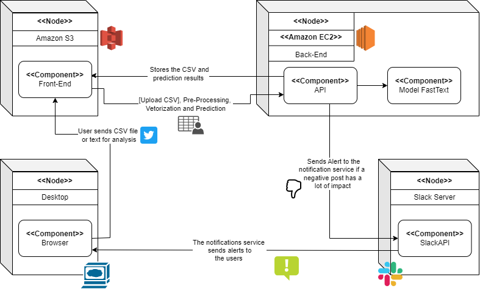
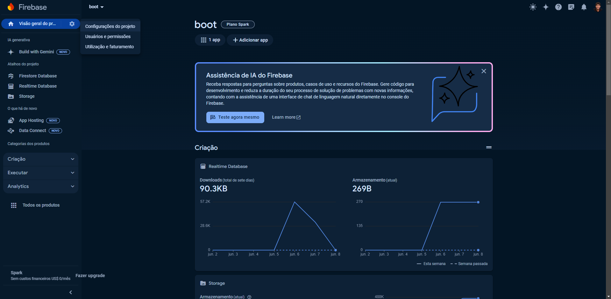

# Documentação PLN - Módulo 6 - Inteli

## Grupo Boot - Solução Jäger

- <a href="https://www.linkedin.com/in/celine-souza-1a38aa225//">Celine Souza</a>
- <a href="https://www.linkedin.com/in/eduardo-hos/">Eduardo Henrique</a>
- <a href="https://www.linkedin.com/in/henrique-cox-4644bb270/">Henrique Cox</a>
- <a href="https://www.linkedin.com/in/marcelo-saadi-pessini-003212209/">Marcelo Saadi</a>
- <a href="https://www.linkedin.com/in/mateus-mar%C3%A7al-212953264/">Mateus Marçal</a>
- <a href="https://www.linkedin.com/in/omatheusrsantos/">Matheus Ribeiro</a>
- <a href="https://www.linkedin.com/in/otto-bernardo-coutinho-lima/">Otto Bernardo</a>

# Sumário

- [Controle de Documento](#controle-de-documento)
- [1. Introdução](#1-introdução)
  - [1.1 Parceiro de Negócios](#11-parceiro-de-negócios)
  - [1.2 Definição do Problema](#12-definição-do-problema)

- [2. Objetivos](#2-objetivos)
  - [2.1 Objetivos Gerais](#21-objetivos-gerais)
  - [2.2 Objetivos Específicos](#22-objetivos-específicos)
  - [2.3 Justificativa](#23-justificativa)

- [3. Compreensão do Problema](#3-compreensão-do-problema)
  - [3.1 Proposta de Valor](#31-proposta-de-valor)
  - [3.2 Matriz de Risco](#32-matriz-de-risco)
  - [3.3 Matriz Oceano Azul](#33-matriz-oceano-azul)
  - [3.4 Análise Financeira](#34-análise-financeira)

- [4. Lean Inception](#4-lean-inception)
  - [4.1 Visão do Produto](#41-visão-do-produto)
  - [4.2 O Produto (É – Não É – Faz – Não Faz)](#42-o-produto-é--não-é--faz--não-faz)
  - [4.3 Brainstorming de Funcionalidades](#43-brainstorming-de-funcionalidades)
  - [4.4 Canvas MVP](#44-canvas-mvp)

- [5. Análise de Experiência do Usuário](#5-análise-de-experiência-do-usuário)
  - [5.1 Personas](#51-personas)
  - [5.2 User Stories](#52-user-stories)

- [6. Metodologia](#6-metodologia)
  - [6.1 CRISP-DM](#61-crisp-dm)
    - [6.1.1 Entendimento do negócio](#611-entendimento-do-negócio)
    - [6.1.2 Entendimento dos dados](#612-entendimento-dos-dados)
    - [6.1.3 Preparação dos dados](#613-preparação-dos-dados)
    - [6.1.4 Modelagem](#614-modelagem)
    - [6.1.5 Avaliação](#615-avaliação)
    - [6.1.6 Implementação](#616-implementação)
    - [6.1.7 Ferramentas](#617-ferramentas)

- [7. Análise Descritiva](#7-análise-descritiva)
  - [7.1 Dados Analisados](#71-dados-analisados)
    
- [8. Arquitetura Macro da Solução](#8-arquitetura-macro-da-solução)
  - [8.1 Diagrama UML](#81-diagrama-uml-de-implantação)
  - [8.2 Regras de Negócio](#82-regras-de-negócio)
  - [8.2.1 Requisitos Não Funcionais](#821-requisitos-não-funcionais)
  - [8.2.2 Requisitos Funcionais](#822-requisitos-funcionais)

- [9. Algoritmos](#9-algoritmos)
  - [9.1 Bag Of Words](#91-bag-of-words)
  - [9.2 Naive Bayes](#92-naive-bayes)
  - [9.3 Word2Vec](#93-word2vec)
  - [9.4 FastText](#95-fasttext)
  - [9.5 FastText+SVM](#95-fasttest-com-svm)
  - [9.6 Transformers - BERT](#96-transformers---bert)

- [10. API da solução](#10-api-da-solução)
  - [10.1 Introdução](#101-introdução)
  - [10.2 Arquitetura da API](#102-arquitetura-da-api)
  - [10.3 Método](#103-método)
  - [10.4 Banco de dados](#104-banco-de-dados)
  - [10.5 Resultados](#105-resultados)
  - [10.6 Conclusão](#106-conclusão)


- [11. Avaliação do Modelo](#11-avaliação-do-modelo)
  - [11.1 Divisão dos dados](#111-divisão-dos-dados)
  - [11.2 Estratégia de Avaliação do modelo](#112-estratégia-de-avaliação-do-modelo)

- [12. Desenvolvimento e Resultados](#12-desenvolvimento-e-resultados)
  - [12.1 BOW e Word2Vec](#121-bow-e-word2vec)
  - [12.2 Naive Bayes](#122-naive-bayes)
  - [12.3 Word2Vec](#123-word2vec)
  - [12.4 Transformers](#124-transformers)
  - [12.5 FastText ](#125-fasttext)
  - [12.6 FastText + SVM](#126-fasttext--svm)

- [13. Novos Resultados](#13-novos-resultados)
  - [13.1 Novas Features](#131-novas-features)
  - [13.2 Novos resultados com FastText com SVM](#132-novos-resultados-com-fasttext--svm)
  - [13.3 Análise do modelo Final](#133-análise-do-modelo-final)

- [14. Funções](#14-funções)
  - [14.1 Pré-Processamento](#141-pré-processamento)
  - [14.2 Implementação](#142-implementação)

- [15. User Experience](#15-user-experience)
  - [15.1 Alestas no Slack](#151-alertas-no-slack)
  - [15.2 Front-end da Solução](#152-front-end-da-solução)

- [16. Conclusões e Recomendações](#16-conclusões-e-recomendações) 
  - [16.1 Conclusões](#161-conclusões) 
  - [16.2 Recomendações](#162-recomendações)
  - [16.3 Implementações](#163-implementações)
  - [16.4 Plano de gerenciamento de riscos](#164-plano-de-gerenciamento-de-riscos)

- [17. Anexos](#17-anexos)
  - [17.1 Mockups adicionais da plataforma Jäger](#171-mockups-adicionais-da-plataforma-jäger)

- [18. Referências](#18-referências)
# Controle de Documento

## Histórico de Revisões

| Data       | Autor  | Versão | Resumo da Atividade           |
|------------|--------|--------|-------------------------------|
| 2024-04-26 | Eduardo Oliveira | v1.0   | Primeira versão do documento com análise de negócios, compreensão do problema e análise de experiência do usuário |
| 2024-05-10 | Matheus Ribeiro | v2.0   | Pré-processamento, desenvolvimento do modelo Bag of Words e utilização do TF e IDF para comparação de métricas |
| 2024-05-24 | Marcelo Saad | v3.0   | Implementação de modelo Word2Vec com Embedding Layer, Naive Bayes e Vetores pré- |
| 2024-07-07 | Eduardo Oliveira | v4.0   | API em flask com modelo escolhido, integração de alerta no Slack |
| 2024-07-21 | Celine Souza  | v5.0   | Deploy da API com o melhor modelo, entrega do MVP |

# 1. Introdução
## 1.1 Parceiro de Negócios
&emsp;&emsp;A Uber é uma empresa de tecnologia líder mundial em mobilidade, que tem como missão criar oportunidades ao conectar pessoas e comunidades. Fundada em 2010, em São Francisco, nos Estados Unidos, expandiu rapidamente sua presença global, oferecendo uma variedade de serviços que vão desde viagens de carro até entregas de alimentos. Com uma vasta rede de operações em mais de 10 mil cidades ao redor do mundo, a Uber enfrenta desafios constantes relacionados à gestão de feedbacks e à manutenção da satisfação dos clientes.

&emsp;&emsp;A abordagem atual para lidar com reclamações é predominantemente reativa, o que pode resultar em crises de reputação e afetar negativamente a relação com seus parceiros e usuários. Diante disso, a solução "Jäger" se apresenta como uma oportunidade estratégica para a empresa. Ao desenvolver uma aplicação de análise de linguagem natural, capaz de monitorar e analisar o sentimento dos clientes em relação à marca, a Uber poderá identificar tendências, tanto positivas quanto negativas, e tomar medidas proativas para melhorar a qualidade de seus serviços e produtos. Assim, o projeto visa contribuir significativamente para aprimorar a experiência do cliente e fortalecer a reputação da Uber no mercado de mobilidade.

## 1.2 Definição do Problema
&emsp;&emsp;Atualmente, a Uber enfrenta desafios relacionados à gestão de feedbacks e à manutenção da satisfação dos clientes. Isso pode resultar em crises de reputação e afetar negativamente a relação com seus parceiros e usuários. A falta de um sistema proativo para identificar e abordar questões emergentes pode prejudicar a percepção da marca e levar a perdas financeiras significativas.

&emsp;&emsp;O escopo do problema abrange a necessidade de identificar oportunidades de melhoria nos produtos e serviços da Uber, a fim de antecipar potenciais crises e preservar a percepção positiva dos usuários e parceiros em relação à marca. O desafio é desenvolver uma solução que permita à Uber analisar o sentimento dos clientes em relação à marca de forma proativa, identificando tendências, tanto positivas quanto negativas, e tomando medidas estratégicas para melhorar a qualidade de seus serviços e produtos.


# 2. Objetivos

## 2.1 Objetivos Gerais
&emsp;&emsp;Desenvolver e implementar uma aplicação de análise de linguagem natural, com o propósito de mensurar o sentimento dos clientes em relação à marca Uber. A aplicação visa fornecer insights estratégicos à empresa, permitindo a identificação proativa de tendências, tanto positivas quanto negativas, para aprimorar a qualidade de seus serviços e produtos.

## 2.2 Objetivos Específicos

Objetivos Específicos:

- Desenvolver um sistema de processamento de linguagem natural capaz de analisar o sentimento dos clientes expressos em tweets (feitos pela plataforma "Twitter" (Atual X))
- Implementar algoritmos de análise de sentimento para identificar tendências positivas e negativas em relação aos serviços e produtos da Uber.
- Gerar relatórios e insights acionáveis a partir dos dados coletados, fornecendo informações estratégicas para tomada de decisões pela equipe da Uber.
- Integrar os feedbacks enviados pela solução "Jäger" aos sistemas da Uber via mensagens na plataforma "Slack", garantindo uma comunicação eficiente e rápida para implementação de melhorias.

## 2.3 Justificativa
&emsp;&emsp;A implementação do projeto "Jäger" é fundamental para a Uber devido à crescente necessidade de entender e responder rapidamente às demandas e expectativas dos clientes. Atualmente, a empresa enfrenta desafios significativos relacionados à gestão de feedbacks e à manutenção da satisfação dos usuários e parceiros. A falta de uma abordagem proativa para identificar e abordar problemas emergentes pode resultar em crises de reputação e afetar negativamente a relação com seus stakeholders.

&emsp;&emsp;Ao desenvolver uma aplicação de análise de linguagem natural, capaz de monitorar e analisar o sentimento dos clientes em relação à marca, através de postagens nas redes sociais, a Uber poderá antecipar problemas potenciais e tomar medidas proativas para melhorar a qualidade de seus serviços e produtos. Isso não apenas fortalecerá a reputação da empresa, mas também contribuirá para aprimorar a experiência do cliente e aumentar a fidelidade à marca.


# 3. Compreensão do Problema
&emsp;&emsp;Nesta seção, será conduzida uma análise do problema enfrentado pela Uber em relação à gestão de feedbacks e à manutenção da satisfação dos clientes. Diferentes perspectivas serão exploradas, desde o Canvas Proposta de Valor até a Análise Financeira, com o objetivo de compreender profundamente os desafios e oportunidades associados ao projeto da solução "Jäger" para o problema da Uber.

## 3.1 Proposta de Valor

&emsp;&emsp;O Canvas Proposta de Valor é uma importante ferramenta empresarial que facilita na compreensão e na criação do posicionamento de um projeto, focando na verdadeira entrega de valor para o cliente. Essa abordagem focada no cliente não apenas ajuda a identificar os principais benefícios da oferta, mas também orienta na definição de estratégias para atender às necessidades e expectativas dos clientes de forma eficaz<sup><a href="#referencia-1">1</a></sup>.

<div align="center">
  <p> <b>Figura 1 </b> - Canvas Proposta de Valor</p>

  <p><b>Fonte:</b> elaborado pela equipe Boot.</p>
</div>


**Criadores de ganho**

* Diferenciação Competitiva: A solução pode ajudar a Uber a oferecer um serviço diferenciado em comparação com seus concorrentes, isso pode aumentar a participação de mercado da Uber.

* Melhoria da Experiência do Usuário: O projeto pode ajudar a Uber a melhorar a experiência do usuário ao identificar críticas, elogios e sugestões. Isso poderia aumentar a satisfação do cliente e a fidelidade à marca.


**Aliviadores de dor**
* Monitoramento de Feedback: O projeto oferece à Uber uma vantagem ao identificar rapidamente problemas ou polêmicas relacionados à marca, permitindo uma resposta ágil e eficaz para abordá-los.

* Identificação de Problemas de Segurança: A solução ajuda a identificar padrões de feedback que indicam preocupações com a segurança dos passageiros ou motoristas. Ao detectar e abordar esses problemas precocemente, a Uber pode melhorar a confiança dos usuários em sua plataforma.

* Entendimento das Necessidades dos Usuários: O projeto analisa os sentimentos dos usuários em relação aos diferentes aspectos dos serviços da Uber, como qualidade das viagens, atendimento ao cliente, preço e conveniência. Essa análise pode fornecer insights valiosos sobre as preferências e expectativas dos usuários.


**Produtos e serviços**
* Alertas de Crise de Reputação: Configuração de alertas automáticos para detectar feedbacks negativos significativos ou crises de reputação em potencial, permitindo uma resposta rápida e eficaz por parte da equipe da Uber.

* Integração com Sistemas Internos: Integração da plataforma de análise de sentimentos com os sistemas internos da Uber, como o sistema de atendimento ao cliente e gestão de qualidade, para facilitar ações corretivas e melhorias operacionais.

* Análise de Sentimentos Automatizada: Implementação de algoritmos de análise de sentimentos para processar e categorizar os feedbacks dos usuários de forma automatizada, identificando padrões e tendências.


**Dores** 
* Reputação da empresa: A Uber enfrenta constantemente desafios relacionados à sua reputação, seja devido a questões de segurança, experiência do usuário insatisfatória, controvérsias trabalhistas ou outras preocupações.

* Entendimento das necessidades dos usuários: A falta de compreensão sobre o que os usuários querem é uma grande dor da Uber, pois pode levar a decisões de negócios equivocadas, lançamento de produtos inadequados e perda de clientes para concorrentes.

**Ganhos**

* Melhoria da Reputação da Marca: Ao identificar e responder rapidamente a feedbacks negativos, a Uber pode melhorar sua reputação, aumentando a confiança dos usuários na marca e mitigando potenciais danos à imagem da empresa.

* Aumento da Satisfação do Cliente: Com o projeto, a Uber pode fazer ajustes em seus serviços para melhor atender às demandas dos clientes, resultando em maior satisfação e fidelidade à marca.

* Redução de Churn de Usuários: Ao abordar problemas e preocupações dos usuários de forma proativa, a Uber pode reduzir a taxa de abandono de usuários (churn), mantendo os clientes existentes e evitando a perda de receita associada à rotatividade.


**Tarefas dos clientes**
* Validar Resultados e Insights: Revisar e validar os resultados e insights gerados pela análise de sentimentos, garantindo que sejam precisos, relevantes e acionáveis para a empresa.

* Implementar Recomendações e Melhorias: Implementar recomendações e melhorias identificadas a partir da análise de sentimentos em seus serviços e operações, visando melhorar a experiência do usuário e atender às demandas dos clientes de forma mais eficaz.

**Diferenciais Competitivos da Solução**

&emsp;&emsp;A seguir, apresentamos os principais diferenciais da nossa solução em comparação com os concorrentes existentes no mercado. Essas características exclusivas justificam a superioridade e a inovação que nossa plataforma oferece, proporcionando vantagens significativas para a Uber.

1. Tecnologia de Ponta em Análise de Sentimentos: nossa solução utiliza algoritmos avançados de análise de sentimentos, que são mais precisos e eficientes do que as tecnologias utilizadas pelos concorrentes. Isso permite uma categorização mais detalhada e a identificação de padrões e tendências com maior precisão.
2. Integração Completa com Sistemas Internos: enquanto muitos concorrentes oferecem soluções isoladas, nossa plataforma pode se integrar totalmente com os sistemas internos da Uber. Isso facilita a implementação de ações corretivas e melhorias operacionais de maneira mais rápida e eficaz.
3. Alertas de Crise de Reputação em Tempo Real: a nossa solução configura alertas automáticos para detectar feedbacks negativos significativos ou crises de reputação em potencial. A capacidade de responder em tempo real a esses problemas é um diferencial crucial, permitindo que a Uber atue de forma proativa para mitigar danos à sua imagem.

### 3.1.1 Matriz SWOT
&emsp;&emsp;A análise SWOT é uma ferramenta estratégica que avalia os pontos fortes, pontos fracos, oportunidades e ameaças de um projeto, produto ou empresa<sup><a href="#referencia-2">2</a></sup>. Complementar o Canvas Proposta de Valor com uma análise SWOT permite identificar sinergias entre os pontos fortes da proposta de valor e as oportunidades externas, mitigar fraquezas, explorar oportunidades emergentes e antecipar ameaças, fornecendo uma compreensão mais completa e informada do contexto em que a oferta está inserida, e orientando estratégias para fornecer valor aos clientes.

<div align="center">
  <p> <b>Figura 2 </b> - Matriz SWOT</p>

 <p><b>Fonte:</b> elaborado pela equipe Boot.</p>
</div>

**Forças:**
- Grande Volume de Dados: A Uber possui acesso a uma grande quantidade de dados de clientes, incluindo avaliações, feedbacks e interações.

- Capacidade de Inovação: A Uber tem uma cultura de inovação e tecnologia, o que pode facilitar a implementação de soluções avançadas de análise de sentimentos.

- Reputação da Marca: A Uber é uma marca reconhecida globalmente, o que pode facilitar a adoção e aceitação da análise de sentimentos pelos usuários e parceiros.

**Fraquezas:**
- Privacidade dos Dados: A coleta e análise de dados de clientes pode levantar preocupações com a privacidade dos dados, o que pode afetar a aceitação do projeto.

- Disponibilidade de dados: A qualidade e a quantidade dos dados de treinamento serão cruciais para o sucesso do sistema.

-   Dependência de Integrações: O sucesso do projeto pode depender da capacidade de integrar com sucesso os sistemas existentes da Uber para acessar e analisar os dados dos clientes.

**Oportunidades:**
- Oportunidade de melhorar a experiência do cliente: Ao identificar e analisar os sentimentos dos clientes, a Uber pode tomar medidas proativas para melhorar a experiência do cliente e reduzir o risco de crises.

- Dados valiosos para tomada de decisões: O sistema fornecerá dados valiosos sobre as percepções dos clientes, que podem ser usados para tomar decisões estratégicas sobre produtos, serviços e marketing.

- Vantagem competitiva: A Uber será uma das primeiras empresas do setor a usar a análise de sentimento em larga escala, o que lhe dará uma vantagem competitiva.

- Potencial para aumentar a fidelidade do cliente: Ao se concentrar nas necessidades e preocupações dos clientes, a Uber pode aumentar a fidelidade do cliente e reduzir o churn.

**Ameaças:**
- Reputação Negativa: Se o projeto não for implementado com sucesso ou se os resultados da análise de sentimentos não forem adequadamente gerenciados, isso pode levar a uma reputação negativa e perda de confiança dos clientes.

- Regulamentações e Privacidade: Mudanças nas regulamentações de proteção de dados ou preocupações crescentes com a privacidade dos dados podem impactar a capacidade da Uber de coletar e analisar dados de clientes para o projeto.

&emsp;&emsp;Essa análise SWOT fornece uma visão abrangente dos pontos fortes, fraquezas, oportunidades e ameaças do projeto de análise de sentimentos da Uber, permitindo uma melhor compreensão do ambiente em que o projeto está inserido e orientando a formulação de estratégias para maximizar seus benefícios e mitigar riscos.

## 3.2 Matriz de Risco

&emsp;&emsp;A matriz de risco, uma ferramenta essencial de gestão em projetos, ela serve como um guia para avaliar e priorizar os riscos associados ao desenvolvimento e implementação de soluções tecnológicas. De acordo com o Blog Efera<sup><a href="#referencia-3">3</a></sup> , ela é composta por uma espécie de quadro bidimensional que mapeia riscos de acordo com sua probabilidade de ocorrência e impacto nas operações,oferecendo  uma visualização clara e objetiva dos desafios que precisam de atenção imediata e daqueles que podem ser monitorados com menor urgência. Isso, classificando cada risco em seu potencial impacto e probabilidade do risco acontecer. Sendo metade do quadro para riscos considerados ameaças, que são negativos e oportunidades, os considerados positivos.

&emsp;&emsp;Além disso, a matriz de risco é uma ferramenta dinâmica que será atualizada a cada sprint do projeto Jäger. Isso é crucial, pois o grupo Boot reconhece que os desafios e problemas enfrentados no desenvolvimento e implementação de soluções tecnológicas estão em constante evolução. Portanto, é necessário que a equipe esteja preparada para adaptar-se e resolver os desafios de acordo com sua relevância e impacto no projeto. E justamente pensando nisso que cada risco identificado é acompanhado de um plano de ação específico, garantindo uma base sólida para aproveitar oportunidades e superar desafios. Veja a seguir a Matriz de Risco da solução *Jäger*.

<div align="center">
  <p><b>Figura 3</b> - Matriz de Risco</p>
  
  <p><b>Fonte:</b> elaborado pela equipe Boot.</p>
</div>

&emsp;&emsp;A seguir, estão transcritos os riscos apontados na imagem de matriz de risco. Em cada risco é possível identificar sua explicação, o responsável pelo risco e o plano de ação que se deve tomar para estar preparado tanto para as ameaças quanto oportunidades. É importante destacar que cada cor do quadro corresponde ao nível de atenção para risco, sendo o quadrado verde atenção mínima, quadrado amarelo atenção mediana com rotina de monitoramento e  quadrado vermelho uma atenção alta.


| **Ameaças**

**Falhas na comunicação do grupo** (Probabilidade de 70%, Impacto Alto):

 - Esta ameaça se refere aos problemas de comunicação entre os membros do grupo, o que pode levar a mal-entendidos, desalinhamento nas expectativas, retrabalho e atrasos nas entregas.

- **Responsável pelo Risco:** Equipe Boot;
  
- **Plano de Ação:** Promover uma cultura de participação ativa nos rituais ágeis, assegurando que todos estejam cientes do que será desenvolvido.

**Membros ausentes nos encontros do time** (Probabilidade de 50%, Impacto Moderado):
  
- Esta ameaça envolve a ausência de membros em reuniões e rituais ágeis, o que pode prejudicar a coesão do grupo e o andamento das atividades.

- **Responsável pelo Risco:** Scrum master / Grupo Boot;
  
- **Plano de Ação:** Metrificar a participação dos membros nos encontros, valorizando a presença nos rituais diários além das entregas. Membros ausentes sem justificativa devem receber feedback corretivo para melhorar a assiduidade.


**Falha de organização das tasks na Sprint Planning** (Probabilidade de 50%, Impacto Alto):
  
- Falhas na organização das tarefas durante o planejamento da sprint, como má divisão de tarefas e prioridades, podem resultar em gargalos no kanban e atraso nas entregas.

-  **Responsável pelo Risco:** Equipe  Boot / Product Owner;
  
 - **Plano de Ação:** Organizar as tarefas considerando suas dependências e prioridades. Quebrar tarefas maiores em subtarefas e alinhar as expectativas e limitações dos membros, para garantir um fluxo de trabalho mais eficiente.

**Dificuldades técnicas na integração das funções na API** (Probabilidade de 30%, Impacto Moderado):
  
 - Problemas técnicos durante a integração das diversas funções da API podem atrasar o desenvolvimento e causar bugs inesperados.

  - **Responsável pelo Risco:** Equipe Boot
  
 - **Plano de Ação:** Realizar testes frequentes durante o desenvolvimento para identificar e resolver problemas de integração o mais cedo possível. Usar ferramentas de integração contínua para automatizar testes e detectar falhas rapidamente.

**Dificuldade na implementação e testes da API** (Probabilidade de 30%, Impacto Alto):
  
- Desafios na implementação e teste da API podem comprometer a funcionalidade e a qualidade do produto final.

- **Responsável pelo Risco:** Grupo Boot;
  
- **Plano de Ação:** Adotar uma abordagem de desenvolvimento orientada a testes (TDD) para garantir que a API seja construída com a qualidade desde o início. Realizar revisões de código e testes unitários para detectar e corrigir erros precocemente.

**Problemas com o design da API (front)** (Probabilidade de 10%, Impacto Moderado):
  
- Problemas no design do frontend da API podem afetar a usabilidade e a experiência do usuário final.

- **Responsável pelo Risco:** Grupo Boot;
  
- **Plano de Ação:** Envolver o designer UX/UI desde o início para criar protótipos e wireframes. Realizar testes de usabilidade com usuários finais para identificar e corrigir problemas de design antes da implementação completa.

**Incompatibilidades de versão e problemas de dependências** (Probabilidade de 10%, Impacto Alto):
  
- Incompatibilidades entre versões de bibliotecas e problemas com dependências podem causar erros e atrasos no desenvolvimento.

- **Responsável pelo Risco:** Grupo Boot;
  
- **Plano de Ação:** Usar ferramentas de gerenciamento de dependências e manter um ambiente de desenvolvimento consistente. Documentar as versões de bibliotecas utilizadas e realizar testes de compatibilidade regularmente.

**Não cumprimento dos critérios de avaliação do projeto** (Probabilidade de 10%, Impacto Muito Alto):
  
 - Este risco diz respeito à possibilidade de o grupo não entregar todos os requisitos solicitados no MPV até o final do módulo;

- **Responsável pelo Risco:** Equipe Boot;
  
- **Plano de Ação:** Realizar reuniões recorrentes de alinhamento do Product Backlog. Priorizar funcionalidades primordiais e que possuem muitas dependências. Alinhar as expectativas da equipe e do cliente.

**Não conseguir entregar o front da API ou entregar Front pouco desenvolvido** (Probabilidade de 50%, Impacto Muito Alto):

- Esta ameaça refere-se à possibilidade de não conseguir desenvolver ou entregar o frontend da API conforme planejado, afetando a funcionalidade completa do projeto.
- **Responsável pelo Risco:** Equipe Boot
- **Plano de Ação:** Priorizar a implementação do frontend desde o início do sprint e realizar revisões frequentes para garantir o progresso. Alinhar expectativas e dividir tarefas entre os membros para garantir que o frontend esteja completo e funcional a tempo.

**Não atendermos à necessidade da Uber** (Probabilidade de 10%, Impacto Muito Alto):

- Esta ameaça está relacionada ao risco de a solução desenvolvida pelo grupo não atender às expectativas da Uber, especialmente no que diz respeito à identificação de tweets propensos a se tornarem virais, devido a trade-offs técnicos ou de design.
- **Responsável pelo Risco:** Product Owner / Equipe Boot
- **Plano de Ação:** Manter uma comunicação objetiva do MVP/Escopo com a Uber durante as entregas para entender claramente suas necessidades e expectativas. Realizar testes contínuos e ajustes na solução para garantir que os critérios de sucesso da Uber sejam atendidos. Solicitar feedback regular para alinhar as entregas com os objetivos do parceiro.

| **Oportunidades**

**Integrar com sucesso a API com o Slack** (Probabilidade de 80%, Impacto Muito Alto):

- A integração bem-sucedida da API com o Slack pode demonstrar a versatilidade e a aplicabilidade prática do projeto, proporcionando um valor significativo para os usuários finais.
- **Responsável pela Oportunidade:** Equipe Boot
- **Plano de Ação:** Planejar e testar a integração com o Slack desde o início do sprint. Documentar e resolver qualquer problema de integração de maneira rápida e eficiente para garantir o sucesso da implementação.

**Aprimoramento das habilidades em desenvolvimento de APIs e uso de Flask** (Probabilidade de 90%, Impacto Alto):
  
- O desenvolvimento contínuo da API usando Flask oferece uma excelente oportunidade para aprimorar habilidades técnicas que são muito valorizadas no mercado.

 - **Responsável pela Oportunidade:** Equipe Boot;
  
- **Plano de Ação:** Implementar boas práticas de desenvolvimento e explorar funcionalidades avançadas da biblioteca para criar uma API robusta e eficiente.

 **Colaboração e engajamento dos membros do grupo**(Probabilidade de 70%, Impacto Muito Alto):
  
- Um alto nível de colaboração e engajamento dos membros pode melhorar a coesão do time e a qualidade do trabalho final.

- **Responsável pela Oportunidade:** Equipe Boot / Scrum Master

- **Plano de Ação:** Promover um ambiente de trabalho colaborativo e incentivar a participação ativa de todos os membros. Realizar dinâmicas de equipe e atividades de integração para fortalecer o espírito de grupo.

**Destacar-se pela qualidade da documentação do projeto**(Probabilidade de 70%, Impacto Alto):
  
 - Criar uma documentação de alta qualidade no GitHub pode servir de referência para futuros projetos e destacar o trabalho do grupo.

- **Responsável pela Oportunidade:** Equipe Boot;
  
 - **Plano de Ação:** Estabelecer padrões de documentação claros e detalhados. Assegurar que todas as funcionalidades estejam bem documentadas, incluindo exemplos de uso, diagramas e instruções de configuração.


**Sucesso na apresentação em inglês** (Probabilidade de 70%, Impacto Moderado):
  
- Realizar uma apresentação bem-sucedida em inglês pode causar uma impressão positiva nos stakeholders e aumentar a confiança no trabalho do grupo.

- **Responsável pela Oportunidade:** Equipe Boot;
  
- **Plano de Ação:** Preparar e ensaiar a apresentação com antecedência. Focar na clareza e precisão da comunicação. Utilizar recursos visuais para apoiar a apresentação e garantir que todos os membros estejam confortáveis em falar em inglês.

**Conseguir entregar a integração do front com a API** (Probabilidade de 50%, Impacto Alto):

- Entregar um frontend funcional e bem desenvolvido da API pode garantir que os usuários tenham uma experiência de uso positiva, destacando a qualidade e a usabilidade do projeto.
- **Responsável pela Oportunidade:** Desenvolvedor Frontend / Líder Técnico
- **Plano de Ação:** Priorizar o desenvolvimento do frontend, garantir revisões contínuas e testes rigorosos para identificar e corrigir problemas antecipadamente. Colaborar estreitamente com o backend para garantir a integração suave.

**Aumento da satisfação da Uber com a entrega do MVP**(Probabilidade de 50%, Impacto Moderado):
  
- Entregar um MVP de alta qualidade que atenda às expectativas da Uber pode fortalecer a parceria e abrir portas para futuras colaborações.

- **Responsável pela Oportunidade:** Equipe Boot;
  
- **Plano de Ação:** Manter uma comunicação constante com a Uber para alinhar expectativas. Priorizar funcionalidades críticas e realizar testes rigorosos para garantir a qualidade da entrega.


## 3.3 Matriz Oceano Azul

<p align="justify">
&emsp;&emsp;A Matriz do Oceano Azul é uma ferramenta estratégica que auxilia as empresas as empresas a das oportunidades de inovação e diferenciação dentro de um mercado específico. Originada do conceito de estratégia do Oceano azul, essa abordagem pressupõe que as empresas fujam do "Oceano Vermelho" (cenário extremamente competitivo, onde suas condições levam a margens de lucro muito pequenas e, em alguns casos, à comoditização de produtos e serviços) e busquem um mercado inexplorado, com baixa pressão nas estratégias de precificação e baixa competição (Oceano Azul)<sup><a href="#referencia-4">4</a></sup>
.
</p>

&emsp;&emsp;No contexto do projeto de mensuração de sentimento para Uber a Matriz do Oceano Azul é uma ferramenta crucial para compreender de que forma o parceiro pode se destacar em relação aos concorrentes presentes no mercado, já que atravéz dessa matriz é possível analisar fatores que são cruciais para os clientes como, preço, transparência, velocidade, atendimento, entre outros. Além disso, a matriz de Oceano Azul auxilia a traçar um plano de ação para chegar no Oceano Azul, traçando quais atributos devem reduzir, eliminar, elevar e criar.

&emsp;&emsp;Nesta análise será possível identificar como a Uber pode se posicionar estratégicamente no mercado, oferecendo uma proposta de valor única e atraente para todos dentro da empresa que irão utilizar a mensuração de sentimento para monitorar a satisfação dos clientes em relação ao serviço disponibilizado. A partir dessa contextualização já é possível começar a análise para o densenvolvimento da matriz do Oceano Azul.

- **Modelo de análise de sentimentos baseado em processamento de linguagem natural:**
  - Utiliza processamento de linguagem natural avançado para analisar e interpretar sentimentos dos clientes.

### Visão Geral do Projeto

&emsp;&emsp;**Projeto:** O projeto visa criar um termômetro de sentimentos que permitirá à Uber capturar e analisar de forma sistemática o feedback dos clientes, identificando áreas de satisfação e oportunidades de melhoria. Ao compreender melhor as percepções e emoções dos usuários, a Uber poderá tomar decisões estratégicas mais informadas, aprimorar seus serviços e manter sua posição de liderança no mercado de mobilidade urbana.
**Empresa:** Uber

### Matriz de Avaliação de Valor

**Faz:**
- **Categorização de sentimento (negativo - neutro - positivo):**
  - Classifica entre positivo e negativo.

- **Envio de alertas no Slack:**
  - Notifica equipes internas sobre percepções de alta intensidade.

- **Analise  de banco de dados off-line:**
  - Dados forncecidos não se atualizam.

&emsp;&emsp;A matriz de avaliação de valor apresenta uma análise comparativa entre a Uber e seus principais concorrentes no mercado de mobilidade urbana: Lyft, serviços de táxi tradicionais e a empresa 99. Esta análise visa identificar e avaliar diversos atributos que são considerados importantes pelos usuários ao escolherem um serviço de transporte. Ao entender como a Uber se posiciona em relação aos seus concorrentes em termos de qualidade do serviço, preço, confiabilidade, facilidade de uso, disponibilidade e inovação, é possível ter uma visão mais abrangente do valor percebido pelos clientes em relação a cada opção de transporte. Essa compreensão é fundamental para a Uber tomar decisões estratégicas e buscar maneiras de se diferenciar no mercado, oferecendo uma experiência que atenda às necessidades e expectativas dos usuários de forma única e eficaz.

<div align="center">
  <p> <b>Tabela 1 </b> - Atributos da Matriz de Oceano Azul</p>

| Atributos                        | Jäger | Brand24 | Sprout Social |
|----------------------------------|-------|---------|---------------|
| Tempo de Resposta ao cliente     | 3     | 6       | 6             |
| Acessibilidade                   | 3     | 9       | 8             |
| Custo de Viabilização do Projeto | 0     | 8       | 7             |
| Precisão do Modelo               | 8     | 9       | 6             |
| Escalabilidade                   | 9     | 6       | 7             |
| Inovação                         | 8     | 7       | 5             |
| Personalização                   | 8     | 6       | 8             |
| Exclusividade                    | 10    | 0       | 0             |
| Integração                       | 10    | 0       | 0             |

  <p><b>Fonte:</b> elaboração pela equipe Bote.</p>
</div>

&emsp;&emsp;Esses atributos foram escolhidos com base na importância percebida pelos clientes e na capacidade da Uber de se destacar em cada um deles. 

<div align="center">
  <p> <b>Figura 4 </b> - Matriz Oceano Azul</p>

  <p><b>Fonte:</b> elaborado pela equipe Boot.</p>
</div>

&emsp;&emsp;Utilizando a tabela e o gráfico acima como base, é possível entender como o projeto de mensuração de sentimento afetaria a Uber.

- **Analise de ironia.:**
  - Não foi analizado ironia no banco de dados.

### Ações Estratégicas

**Reduzir:**

1. **Erros Operacionais Humanos**
  - Reduzir a incidência de erros na mensuração é crucial para a distinção do projeto no mercado. Ao minimizar os erros operacionais humanos, a usabilidade dos serviços é aprimorada, resultando em uma melhor compreensão dos insights gerados pela mensuração do sentimento em relação à marca Uber como um todo. Essa precisão na mensuração proporciona uma base sólida para as estratégias de diferenciação e posicionamento da marca, fortalecendo sua competitividade no mercado.

2. **Usabilidade**
  - O projeto tem como principal objetivo ser uma inteligência artificial (IA) com uma integração eficiente com plataformas como o Slack, visando oferecer uma experiência de usuário aprimorada. Nesse sentido, houve uma decisão estratégica de priorizar a integração e personalização em detrimento da usabilidade, como forma de se destacar das soluções concorrentes. Essa abordagem visa não apenas atender às necessidades dos usuários, mas também proporcionar uma experiência mais personalizada e integrada, alinhada com as demandas do mercado e as expectativas dos clientes.

**Eliminar:**

- **Monitoramento não Contínuo:** 
  - Monitorar o Twitter para perceber a percepção da marca com base no banco de dados fornecidos.
  
- **Termômetro de Sentimentos:** 
  - Desenvolver um termômetro visual para mostrar a intensidade dos sentimentos.
  
3. **Custo de Viabilização do Projeto**
   - Devido ao contexto de aprendizado em que estamos inseridos, a Uber não incorre em custos no desenvolvimento da solução, uma vez que esta é desenvolvida por alunos do Inteli, uma faculdade com o ensino baseado em projetos.

**Elevar:**

4. **Automatização de Processos Manuais**
   - A solução visa interpretar mensagens registradas no Twitter para mensurar o sentimento em relação aos serviços prestados pela Uber. No momento, não existe uma solução amplamente eficaz para viabilizar essa automatização de processos de monitoramento das redes sociais. A proposta apresentada preenche essa lacuna ao oferecer uma solução que automatiza esse processo de monitoramento, proporcionando à Uber insights valiosos sobre a percepção do público em relação à marca e seus serviços.

5. **Personalização**
  - A solução será adaptada de acordo com as necessidades específicas da Uber e de seus usuários, visando aliviar uma dor existente dentro da empresa. Ao oferecer uma experiência personalizada e sob medida, a solução atenderá às demandas individuais de cada cliente, fortalecendo assim o vínculo com a marca e a fidelidade do cliente. Isso significa que a solução será projetada de forma modular e configurável, permitindo que a Uber personalize e ajuste suas funcionalidades e recursos de acordo com as preferências e requisitos específicos de cada mercado, segmento de cliente ou situação operacional.

**Criar:**

6. **Exclusividade**
  - Apenas a Uber poderá ter acesso a essa solução, uma vez que se tornará propriedade exclusiva da Uber após o término do projeto. Isso significa que todos os direitos de propriedade intelectual e de uso da solução serão transferidos para a Uber, garantindo que a empresa tenha controle total sobre seu desenvolvimento, implementação e evolução futura.

7. **Integração**
  - Flexibilidade e Modularidade: A Uber logrará integrar a solução a diversas plataformas de sua preferência, garantindo uma experiência fluida e harmoniosa para os usuários finais. A solução será projetada de forma flexível e modular, permitindo uma integração com os sistemas existentes da Uber, bem como com outras plataformas externas que a empresa possa utilizar.

  - Aproveitamento Máximo dos Recursos: Essa integração abrangente permitirá à Uber aproveitar ao máximo os recursos da solução, maximizando sua eficácia e potencializando seus benefícios para os usuários e para a empresa como um todo.

  - Escalabilidade e Adaptação: Além disso, a capacidade de integração facilitará a escalabilidade da solução dentro da empresa, permitindo que ela se adapte facilmente às mudanças nas necessidades e nos requisitos do negócio da Uber ao longo do tempo.

  - Avaliação Crítica da Capacidade de Integração: É crucial considerar se os recursos atuais da Uber são suficientes para suportar as novas iniciativas propostas sem comprometer as operações existentes. Uma análise detalhada será realizada para garantir que a infraestrutura tecnológica da Uber possa acomodar a nova solução de maneira eficiente. Isso inclui a avaliação da capacidade de processamento, armazenamento de dados e compatibilidade com sistemas legados.

**Proposta do MVP:**
- **Modelo de Análise de Sentimentos:**
  - Serviço de análise de sentimento  baseada em processamento de linguagem natural com base offline..
  - Envio de alertas proativos no Slack para percepções negativas e positivas de potencial impacto no processo.

**Resultado Esperado:**
- **Ferramenta como suporte:**
  - Aumento da capacidade de identificar e abordar  feedbacks negativos.
  - Ferramenta como suporte futuro ao processo de tomada de decisões.

**Jornadas:**
- **Monitoramento e Análise aprimorado:**
  - Análise de dados do X.
  - Identificação de sentimentos e classificação.

&emsp;&emsp;Essas ações estratégicas visam criar um espaço único e inexplorado no mercado, onde a Uber pode se diferenciar da concorrência e oferecer uma experiência excepcional aos seus clientes.

&emsp;&emsp;Ao aplicar a estratégia do Oceano Azul ao projeto da Uber, espera-se identificar oportunidades de inovação e crescimento que permitam à empresa melhorar a percepção dos clientes e fortalecer sua posição no mercado de mobilidade e transporte.

## 3.4 Análise Financeira
&emsp;&emsp;A análise financeira desse projeto baseia-se em dois pilares: os custos estimados da implantação e manutenção do projeto durante o período de um ano.

&emsp;&emsp;Para a implantação do MVP do projeto, precisa-se fazer a suposição de que o grupo Boot, composto por estudantes do INTELI, estão sendo pagos, portanto, considerando um pagamento de 200 reais por hora por integrante, que trabalhamo 2 horas por dia durante 10 semanas. Levando em conta que o grupo tem 7 pessoas, o custo total por integrante no fim das 10 semanas seria de R$20.000 por pessoa (R$ 140.000,00 ao total).

&emsp;&emsp;Ademais, para a implantação desse projeto e manutenção dele, foram orçados os seguintes custos:


<div align="center">
  <p> <b>Tabela 2</b> - Custos sobre projeto</p>

| Nome | Descrição | Valor | Período |
| --- | --- | --- | --- |
| Equipe | Pessoas que irão realizar a manutenção e escalar a aplicação. Foram estimados, entre plenos e seniors, três profissionais sendo desenvolvedor backend, desenvolvedor frontend e cientista de dados. | R$45.000 (todos plenos) R$75.000 (todos seniors) | Mês |
| Infraestrutura | Estrutura de servidores que irão sustentar o funcionamento completo da aplicação, sendo esses estimados usando os serviços da google cloud, sendo: 2 instâncias n1-standard-4 operando 24 horas por dia, um storage de 50tb, e 1 API Cloud Natural Language ($1000 cada 1m de unidades de textos, uma unidade de texto é 1000 caracteres) | R$6.300 (sem a API de NLP) R$16.800 (com a API de NLP) | Mês |
| Aquisição de dados | Twitter API Premium que permite acesso a tweets dos últimos 30 dias ou ao arquivo completo de tweets históricos, com funcionalidades avançadas de pesquisa. | R$12.000,00 | Mês |

  <p><b>Fonte:</b> elaboração pela equipe Boot.</p>
</div>


&emsp;&emsp;Assim, o gasto total estimado, em um período de um ano, seria entre R$759.600 ~ R$1.245.600 sendo o fator variante a composição da equipe de manutenção e a API de NLP. Vale ressaltar que pode-se contratar uma pessoa que trabalhe em todas essas áreas e/ou barganhar salário.
Um motivador da implementação dessa solução, ainda que não gere receita diretamente, é o potencial da aplicação de identificar tendências negativas e pontos críticos nas percepções dos usuários e parceiros antes que eles se transformem em crises.

&emsp;&emsp;As informações utilizadas foram extraídas de sites confiáveis e plataformas de cotação oficiais. Mais especificamente, os salários foram obtidos pelo Glassdoor, uma plataforma colaborativa que informa remunerações em diferentes empresas, no caso da Uber<sup><a href="#referencia-5">5</a></sup>
. Os custos de infraestutura foram orçados diretamente na google cloud<sup><a href="#referencia-6">6</a></sup>
. O custo da API foi extraído diretamente do site do X<sup><a href="#referencia-7">7</a></sup>. 

# 4. Lean Inception

&emsp;&emsp;O Lean Inception é um método ágil de desenvolvimento de projetos que ajuda na objetificação do MVP(Produto Mínimo Viável). Seu objetivo é acelerar a entrega de produtos, garantindo maior assertividade e qualidade de acordo com o livro Lean Inception - Como alinhar pessoa e contruit o produto certo do Paulo Caroli<sup><a href="#referencia-8">8</a></sup>. Alinhando as áreas de negócios e meios para a construção do produto, veja  as seções a seguir onde se encontra detalhado:

- **Visão de Produto:** Definição clara do propósito e direção do produto.
- **O que o Produto É – Não É – Faz – Não Faz:** Esclarecimento das funcionalidades e limitações do produto.
- **Brainstorming de Funcionalidades:** Processo para identificar e priorizar as funcionalidades do produto.
- **MVP (Produto Mínimo Viável):** Desenvolvimento e implementação da versão simples do produto para validação.

### **4.1 Visão do Produto**

&emsp;&emsp;A visão de produto é onde se descreve o propósito, os objetivos e o valor que um produto pretende entregar aos usuários. Ela serve como um guia para toda a equipe de desenvolvimento, garantindo alinhamento e foco nas necessidades e expectativas dos stakeholders. A visão de produto define a direção a ser seguida durante o desenvolvimento, ajudando a orientar as decisões e prioridades ao longo do ciclo de desenvolvimento do produto. Veja a seguir a visão de produto do grupo *Bote*.

- **Frase da Visão:** Para a área de comunicação e marketing da Uber que busca melhorar a percepção da marca em tempo real, o produto é um modelo de análise de sentimentos baseado em linguagem natural que, diferentemente de ferramentas de monitoramento convencionais, oferece análises precisas e envio de alertas imediatos para ações proativas.

- **Missão:** Desenvolver uma aplicação de análise de sentimentos para monitorar a percepção dos clientes em relação à Uber e fornecer insights acionáveis para melhorias estratégicas pelo Slack.
  
- **Visão:** Ser uma ferramenta de monitoramento de sentimentos da Uber, integrada ao Slack, para permitir ações proativas e preventivas com base no feedback dos clientes.
  
- **Valores:** 
  - Eficiência: Agir rapidamente em resposta aos alertas gerados.
  - Precisão: Utilizar análise de linguagem natural avançada para interpretação precisa dos sentimentos.
  - Colaboração: Fomentar a colaboração entre equipes para resolver problemas de percepção de marca.


### **4.2 O Produto (É – Não É – Faz – Não Faz)**

&emsp;&emsp;A matriz "É – Não É – Faz – Não Faz" é uma ferramenta para delimitar o escopo do MVP (Produto Mínimo Viável) de um produto, definindo as características e funcionalidades que o produto possui e deve realizar, ao mesmo tempo em que estabelece o que o produto não é e quais funcionalidades não devem ser incluídas. Ou seja, ela ajuda a focar nas características mais relevantes do produto, garantindo que o MVP seja desenvolvido alinhado com as necessidades do projeto.

<div align="center">
  <p> <b>Figura 5 </b> -Matriz (É – Não É – Faz – Não Faz)</p>

  <p><b>Fonte:</b> elaborado pela equipe Boot.</p>
</div>

&emsp;&emsp;Veja a seguir a matriz transcrita com mais detallhamento: 

**É:**
- **Ferramenta de uso interno da Uber:**
  - Desenvolvida para atender às necessidades internas da Uber, especificamente para a área de comunicação e marketing.

- **Modelo de análise de sentimentos baseado em processamento de linguagem natural:**
  - Utiliza processamento de linguagem natural avançado para analisar e interpretar sentimentos dos clientes.

**Não É:**
- **Um produto momentâneo:**
  - Requer desenvolvimento contínuo e manutenção para se adaptar às mudanças nas percepções dos clientes.

- **Um dashboard executivo:**
  - Embora apresente informações de análise, não é um painel de controle executivo tradicional.

**Faz:**
- **Categorização de sentimento (negativo - neutro - positivo):**
  - Classifica entre positivo e negativo.

- **Envio de alertas no Slack:**
  - Notifica equipes internas sobre percepções de alta intensidade.

- **Analise  de banco de dados off-line:**
  - Dados forncecidos não se atualizam.

**Não Faz:**
- **Distinção de comentários entre motoristas e clientes:**
  - Não diferencia ou separa comentários com base na fonte, focando apenas na percepção da marca.

- **Monitoramento contínuo do Twitter:**
  - Coleta e analisa dados em tempo real para acompanhar a percepção da marca.

- **Analise de ironia.:**
  - Não foi analizado ironia no banco de dados.

- **Desenvolvimento de dashboards:**
  - Não foca no desenvolvimento de painéis, mas sim em análises de sentimentos e alertas.


### **4.3 Brainstorming de Funcionalidades**

&emsp;&emsp;Durante o kickoff com o parceiro e com base na análise do TAPI, documento que orienta os objetivos do projeto, foi conduzida uma sessão de brainstorming no dia 18/04/2024. Esta sessão teve como objetivo identificar e priorizar as funcionalidades mais relevantes e estratégicas para o produto. O processo colaborativo envolveu diversas visões dos stakeholders, incluindo o parceiro Uber, proporcionando uma perspectiva holística e alinhada das necessidades e expectativas do produto. Dessa forma se definui as seguintes funcionalidades da solução:

- **Monitoramento não Contínuo:** 
  - Monitorar o Twitter para perceber a percepção da marca com base no banco de dados fornecidos.
  
- **Termômetro de Sentimentos:** 
  - Desenvolver um termômetro visual para mostrar a intensidade dos sentimentos.
  

### **4.4 Canvas MVP**

&emsp;&emsp;O MVP(Produto Mínimo Viável) é a versão simplificada do produto que pode ser lançada no mercado para validar hipóteses e premissas comerciais iniciais. Esta abordagem  permite coletar feedbacks de usuários reais e iterar rapidamente com base em dados concretos e validados, garantindo uma evolução eficiente do produto necessario para atender as dores da Uber em não conseguir analisar de forma produtiva os comnetários de suas redes sociais.

<div align="center">
  <p> <b>Figura 6 </b> -Canva MVP</p>

  <p><b>Fonte:</b> elaborado pela equipe Bote.</p>
</div>

Veja a seguir com mais detalhamneto cada tópico trago na matriz. 

**Segmento da Persona:**
- **Área de Comunicação, Marketing e Data Science da Uber:**
  - Responsáveis por monitorar e gerenciar a percepção da marca nas redes sociais.
  - Necessidade de análises rápidas e precisas para ações proativas e preventivas.


**Proposta do MVP:**
- **Modelo de Análise de Sentimentos:**
  - Serviço de análise de sentimento  baseada em processamento de linguagem natural com base offline..
  - Envio de alertas proativos no Slack para percepções negativas e positivas de potencial impacto no processo.

**Resultado Esperado:**
- **Ferramenta como suporte:**
  - Aumento da capacidade de identificar e abordar  feedbacks negativos.
  - Ferramenta como suporte futuro ao processo de tomada de decisões.


**Jornadas:**
- **Monitoramento e Análise aprimorado:**
  - Análise de dados do X.
  - Identificação de sentimentos e classificação.

- **Alerta e Ação:**
  - Facilitação na comunicação e coordenação entre as equipes internas para ações corretivas.


**Estrutura de Custo (aquilo que se espera ter um custo):**
- **Desenvolvimento e Manutenção do Modelo de Machine Learning:**
  - Investimento em tecnologia e recursos humanos especializados.

- **Integração com Slack:**
  - Desenvolvimento e configuração de integrações.
  
- **Monitoramento e Análise de Dados:**
  - Custos associados à coleta, processamento e análise contínua de dados.


**Features:**
- **Motor de Análise de Sentimentos Avançada::**
  - Uso de dados do banco fornecido.
  
- **Serviço de alerta no Slack:**
  - Envio de notificações automáticas para percepções negativas e positivas com potencial de impacto.
  
- **Termômetro de Sentimentos Visual:**
  - Representação visual da intensidade dos sentimentos coletados.


**Métricas para Validar as Hipóteses do Negócio:**
- **Taxa de Alertas Respondidos e Ações Tomadas:**
  - Avaliação da eficácia na resposta rápida aos alertas gerados, como algo interessante de se ter.
  
- **Feedback dos Usuários Internos:**
  - Coleta de feedbacks e percepções das equipes internas sobre a utilidade e eficácia da solução.

# 5. Análise de Experiência do Usuário
&emsp;&emsp; Nesta seção, exploraremos aspectos fundamentais da experiência do usuário, com foco nas personas e nas histórias de usuário. Essas ferramentas são essenciais para compreender e aprimorar a interação entre os usuários e o produto.

## 5.1 Personas
&emsp;&emsp;Uma persona<sup><a href="#referencia-9">9</a></sup> é uma representação genérica do seu usuário ideal. Ela é baseada em dados reais sobre o comportamento e características demográficas destes usuários, assim como algumas especulações sobre suas histórias pessoais, motivações e preocupações. No contexto do projeto, uma persona pode ser um funcionário que trabalha com a análise das redes sociais, bem como um diretor que cria estratégias de marketing para a empresa. Essas personas nos ajudam a entender melhor as necessidades, experiências e objetivos dos usuários, permitindo que criemos um produto mais eficaz e centrado no usuário.

&emsp;&emsp;Para o desenvolvimento dessas personas, foram realizadas pesquisas acerca dos cargos existentes atualmente na empresa Uber e que se relacionam com as necessidades do projeto. Para realizar estas pesquisas, utilizamos a plataforma Linkedin <sup><a href="#referencia-10">10</a></sup> <sup><a href="#referencia-11">11</a></sup> <sup><a href="#referencia-12">12</a></sup>. A partir destas pesquisas, encontramos três cargos de interesse e pesquisamos mais a respeito deles, sendo estes "Strategic Operation Manager<sup><a href="#referencia-13">13</a></sup>", "Social Media Analyst<sup><a href="#referencia-14">14</a></sup>" e "Sales Operation Data Analyst<sup><a href="#referencia-15">15</a></sup>". As fotos das personas foram geradas utilizando o site 'thispersondoesnotexist'<sup><a href="#referencia-16">16</a></sup>, uma plataforma que utiliza inteligência artificial para criar imagens de pessoas que não existem.

&emsp;&emsp; Sendo assim, criamos algumas personas, as quais serão apresentadas a seguir:


<div align="center">
  <p> <b>Figura 7 </b>- Persona 1</p>

  <p><b>Fonte:</b> elaborado pela equipe Boot.</p>
</div>


<div align="center">
  <p> <b>Figura 8 </b>- Persona 2</p>

  <p><b>Fonte:</b> elaborado pela equipe Boot.</p>
</div>


<div align="center">
  <p> <b>Figura 9 </b>- Persona 3</p>

  <p><b>Fonte:</b> elaborado pela equipe Boot.</p>
</div>


&emsp;&emsp;A partir destas personas, será possível analisar as necessidades dos funcionários que são impactados pelo projeto, a fim de desenvolvermos uma solução mais precisa.</p>

## 5.2 User Stories
&emsp;&emsp;"User stories ou, em português, histórias de usuários, fazem parte de uma estrutura ágil e explicação informal que ilustra o recurso do software na perspectiva do usuário final ou cliente.<sup><a href="#referencia-17">17</a></sup> "

&emsp;&emsp;As User Stories descrevem as principais funcionalidades do projeto relacionando com as personas mapeadas. Cada história de usuário apresenta uma descrição clara das necessidades do usuário, permitindo que a equipe de desenvolvimento compreenda e implemente as funcionalidades de acordo com as expectativas. As histórias de usuário são fundamentais para o desenvolvimento ágil de software, pois orientam o planejamento, o desenvolvimento e a entrega de novas funcionalidades de forma incremental e centrada no usuário.

<div align="center">
  <p> <b>Tabela 3 </b> -Persona 3 - User Story 1</p>

| Categoria             | Dados                                                                                                               |
|-----------------------|---------------------------------------------------------------------------------------------------------------------|
| Número                | 1.1                                                                                                                 |
| Título                | Visualização do sentimento dos clientes da Uber                                                                         |
| Personas              | Responsável de monitoramento das redes sociais (social media analyst)                                                                                              |
| História              | Eu, como responsável pelo monitoramento das redes sociais da Uber (social media analyst), quero ter uma visualização clara dos sentimentos dos clientes que postam sobre a empresa no Twitter.       |
| Critérios de aceitação | CR-01 - O social media analyst deve conseguir visualizar os sentimentos nos textos dos tweet<br>Validação-01: O resultado da análise do texto dos tweets deve ser os sentimentos dos clientes.<br>Validação-02: O modelo deve retornar os sentimentos encontrados na análise. |
| Testes de aceitação    | Critério de aceitação: CR-01<br>a. O analista de redes sociais seleciona um tweet existente.<br>– Os sentimentos são visualizados = correto. <br>– Os sentimentos não são visualizados = errado, deve ser corrigido.<br><br>b. O analista de redes sociais seleciona um tweet inexistente.<br>– Os sentimentos são visualizados = errado, deve ser corrigido. <br>– Os sentimentos não são visualizados = correto, deve exibir uma mensagem informando que o tweet não existe.<br><br>

  <p><b>Fonte:</b> elaboração pela equipe Boot.</p>
</div>

<div align="center">
  <p> <b>Tabela 4 </b> -Persona 3 - User Story 2</p>


| Categoria             | Dados                                                                                                               |
|-----------------------|---------------------------------------------------------------------------------------------------------------------|
| Número                | 1.2                                                                                                                 |
| Título                | Alerta de tweets virais ou com repercussão negativa sobre a marca Uber                                                                         |
| Personas              | Responsável pelo monitoramento das redes sociais (social media analyst)                                                                                              |
| História              | Eu, como responsável pelo monitoramento das redes sociais da Uber (social media analyst), quero ser avisado quando algum tweet sobre a marca Uber viralizar ou tiver alguma repercussão negativa.       |
| Critérios de aceitação | CR-01: O social media analyst deve receber alertas quando um tweet sobre a marca Uber viralizar ou tiver uma repercussão negativa.<br>Validação-01: Os alertas devem ser enviados em tempo real.<br>Validação-02: Os alertas devem conter informações relevantes, como o conteúdo do tweet e o número de interações (likes, retweets, comentários). |
| Testes de aceitação    | Critério de aceitação: CR-01<br>a. O analista de redes sociais recebe um alerta quando um tweet sobre a marca Uber viraliza.<br>– O alerta é recebido = correto. <br>– O alerta não é recebido = errado, deve ser corrigido.<br><br>b. O analista de redes sociais recebe um alerta quando um tweet sobre a marca Uber tem repercussão negativa.<br>– O alerta é recebido = correto. <br>– O alerta não é recebido = errado, deve ser corrigido.<br><br>c. O analista de redes sociais não recebe alertas sobre tweets que não envolvem a marca Uber.<br>– Nenhum alerta é recebido = correto. <br>– Alertas são recebidos = errado, deve ser corrigido. |

  <p><b>Fonte:</b> elaboração pela equipe Boot.</p>
</div>

<div align="center">
  <p> <b>Tabela 5 </b> -  Persona 1 - User Story 3</p>

| Categoria             | Dados                                                                                                               |
|-----------------------|---------------------------------------------------------------------------------------------------------------------|
| Número                | 1.3                                                                                                                 |
| Título                | Utilização de informações de análise de sentimento para criação de tendências e campanhas                                                                         |
| Personas              | Responsável pelo marketing da Uber                                                                                              |
| História              | Eu, como responsável pelo marketing da Uber, quero utilizar as informações provenientes da análise de sentimento dos posts dos clientes para criar novas tendências e campanhas para a marca.       |
| Critérios de aceitação | CR-01: O responsável pelo marketing deve ter acesso às informações de análise de sentimento dos posts dos clientes.<br>Validação-01: As informações devem ser apresentadas de forma clara e acessível.<br>Validação-02: As informações devem ser atualizadas regularmente para refletir as tendências atuais. |
| Testes de aceitação    | Critério de aceitação: CR-01<br>a. O responsável pelo marketing consegue acessar as informações de análise de sentimento dos posts dos clientes.<br>– As informações são acessadas = correto. <br>– As informações não são acessadas = errado, deve ser corrigido.<br><br> |
  <p><b>Fonte:</b> elaboração pela equipe Boot.</p>
</div>

<div align="center">
  <p> <b>Tabela 6 </b> - Persona 3 - User Story 4</p>


| Categoria             | Dados                                                                                                               |
|-----------------------|---------------------------------------------------------------------------------------------------------------------|
| Número                | 1.4                                                                                                                 |
| Título                | Utilização de análise de sentimento para criação de novos posts                                                                         |
| Personas              | Líder de comunicação da Uber                                                                                              |
| História              | Eu, como líder de comunicação da Uber, responsável pela criação de novos posts nas redes sociais da empresa, quero utilizar as informações provenientes da análise de sentimento dos posts dos clientes para criar novos posts.       |
| Critérios de aceitação | CR-01: O líder de comunicação deve ter acesso às informações de análise de sentimento dos posts dos clientes.<br>Validação-01: As informações devem ser apresentadas de forma clara e acessível.<br>Validação-02: As informações devem ser atualizadas regularmente para refletir as tendências atuais. |
| Testes de aceitação    | Critério de aceitação: CR-01<br>a. O líder de comunicação consegue acessar as informações de análise de sentimento dos posts dos clientes.<br>– As informações são acessadas = correto. <br>– As informações não são acessadas = errado, deve ser corrigido.<br><br> |

  <p><b>Fonte:</b> elaboração pela equipe Boot.</p>
</div>

<div align="center">
  <p> <b>Tabela 7 </b> - Persona 1 - User Story 5</p>


| Categoria             | Dados                                                                                                               |
|-----------------------|---------------------------------------------------------------------------------------------------------------------|
| Número                | 1.5                                                                                                                 |
| Título                | Mensuração da repercussão dos posts dos usuários                                                                         |
| Personas              | Responsável pelo monitoramento das redes sociais                                                                                              |
| História              | Eu, como responsável pelo monitoramento das redes sociais da Uber (social media analyst), quero ter uma forma de mensurar a repercussão dos posts dos usuários.       |
| Critérios de aceitação | CR-01: O social media analyst deve ter acesso a métricas que permitam mensurar a repercussão dos posts dos usuários.<br>Validação-01: As métricas devem incluir o número de visualizações, curtidas, compartilhamentos e comentários dos posts.<br>Validação-02: As métricas devem ser apresentadas de forma clara e organizada em um relatório mensal.<br> |
| Testes de aceitação    | Critério de aceitação: CR-01<br>a. O social media analyst consegue acessar as métricas de repercussão dos posts dos usuários.<br>– As métricas estão disponíveis = correto. <br>– As métricas não estão disponíveis = errado, deve ser corrigido.<br><br> |
  <p><b>Fonte:</b> elaboração pela equipe Boot.</p>
</div>

<div align="center">
  <p> <b>Tabela 8 </b> - Persona 1 - User Story 6</p>


| Categoria             | Dados                                                                                                               |
|-----------------------|---------------------------------------------------------------------------------------------------------------------|
| Número                | 1.6                                                                                                                 |
| Título                | Recebimento de alertas sobre a repercussão dos posts dos usuários                                                                         |
| Personas              | Responsável pelo monitoramento das redes sociais                                                                                              |
| História              | Eu, como responsável pelo monitoramento das redes sociais da Uber (social media analyst), quero receber alertas sobre a repercussão dos posts dos usuários no Slack, contendo o tipo de sentimento, trecho do post (comentário), plataforma em que foi postado, nome do ativo, tipo do post, quantidade de likes e comentários.       |
| Critérios de aceitação | CR-01: O social media analyst deve receber alertas sobre a repercussão dos posts dos usuários no Slack.<br>Validação-01: Os alertas devem conter as informações solicitadas.<br>Validação-02: Os alertas devem ser enviados em tempo real.<br>CR-02: Os alertas devem conter o tipo de sentimento, trecho do post, plataforma em que foi postado, nome do ativo, tipo do post, quantidade de likes e comentários.<br>Validação-03: As informações no alerta devem estar corretas e atualizadas. |
| Testes de aceitação    | Critério de aceitação: CR-01<br>a. O social media analyst recebe alertas sobre a repercussão dos posts dos usuários no Slack.<br>– Os alertas são recebidos = correto. <br>– Os alertas não são recebidos = errado, deve ser corrigido.<br><br>Critério de aceitação: CR-02<br>a. Os alertas contêm todas as informações solicitadas.<br>– As informações estão presentes e formatadas corretamente = correto. <br>– Algumas informações estão ausentes ou formatadas incorretamente = errado, deve ser corrigido.<br><br>b. As informações nos alertas estão corretas e atualizadas.<br>– As informações estão corretas e atualizadas = correto. <br>– Algumas informações estão incorretas ou desatualizadas = errado, deve ser corrigido. |

  <p><b>Fonte:</b> elaboração pela equipe Boot.</p>
</div>


<div align="center">
  <p> <b>Tabela 9 </b> - Persona 1 - User Story 7</p>

| Categoria             | Dados                                                                                                               |
|-----------------------|---------------------------------------------------------------------------------------------------------------------|
| Número                | 1.7                                                                                                                 |
| Título                | Notificação de post negativo com muita repercussão                                                                         |
| Personas              | Líder de marketing global                                                                                              |
| História              | Eu, como líder de marketing global, gostaria de ser notificado no caso de um post negativo para a marca receber muita repercussão.       |
| Critérios de aceitação | CR-01: O líder de marketing global deve receber notificações caso um post negativo para a marca receba muita repercussão.<br>Validação-01: As notificações devem ser enviadas em tempo real.<br>Validação-02: As notificações devem conter informações relevantes sobre o post, como o conteúdo, número de interações (likes, retweets, comentários) e plataforma em que foi postado.<br>Validação-03: O líder de marketing global deve poder acessar as notificações de forma fácil e rápida. |
| Testes de aceitação    | Critério de aceitação: CR-01<br>a. O líder de marketing global recebe notificações caso um post negativo para a marca receba muita repercussão.<br>– As notificações são recebidas = correto. <br>– As notificações não são recebidas = errado, deve ser corrigido.<br><br>|

  <p><b>Fonte:</b> elaboração pela equipe Boot.</p>
</div>

# 6. Metodologia
&emsp;&emsp;Metodologias de mineração de dados são abordagens estruturadas para explorar grandes conjuntos de dados em busca de padrões úteis. Exemplos incluem o CRISP-DM, que define seis fases desde a compreensão do problema até a implementação da solução, e o SEMMA, focado em amostragem, exploração, modificação, modelagem e avaliação. O objetivo comum é extrair informações valiosas dos dados para orientar decisões estratégicas em diversos domínios.

## 6.1 CRISP-DM
&emsp;&emsp;O CRISP-DM (Cross Industry Standard Process for Data Mining) é uma metodologia estruturada em seis fases para a mineração de dados. Essa metodologia fornece um guia abrangente para a realização de projetos de mineração de dados, desde a compreensão do problema de negócio até a implementação dos modelos em ambiente de produção.

### 6.1.1 Entendimento do negócio
&emsp;&emsp;Nesta fase inicial, o foco está na compreensão do problema de negócio em questão e do contexto em que ele está inserido. Isso inclui identificar os objetivos do projeto, os requisitos do cliente e as expectativas de resultados. Uma compreensão completa e alinhada entre os envolvidos é essencial, pois qualquer falha nessa fase pode comprometer todo o projeto no futuro.<sup><a href="#referencia-18">18</a></sup>

### 6.1.2 Entendimento dos dados
&emsp;&emsp;Nesta etapa, é fundamental compreender profundamente os conjuntos de dados que serão utilizados, identificando suas fontes, formatos e estruturas. Isso envolve realizar uma exploração inicial dos dados para entender suas características e possíveis desafios, como valores ausentes, inconsistências ou outliers. Além disso, é importante determinar como os dados serão acessados e coletados, garantindo a integridade e a qualidade das informações. Essa fase proporciona uma base sólida para as etapas subsequentes do projeto, permitindo uma análise mais eficaz e insights mais precisos.

### 6.1.3 Preparação dos dados
&emsp;&emsp;A Preparação de Dados garante a qualidade e confiabilidade dos dados que serão utilizados na modelagem. Essa etapa é como preparar os ingredientes para uma receita: se os ingredientes estiverem bons, o prato final será delicioso. Da mesma forma, se os dados forem preparados adequadamente, os modelos de mineração de dados serão confiáveis e fornecerão insights valiosos para o seu negócio.

### 6.1.4 Modelagem
&emsp;&emsp;Nesta fase, uma variedade de algoritmos de modelagem é aplicada aos conjuntos de dados preparados anteriormente, sendo ajustados e refinados conforme necessário. Os modelos são treinados utilizando técnicas de aprendizado de máquina ou estatística, com o objetivo de criar representações matemáticas dos padrões presentes nos dados. A modelagem também envolve a avaliação da performance dos modelos, utilizando métricas adequadas para determinar sua eficácia na resolução do problema de negócio em questão.

### 6.1.5 Avaliação
&emsp;&emsp;A etapa de Avaliação é onde os modelos desenvolvidos durante a fase de Modelagem são rigorosamente avaliados quanto à sua eficácia e desempenho. Nesta fase, os modelos são testados utilizando conjuntos de dados independentes (dados de teste) para verificar sua capacidade de generalização para novos dados. Além disso, métricas específicas são utilizadas para medir a performance dos modelos, como acurácia, precisão, recall, F1-score, entre outras, dependendo do tipo de problema de análise. Os resultados obtidos são comparados com os objetivos estabelecidos na fase inicial do projeto, e os modelos são refinados e ajustados conforme necessário.

### 6.1.6 Implementação
&emsp;&emsp;A etapa de Implementação é o momento em que os modelos de análise de dados desenvolvidos e avaliados são colocados em prática, integrando-os aos sistemas existentes da organização ou ambiente de produção. Durante essa fase, os modelos são implantados de forma eficiente e escalável, garantindo que possam ser utilizados de maneira contínua e sustentável. Isso pode envolver a criação de interfaces de usuário para interação com os modelos, integração com APIs ou sistemas de software, e a configuração de processos de monitoramento para acompanhar o desempenho dos modelos em tempo real.

### 6.1.7 Ferramentas
&emsp;&emsp;A etapa de Ferramentas refere-se à descrição das tecnologias e recursos utilizados em cada fase do processo de mineração de dados. Isso inclui desde as ferramentas de coleta e pré-processamento de dados, como KNIME, RapidMiner e Python, até as ferramentas de modelagem, como R, Python, SAS e SPSS. Além disso, são mencionadas as ferramentas de visualização de dados, como Tableau, Qlik Sense e Power BI, que auxiliam na interpretação e comunicação dos resultados obtidos. Cada fase do processo pode exigir o uso de diferentes ferramentas, dependendo das necessidades específicas do projeto e das habilidades da equipe envolvida. 


# 7. Análise Descritiva
&emsp;&emsp;Nesta seção, foi realizada uma análise descritiva do corpus disponível. Essa etapa possibilita uma compreeensão preliminar dos dados, identificando padrões, tendências e características relevantes. Tal análise permite direcionar o pré-processamento para obter melhores resultados das métricas geradas pela aplicação do modelo.

## 7.1 Dados Analisados
&emsp;&emsp;A análise inicia-se com uma visão geral dos dados, utilizando métodos como ```dataset.head()``` para visualizar as primeiras linhas do conjunto de dados e ```dataset.info()``` para obter informações sobre os tipos de dados e a quantidade de valores não nulos em cada coluna. É importante ter essa visão geral para entender como que o dataset está distribuído.

### ***7.1.1 Análise do Gráfico de Distribuição de Frequência de Palavras de Acordo com a Classe do Comentário***
&emsp;&emsp;Em seguida foi gerado um gráfico da distribuição dos comentários de acordo com o sentimento identificado ( negativo, positivo e neutro ). Através de: ```plt.figure(figsize=(10, 6))``` e ```dataset['sentiment'].value_counts().plot(kind='bar', color='skyblue')``` , é gerado o gráfico de visualização da quantidade de comentários por classe.
<div align="center">
  <p> <b>Figura 10 </b>- Gráfico de quantidade de Comentários por Sentimento Negativo, Positivo e Neutro</p>

  <p><b>Fonte:</b> elaborado pela equipe Boot.</p>
</div>

&emsp;&emsp;A partir da visualização do gráfico, é possível concluir que há uma quantidade significativamente maior de comentários negativos em relação a quantidade de comentários neutros e positivos. Essa distribuição pode enviasar o modelo na hora de ler os dados do dataset. Sob essa ótica, foi feita uma distribuição de classe utilizando o SMOTE com uma técnica chamada Ovversampling. Essa técnica é utilizada no contexto de aprendizagem de máquina para lidar com conjuntos de dados desbalanceados. Em resumo, o oversampling envolve aumentar a representação das classes minoritárias, gerando mais exemplos dessas classes por meio de depuração de instâncias existentes ou criação de exemplos sintéticos. Isso ajuda a equilibrar a distribuição das classes e a melhorar o desempenho dos modelos ao treiná-los, diminuindo a quantidade de viéses em relação aos dados desbalanceados.

<div align="center">
  <p> <b>Figura 11 </b>- Gráfico de Sentimento com Distribuição de Classe Utilizando o SMOTE - Oversampling</p>

  <p><b>Fonte:</b> elaborado pela equipe Boot.</p>
</div>

&emsp;&emsp; Com a visualização do gráfico após a distribuição é possível visualizar o resultado do oversampling no dataset. Com a técnica aplicada os comentários ficaram distribuídos de forma igual, além disso, as classes positiva e neutra tiveram um aumento significativo na quantidde de comentários registrados no dataset, enquanto a quantidade de comentários negativos diminuiu.

&emsp;&emsp;Para compreender melhor as características das diferentes classes de sentimento, foram gerados histogramas do comprimento das frases classificadas como positivas, negativas e neutras utilizando a biblioteca Plotly Express. Esses histogramas proporcionaram uma visão sobre a tese formulada de existir um padrão nos comentários positivos, neutros e negativos, especialmente em relação ao comprimento de cada frase. Observou-se que as frases negativas tendem a ter comprimentos maiores do que as demais, enquanto as neutras e positivas apresentam um equilíbrio nesse aspecto. 

<div align="center">
  <p> <b>Figura 12 </b>- Histograma de comprimento das frases positivas</p>

  <p><b>Fonte:</b> elaborado pela equipe Boot.</p>
</div>

<div align="center">
  <p> <b>Figura 13 </b>- Histograma de comprimento das frases neutras</p>

  <p><b>Fonte:</b> elaborado pela equipe Boot.</p>
</div>

<div align="center">
  <p> <b>Figura 14 </b>- Histograma de comprimento das frases negativas</p>

  <p><b>Fonte:</b> elaborado pela equipe Boot.</p>
</div>

&emsp;&emsp;A observação de que os tweets classificados como negativos tendem a possuir mais caracteres do que os positivos e neutros pode ter implicações significativas na análise dos dados. Essa diferença no comprimento das frases entre as classes de sentimento pode influenciar diretamente os modelos de análise de texto e aprendizado de máquina.

&emsp;&emsp;Primeiramente, o comprimento das frases pode afetar a forma como os algoritmos de processamento de linguagem natural interpretam e extraem características dos textos. Frases mais longas podem conter informações mais complexas e detalhadas, impactando a eficácia dos modelos na compreensão e classificação do sentimento.

&emsp;&emsp;Além disso, a discrepância no comprimento das frases entre classes pode introduzir viés nos modelos, uma vez que características relacionadas ao tamanho das frases podem ser erroneamente interpretadas como indicativos exclusivos de um determinado sentimento. Isso pode resultar em modelos menos precisos e generalizáveis, especialmente quando aplicados a dados de entrada com distribuição semelhante.

&emsp;&emsp;Portanto, ao realizar análises de dados de sentimento em textos curtos, é fundamental considerar estratégias adequadas de pré-processamento e modelagem. Isso pode incluir técnicas de normalização de dados ou o uso de algoritmos de aprendizado que sejam robustos em relação ao comprimento variável das frases, visando minimizar os efeitos do viés associado ao comprimento e promover uma análise mais precisa e equilibrada dos dados de sentimento.


### ***7.1.3 Análise do gráfico de palavras mais frequentes do dataset***

&emsp;&emsp;Para entender quais palavras foram mais frequentes nos comentários, foi gerado um gráfico de barra. 

<div align="center">
  <p> <b>Figura 15 </b>- Gráfico das palavras mais frequentes dentro do dataset</p>

  <p><b>Fonte:</b> elaborado pela equipe Boot.</p>
</div>

&emsp;&emsp; A partir da visualização desse gráfico é possível ver que a maior parte das palavras que aparecem nele são "Stop Words". Stop Words são palavras que não influenciam na leitura do sentimento do comentário. Essas palavras desotimizam a leitura do modelo, o que pode ser prejudicial no treinamento do memso. A partir disso foram feitas remoções dessas "Stop Words", como, "a" e "the" com o intuito de melhorar a leitura dos dados.

&emsp;&emsp; Após a retirada das "Stop Words" foram grerados gráficos de nuvens de palavras para visuzliar a distribuição da frequência das palavras após a retirada das mesmas.

<div align="center">
  <p> <b>Figura 16 </b>- WordCloud Positivo</p>

  <p><b>Fonte:</b> elaborado pela equipe Boot.</p>
</div>

<div align="center">
  <p> <b>Figura 17 </b>- WordCloud Neutro</p>

  <p><b>Fonte:</b> elaborado pela equipe Boot.</p>
</div>

<div align="center">
  <p> <b>Figura 18 </b>- WordCloud Negativo</p>

  <p><b>Fonte:</b> elaborado pela equipe Boot.</p>
</div>

# 8. Arquitetura Macro da Solução
<p align="justify">Nesta seção, apresentamos a arquitetura macro da solução desenvolvida para a análise de sentimentos. A arquitetura abrange os principais componentes e suas interações, proporcionando uma visão geral de como o sistema foi estruturado para atender aos requisitos do projeto. Detalharemos os módulos responsáveis pela coleta de dados, processamento de linguagem natural (NLP), armazenamento e visualização dos resultados. Além disso, discutiremos as tecnologias e frameworks utilizados, destacando as escolhas de design que garantem escalabilidade, eficiência e segurança. Essa visão abrangente da arquitetura é importante para entender a integração dos diversos elementos que compõem a solução e como eles trabalham em conjunto para fornecer insights valiosos sobre o sentimento dos clientes.</p>

## 8.1 Diagrama UML de Implantação
&emsp;&emsp; O diagrama UML de implantação ilustra a arquitetura do sistema projetado para notificar o líder de marketing global sobre posts negativos com muita repercussão em tempo real. A seguir, a figura do diagram, a descrição detalhada dos componentes e suas interações:

<div align="center">
  <p> <b>Figura 19 </b>- Diagrama UML de Implantação 1</p>

  <p><b>Fonte:</b> elaborado pela equipe Boot.</p>
</div>

**Componentes do Sistema**

- Amazon S3
  - Descrição: 
    - Servidor que hospeda a aplicação React responsável pela interface com o usuário.
  - Componentes:
    - Front-End: A aplicação React que envia e recebe dados da API.

- Browser (User)
  - Descrição: 
    - O navegador utilizado pelo usuário para interagir com a aplicação.
  - Componentes:
    - User (Browser): Interface de interação do usuário com a aplicação React.

- Amazon EC2
  - Back-End
    - Descrição: 
      - Servidor que hospeda a API e o modelo de machine learning, gerenciando os processos de preprocessamento, vetorização e predição.
    - Componentes:
      - Flask: Aplicação Flask que expõe diversos endpoints (upload, preprocess, vectorize, predict, results, alert).
      - Model FastText: Modelo de machine learning (FastText + SVM) utilizado para realizar a predição dos dados vetorizados.

- Slack Server
  - Descrição: 
    - Serviço responsável por enviar notificações de alertas em caso de posts negativos com muita repercussão.
  - Componentes:
    - SlackAPI: Integração com a API do Slack para envio de notificações.

**Interações entre os Componentes**

- Browser para Front-End
  - O usuário envia um arquivo CSV ou texto para análise através do navegador.
  - Conexão: User (Browser) -> Front-End (React)

- Front-End para API
  - A aplicação React envia o texto ou arquivo CSV para a API para preprocessamento, vetorização e predição.
  - Conexão: Front-End (React) -> Back-End (API (Flask)) [Upload CSV, Preprocessamento, Vetorização, Predição]

- API para Amazon S3
  - A API armazena os arquivos CSV e os resultados da predição.
  - Conexão: Back-End (API, Model FastText + SVM) -> Amazon S3 [Armazenamento de CSV e Resultados]

- API para Slack Server
  - A API envia alertas para o serviço de notificações Slack em caso de posts negativos com muita repercussão, analisando a chance de ser viral do tweet e intensidade do impacto.
  - Conexão: API -> Slack Server (SlackAPI) [Enviar Alerta]

- Slack Server para Browser
  - O serviço de notificações envia alertas para o usuário via Slack.
  - Conexão: Notification Service (SlackAPI) -> User (Browser) [Receber Alerta]

**Fluxo de Processo**

1. O usuário faz upload de um arquivo CSV ou envia texto diretamente através da interface React.
2. A aplicação React envia os dados para a API, que realiza o preprocessamento, vetorização e predição dos dados.
3. A API interage com o modelo FastText para obter as predições, que são então armazenadas.
4. Os arquivos CSV são armazenados para referência futura.
5. Se a predição identificar um post negativo com muita repercussão, a API envia uma notificação através do Slack e do Front-End.
6. O usuário recebe a notificação no Slack API, através do seu Browser, contendo informações relevantes sobre o post negativo.

**Fluxo de Processo Ilustrado**

<div align="center">
  <p> <b>Figura 20 </b>- Diagrama UML de Implantação 1</p>

  <p><b>Fonte:</b> elaborado pela equipe Boot.</p>
</div>

1. O usuário, através do seu Browser envia um tweet para análise.
2. O Front-End, armazenado na Amazon S3, envia o tweet para a API, armazenada na Amazon EC2.
3. A API armazena dentro do serviço de armazenamento os resultados da predição do tweet recebido.
4. Se o tweet recebido, após a predição, tiver demonstrado impacto negativo muito alto, um trigger de alerta no Slack é acionado.
5. O Slack, ao receber o trigger de alerta, envia uma notificação/alerta para o usuário, que nesse caso seria o líder de marketing global, que seria avisado sobre um possível tweet com muita repercursão negativa.

**Conclusão:**

&emsp;&emsp;Este diagrama UML de implantação representa a arquitetura e o fluxo de dados do sistema, assegurando que o líder de marketing global seja notificado em tempo real sobre posts negativos com grande repercussão, conforme os critérios de aceitação e validação definidos.

## 8.2 Regras de Negócio
A regra de negócio para o projeto de mensuração de sentimentos da Uber define diretrizes essenciais para o monitoramento e gestão da percepção da marca, incluindo a priorização do tratamento de feedbacks negativos, o reconhecimento de feedbacks positivos e a garantia da confidencialidade dos dados coletados. Essas diretrizes visam assegurar uma abordagem ética e consistente na gestão da experiência do usuário, alinhada aos valores e políticas da empresa.

**Regras de Negócios**

1. A empresa deve monitorar continuamente as interações dos clientes e parceiros com a plataforma da Uber em busca de feedbacks, reclamações e elogios.
2. Qualquer feedback negativo que possa afetar negativamente a percepção da marca deve ser identificado e tratado com prioridade, visando mitigar possíveis crises de reputação.
3. Os feedbacks positivos devem ser reconhecidos e utilizados para destacar os pontos fortes da plataforma, incentivando a fidelidade dos clientes e parceiros.
4. Os dados coletados durante o processo de mensuração de sentimentos devem ser tratados com confidencialidade e utilizados apenas para fins analíticos e de melhoria da experiência do cliente.
5. Todas as ações tomadas com base nos insights obtidos do monitoramento de sentimentos devem estar alinhadas com os valores e políticas da empresa, garantindo uma abordagem ética e responsável.

## 8.2.1 Requisitos Não Funcionais
**Descrição:** Os requisitos não funcionais são estabelecidos com base na norma ISO25010<sup><a href="#referencia-19">19</a></sup>
, que define critérios de qualidade para sistemas de software. Eles garantem que o sistema atenda aos padrões de desempenho, confiabilidade, usabilidade, segurança e outras características essenciais. Além disso, os requisitos não funcionais são alinhados com as regras de negócio estabelecidas, garantindo que o sistema cumpra os objetivos e necessidades da organização. Isso inclui a aderência a regulamentações específicas do setor, garantia de disponibilidade e integridade dos dados, interfaces intuitivas para os usuários e medidas de segurança robustas para proteger informações sensíveis.

**1. Segurança:** O sistema deve implementar medidas robustas de segurança para garantir a proteção dos dados dos clientes e parceiros durante todas as fases do processo, desde a coleta até a análise. Isso inclui criptografia de dados, controle de acesso, auditorias de segurança e conformidade com regulamentações de privacidade, como GDPR e LGPD, alinhando-se às regras de negócio estabelecidas para proteção da marca Uber e seus usuários.

**2. Desempenho:** O sistema deve ser dimensionado para lidar eficientemente com grandes volumes de dados, mantendo tempos de resposta aceitáveis para as análises realizadas. Isso implica na otimização de consultas de banco de dados, uso eficiente de recursos de hardware e monitoramento contínuo do desempenho do sistema, alinhando-se com a necessidade da Uber de análises precisas e rápidas para aprimorar a percepção da marca em tempo real.

**3. Escalabilidade:** O sistema deve ser projetado para ser escalável, permitindo expansão conforme o crescimento futuro da demanda por análises de sentimentos e feedbacks dos clientes. Isso envolve arquiteturas flexíveis e elásticas que possam ser facilmente ajustadas para acomodar aumentos de carga, mantendo a eficiência operacional e o atendimento às regras de negócio da Uber para adaptação rápida às mudanças no mercado.

**4. Usabilidade:** A interface do sistema deve ser intuitiva e amigável, proporcionando uma experiência de usuário agradável e facilitando a interação com as funcionalidades disponíveis. Isso está em conformidade com as regras de negócio que buscam a colaboração entre equipes para resolver problemas de percepção de marca, promovendo o uso eficaz do sistema por parte dos funcionários da Uber.

**5. Confiabilidade:** O sistema deve ser altamente confiável, minimizando o tempo de inatividade e reduzindo ao máximo a ocorrência de erros durante sua operação. Isso inclui testes rigorosos de qualidade, implementação de redundância e recuperação de falhas para garantir a disponibilidade contínua do sistema, alinhando-se com a necessidade da Uber de uma ferramenta confiável para identificar e abordar rapidamente feedbacks negativos dos clientes.

**6. Compatibilidade:** O sistema deve ser compatível e integrar-se de forma suave com outras plataformas e sistemas existentes na infraestrutura da Uber, como Slack e bancos de dados corporativos. Isso visa garantir a interoperabilidade e a troca eficiente de dados entre diferentes sistemas, alinhando-se com a estratégia de tecnologia da Uber para uma operação eficaz e integrada.

**7. Compliance:** O sistema deve estar em conformidade com regulamentações e políticas de proteção de dados, garantindo a privacidade e a segurança das informações dos usuários. Isso inclui a adesão às leis de privacidade, como GDPR e LGPD, e a implementação de práticas e controles para proteger os dados contra acessos não autorizados, em conformidade com as regras de negócio da Uber para garantir a segurança e confidencialidade das informações dos clientes e parceiros.

## 8.2.2 Requisitos Funcionais
**Descrição:** Os requisitos funcionais definem as funcionalidades específicas que um sistema ou produto deve oferecer, descrevendo suas operações e comportamentos esperados. Esses requisitos devem estar alinhados com as regras de negócio, que estabelecem diretrizes e restrições, e com o Lean Inception, garantindo o desenvolvimento de um MVP que atenda às expectativas dos usuários e agregue valor desde as primeiras iterações do projeto. 

**1. Integração com Slack:**

    - Regra de Negócio: Facilitar a comunicação e coordenação entre as equipes internas para ações corretivas, conforme definido na visão do produto.
    
    - Lean Inception: Este requisito está alinhado com a missão de desenvolver uma aplicação integrada ao Slack para fornecer insights acionáveis para melhorias estratégicas.

**2. Geração de Dashboard e Relatórios Diários:**

    - Regra de Negócio: Permitir o acesso a informações relevantes de forma rápida e eficiente para apoiar o processo decisório, conforme definido nos valores do produto.

    - Lean Inception: Esse requisito contribui para a visão do produto de ser uma ferramenta de monitoramento de sentimentos da Uber, integrada ao Slack, para permitir ações proativas e preventivas com base no feedback dos clientes.

**3. Análise de Sentimento dos Feedbacks:**

    - Regra de Negócio: Aumentar a capacidade de identificar e abordar feedbacks negativos de forma proativa, como definido na missão do produto.

    - Lean Inception: Esse requisito está alinhado com a proposta do MVP de desenvolver um modelo de análise de sentimentos para monitorar a percepção dos clientes em relação à Uber.

**4. Integração Contínua com Plataforma X:**

    - Regra de Negócio: Garantir uma análise contínua e em tempo real da percepção dos usuários, como definido na missão e visão do produto.

    - Lean Inception: Esse requisito contribui para a jornada de monitoramento e análise aprimorados, permitindo uma coleta contínua de feedbacks para suportar o desenvolvimento iterativo do produto.

## 8.3 Diagrama de fluxo da solução

<p align="justify">Um diagrama de fluxo é importante para a visualização das interações dentro da solução. Este diagrama permite o entedimento dos fluxos de usabilidade do usuário e contempla a integração entre a máquina do usuário, o frontend, as APIs e o banco de dados. É possível visualizar o diagrama à seguir:</p>

<div align="center">
  <p> <b>Figura 21 </b>- Diagrama de fluxo</p>

  <p><b>Fonte:</b> elaborado pela equipe Boot.</p>
</div>

<p align="justify">Em suma, é possível concluir que o diagrama é um facilitador da visualização e entendimento do fluxo de funcionamento do sistema.</p>

# 9. Algoritmos
&emsp;&emsp;Nesta seção, serão apresentados os algoritmos empregados e testados para desenvolver a solução mais eficaz na identificação das emoções presentes nos Tweets armazenados no banco de dados da Uber. Foi explorado diferentes modelos, fornecendo uma compreensão dos benefícios e das trocas associadas a cada algoritmo(trade-offs).

&emsp;&emsp;O Grupo Boot utiliza a metodologia CRISP-DM para determinar o melhor modelo a ser adotado, como já explicado em seções anteriores. Destaca-se que, para a solução Jäger, foram analisados modelos de classificação e extração de características.

&emsp;&emsp;A Uber propôs um desafio de análise da gravidade, além da classificação entre bom, neutro e ruim. Para avaliar a gravidade, seja ela muito boa ou muito ruim, é necessário um modelo de regressão para mensurar a intensidade das emoções.

&emsp;&emsp;É importante considerar que é mais desafiador obter dados classificados como positivos, dada a escassez de dados positivos no banco de dados.

&emsp;&emsp;Os modelos testados após o pré-processamento incluem Bag of Words, Naive Bayes, Word2Vec e TF-IDF.

&emsp;&emsp; Para alguns modelos como Naive Bayes, será comum ver métricas iguais para a avalição de desempenho dos modelas. Para entendê-las, veja a explicação a seguir delas, retiradas do artigo "Métricas de Avaliação: acurácia, precisão, recall… quais as diferenças?" <sup><a href="#referencia-20">20</a></sup>( Caso tenha duvidas sobre temros como verdadeiro-positivo ou falsos negativos pule para a [Seção 12](https://github.com/Inteli-College/2024-1B-T10-SI06-G01/blob/main/documentos/documentation.md#122-naive-bayes) onde tem uma breve explicação sobre): 

1. **Acurácia**:
   - **O que mede:** A acurácia mede a proporção de predições corretas em relação ao total de predições feitas pelo modelo.
   - **Exemplo:** Imagine que um modelo que classifica Pokémon como lendários ou não lendários. Se o modelo classificar corretamente 90 Pokémon de um total de 100, a acurácia é de 90%.
   - **Como avaliar:** A acurácia é uma métrica geralmente boa quando as classes estão balanceadas. No entanto, pode ser enganosa quando há desequilíbrio entre as classes, dando a falsa impressão de bom desempenho quando na verdade o modelo está apenas prevendo a classe majoritária.

2. **F1-Score**:
   - **O que mede:** O F1-Score é uma média harmônica entre precisão e recall, dando mais peso ao recall. É especialmente útil quando há desequilíbrio entre as classes, como no caso desse projeto.
   - **Exemplo:** Se o interesse for em identificar todos os Pokémon lendários (classe positiva), mesmo que isso signifique classificar alguns Pokémon não lendários como lendários, o F1-Score seria uma métrica útil.
   - **Como avaliar:** O F1-Score é bom quando o recall é mais importante do que a precisão, como em situações onde falsos negativos são mais prejudiciais do que falsos positivos.

3. **Recall**:
   - **O que mede:** O recall mede a proporção de instâncias positivas que foram corretamente identificadas pelo modelo.
   - **Exemplo:** Se existirem 50 Pokémon lendários em um conjunto de dados de teste e o modelo conseguir identificar corretamente 45 deles como lendários, o recall é de 90%.
   - **Como avaliar:** O recall é uma métrica importante quando é crucial identificar corretamente todas as instâncias positivas, como em testes médicos ou detecção de fraudes.

4. **Precision**:
   - **O que mede:** A precisão mede a proporção de instâncias classificadas como positivas que são realmente positivas.
   - **Exemplo:** Se o modelo classificar 60 Pokémon como lendários, mas apenas 45 deles realmente forem lendários, a precisão é de 75%.
   - **Como avaliar:** A precisão é importante quando se deseja minimizar os falsos positivos, como em sistemas de detecção de spam, onde classificar erroneamente um e-mail legítimo como spam é indesejado.

&emsp;&emsp;Entender o significado e a aplicação de cada métrica é essencial para avaliar adequadamente o desempenho de um modelo de classificação em diferentes contextos. As métricas de Recall, Precisão e F1-Score são para o projeto de análise de sentimentos na Uber as mais importantes na visão do grupo Boot. O Recall é crucial para garantir que capturamos a maioria dos exemplos positivos, ou seja, os comentários que indicam satisfação ou aspectos positivos da experiência com a Uber. A Precisão é importante para minimizar os falsos positivos, garantindo que nossas análises sejam baseadas em dados precisos e confiáveis. O F1-Score combina Recall e Precisão, proporcionando uma avaliação abrangente do desempenho do modelo, especialmente em cenários com desequilíbrio entre as classes, como o deste projeto, onde os exemplos positivos são menos frequentes. Em suma, essas métricas nos permitem avaliar adequadamente o desempenho do modelo, garantindo análises precisas para tomada de decisão.

## 9.1 Bag Of Words

&emsp;&emsp;De acordo com o livro Processamentos de linguagem natural, no capítulo Representação vetorial de textos — bag of words<sup><a href="#referencia-21">21</a></sup>, o algoritmo Bag of Words (BoW) é uma técnica amplamente utilizada para extrair características de textos ou documentos. Essa abordagem conta a frequência das palavras em um documento, sem considerar a ordem em que aparecem. 

&emsp;&emsp;No contexto do Processamento de Linguagem Natural (PLN), o Bag of Words (BoW) é uma técnica utilizada para representar textos de forma numérica, tornando-os compreensíveis para algoritmos de aprendizado de máquina, ou seja, traduz o texto de forma que o computador(máquina) possa entender. Essa abordagem transforma um documento em um vetor, onde cada elemento do vetor representa uma palavra única do vocabulário presente no documento, e o valor associado a cada elemento indica a frequência com que essa palavra ocorre no texto.

Por exemplo, considere as frases:

1. "Eu usei o Uber para ir ao trabalho."
2. "O Uber é uma opção conveniente para se locomover na cidade."

&emsp;&emsp;Ao aplicar o modelo Bag of Words a essas frases, primeiro criamos um vocabulário único, que seria composto pelas palavras: "eu", "usei", "o", "Uber", "para", "ir", "ao", "trabalho", "é", "uma", "opção", "conveniente", "se", "locomover", "na", "cidade".

&emsp;&emsp;Então, representamos cada frase como um vetor, onde cada posição do vetor corresponde a uma palavra do vocabulário e o valor em cada posição indica a frequência dessa palavra na frase. Por exemplo, para a primeira frase, o vetor seria:

`` 1, 1, 1, 1, 1, 1, 1, 1, 0, 0, 0, 0, 0, 0, 0, 0, 0 ``

&emsp;&emsp;Isso ocorre porque as palavras "eu", "usei", "o", "Uber", "para", "ir", "ao", "trabalho" aparecem uma vez na frase, enquanto as demais palavras não aparecem.

Para a segunda frase, o vetor seria:

`` [0, 0, 1, 1, 0, 0, 0, 0, 1, 1, 1, 1, 1, 1, 1, 1, 1 ``


&emsp;&emsp;Neste caso, as palavras "Uber", "é", "uma", "opção", "conveniente", "para", "se", "locomover", "na", "cidade" aparecem uma vez na frase, enquanto as demais não.

&emsp;&emsp;Essa representação numérica permite que os computadores processem e analisem os textos de maneira eficiente, realizando tarefas como classificação de documentos, análise de sentimentos e extração de informações com base nas frequências das palavras presentes nos textos.

&emsp;&emsp;Os benefícios do Bag of Words incluem sua simplicidade de implementação e sua eficácia em lidar com conjuntos de dados textuais. Essa abordagem permite uma fácil extração de características dos textos, facilitando a aplicação de algoritmos para a tarefa de análise de sentimentos, que atende o obejtivo do projeto. Além disso, o BoW fornece uma representação compacta dos documentos, o que simplifica o processamento computacional e reduz os requisitos de memória.

&emsp;&emsp;No entanto, é importante reconhecer os *trade-offs*(malefícios) associados ao uso do Bag of Words. Uma de suas principais limitações é a falta de consideração do significado semântico das palavras nos documentos, ou seja, no entendimento do significado do texto. O BoW ignora completamente o contexto em que as palavras são usadas, o que pode levar a representações imprecisas, especialmente em casos onde o contexto é crucial para a compreensão do texto. Além disso, o tamanho do vetor resultante pode ser significativamente grande para documentos extensos, o que pode exigir muito tempo e recursos computacionais para processamento. Isso torna o Bag of Words menos escalável em grandes bases de dados, exigindo uma seleção cuidadosa de palavras relevantes para cada caso de uso.

## 9.2 Naive Bayes

&emsp;&emsp;O teorema de Bayes, introduzido por Thomas Bayes em 1763, é fundamental para o entendimento do Classificador Naive Bayes. Esse teorema descreve a probabilidade condicional de um evento, dado o conhecimento prévio de condições relacionadas a esse evento. A fórmula do teorema de Bayes é representada da seguinte forma  de acordo com o Capítulo 3 • Probabilidade Condicional e Independênci do livro Probabilidade<sup><a href="#referencia-22">22</a></sup>:

`` P(A|B) = (P(B|A)* P(A)) / P(B) ``

&emsp;&emsp;Essa fórmula descreve a probabilidade de ocorrência do evento A, dado que o evento B já ocorreu, ou seja, a probabilidade de um evento acontecer dado outro(probabilidade condicional).

&emsp;&emsp;O algoritmo Naive Bayes estende o teorema de Bayes e é conhecido por sua simplicidade em problemas de classificação. Ele parte do princípio de independência entre os recursos (eventos), o que simplifica significativamente o cálculo das probabilidades condicionais.

&emsp;&emsp;Por exemplo, ao classificar um e-mail como spam ou não spam, o Naive Bayes calcula a probabilidade de um e-mail ser spam com base na probabilidade de cada palavra aparecer em e-mails de spam e não spam. Para ilustrar isso, suponha que tenha duas palavras relevantes para a classificação de um e-mail: "oferta" e "grátis". 

&emsp;&emsp;O Naive Bayes calculará a probabilidade de um e-mail ser spam dado que contém a palavra "oferta" multiplicando a probabilidade de um e-mail ser spam (P(spam)) pela probabilidade de conter a palavra "oferta" dado que o e-mail é spam (P(oferta|spam)). Em seguida, fará o mesmo para a palavra "grátis", multiplicando a probabilidade de um e-mail ser spam pela probabilidade de conter a palavra "grátis" dado que o e-mail é spam. Da seguinte forma olhando para formula:

``  P(spam|oferta) = P(spam) \times P(oferta|spam) `` 

``  P(spam|grátis) = P(spam) \times P(grátis|spam) `` 

&emsp;&emsp;O Naive Bayes então compara essas probabilidades condicionais calculadas para determinar a classificação final do e-mail.

&emsp;&emsp;Esse exemplo simplificado ilustra como o Naive Bayes trata cada palavra (recurso) como independente uma da outra na probabilidade condicional, tornando os cálculos mais simples.

&emsp;&emsp;O Classificador Naive Bayes apresenta uma série de vantagens que o tornam uma escolha popular. Uma das principais vantagens é seu aprendizado rápido, o que significa que ele pode ser treinado com eficiência mesmo em conjuntos de dados muito grandes. Isso é especialmente útil em ambientes onde o tempo é um recurso valioso e é necessário obter resultados rapidamente, como no caso desse projeto com a Uber. Além disso, o Naive Bayes geralmente requer menos dados de treinamento em comparação com outros algoritmos mais complexos, tornando-o uma escolha atraente quando os dados disponíveis são limitados. Sua capacidade de lidar bem com dados categóricos também é uma vantagem significativa em muitos problemas do mundo real, onde os atributos podem ser representados por categorias discretas.

&emsp;&emsp;Todavia, é importante reconhecer que o Naive Bayes também possui algumas limitações. Uma delas é a suposição de independência entre os recursos já detalhada, o que nem sempre é realista em conjuntos de dados do mundo real. Essa suposição pode levar a modelos simplificados demais e a estimativas imprecisas em alguns casos. Além disso, o Naive Bayes é sensível a problemas de frequência zero de acordo com o site analyticsvidhya <sup><a href="#referencia-23">23</a></sup>, o que significa que se uma palavra ou característica não aparecer em um determinado conjunto de treinamento, isso pode levar a estimativas de probabilidade zero, afetando a qualidade das previsões. 

&emsp;&emsp;Essa discussão mais detalhada sobre os benefícios e *trade-offs*(pontos negativos) do Classificador Naive Bayes ajuda a fornecer uma visão mais completa de suas capacidades e limitações, permitindo uma avaliação mais informada ao escolher entre diferentes algoritmos de aprendizado de máquina pelo grupo Boot.

&emsp;&emsp;Recomenda-se usar o Classificador Naive Bayes em problemas com grande quantidade de dados categóricos e onde a suposição de independência entre os recursos é válida. Estratégias para melhorar o desempenho do Naive Bayes incluem remoção de características correlacionadas e técnicas de transformação de características, que ao longo da documentação e do código do projeto, é possivel ser verificada.


## 9.3 Word2Vec

&emsp;&emsp;O Word2Vec é um algoritmo de aprendizado de máquina popular para vetorização de palavras desenvolvido pelo Google. Ele usa redes neurais para aprender representações vetoriais de palavras a partir de grandes volumes de texto. Essas representações vetoriais, ou "embeddings", capturam muitas propriedades linguísticas das palavras, como seu significado semântico e sintático.

&emsp;&emsp;O Word2Vec tem duas variantes principais: o modelo CBOW (Continuous Bag of Words) e o modelo Skip-gram. O modelo CBOW prevê uma palavra alvo com base no contexto ao redor, enquanto o modelo Skip-gram faz o oposto, prevendo o contexto a partir de uma palavra alvo. "O algoritmo word2vec utiliza tarefas de classificação para prever a probabilidade com que uma palavra aparece próxima de outra, definindo-a como a característica incorporada à palavra. Trata-se, portanto, de um método estatístico e de aprendizado supervisionado."<sup><a href="#referencia-24">24</a></sup>

&emsp;&emsp;Por exemplo, se tivermos a frase "Marlin está procurando ___", o modelo CBOW pode prever a palavra "Nemo" com base no contexto em que Marlin está procurando alguém. Já o modelo Skip-gram faz o oposto, tentando prever o contexto a partir de uma palavra alvo. Então, se fornecermos a palavra "Nemo", o modelo Skip-gram pode tentar prever palavras que frequentemente aparecem próximas a "Nemo", como "Marlin", "Dory", "oceano" e assim por diante. Ao analisar o roteiro de "Procurando Nemo", o Word2Vec pode aprender que a palavra "Nemo" frequentemente aparece perto das palavras "pai", "Dory", "oceano", "Barco", entre outras, com base nas relações contextuais estabelecidas no filme. Essas relações são então representadas como vetores matemáticos densos, onde palavras semanticamente relacionadas residem próximas umas das outras no espaço vetorial.

&emsp;&emsp;Existe uma diferença na performance do modelo de vetorização que varia de acordo com a abordagem utilizada. Enquanto o CBOW tem a vantagem de efetuar o processo de treinamento mais rapidamente e lidar melhor com palavras de alta frequência, o Skip-Gram apresenta melhor atuação para pequenos volumes de dados e palavras de baixa frequência.

&emsp;&emsp;No contexto deste projeto, o Word2Vec pode ser usado para transformar as palavras dos comentários em vetores. Esses vetores podem então ser usados como entrada para algoritmos de aprendizado de máquina. A vantagem de usar o Word2Vec é que ele pode capturar o significado semântico das palavras, o que pode melhorar a precisão dos modelos de aprendizado de máquina que dependem desses vetores. 

&emsp;&emsp;A seguir serão apresentados os algoritmos Word2Vec com modelo pré-treinado, e modelos de classificação Naive Bayes e Embedding Layer para melhor entendimento do leitor.

### 9.3.1 Naive Bayes utilizando vetorização Word2Vec
&emsp;&emsp;A combinação do algoritmo Naive Bayes com a vetorização de palavras Word2Vec representa uma abordagem para a classificação de textos, aproveitando as vantagens de ambos os métodos. O Word2Vec transforma palavras em vetores densos de números reais, capturando relações semânticas e contextuais entre as palavras, enquanto o Naive Bayes é um classificador probabilístico simples e eficiente.
<sup><a href="referencia-25">25</a></sup>

&emsp;&emsp;O Word2Vec cria vetores de palavras (chamados de embeddings) que refletem os contextos nos quais as palavras aparecem. Por exemplo, palavras com significados semelhantes tendem a ter representações vetoriais próximas no espaço vetorial. Para implementar o Word2Vec, podemos usar bibliotecas como Gensim no Python.

&emsp;&emsp;Após a vetorização das palavras, precisamos criar uma representação vetorial para cada documento. Uma abordagem comum é calcular a média dos vetores das palavras que compõem o documento. Em seguida, esses vetores médios são usados como entradas para o classificador Naive Bayes.

&emsp;&emsp;O Word2Vec captura relações semânticas entre palavras, o que pode melhorar significativamente a capacidade do Naive Bayes de lidar com contextos textuais complexos. Por exemplo, considere duas frases sobre o filme 'Ratatouille':

- Frase positiva: 'Ratatouille é um filme encantador e inspirador com uma história cativante.'
- Frase negativa: 'Ratatouille é um filme entediante e sem graça, uma verdadeira decepção.'

&emsp;&emsp;O Word2Vec transformaria essas frases em vetores numéricos, capturando as relações semânticas entre as palavras. Por exemplo, palavras como 'encantador' e 'inspirador' teriam vetores próximos, assim como 'entediante' e 'sem graça'. Essas representações vetoriais seriam então utilizadas como entradas para o algoritmo Naive Bayes.

&emsp;&emsp;Naive Bayes, conhecido por sua simplicidade e eficiência, usaria essas representações para calcular a probabilidade de cada frase pertencer a uma categoria (positiva ou negativa). A combinação do Word2Vec com o Naive Bayes permite que o modelo aproveite as nuances semânticas capturadas pelos vetores de palavras, melhorando a precisão da classificação.

&emsp;&emsp;**Conclusão:**

&emsp;&emsp;Os resultados dessas métricas ajudam a entender o desempenho do modelo em diferentes aspectos. A acurácia indica a proporção de predições corretas, enquanto o F1-score é a média harmônica da precisão e do recall, proporcionando uma única métrica que equilibra ambos. O recall mede a proporção de instâncias positivas corretamente identificadas, e a precisão mede a proporção de instâncias classificadas como positivas que são realmente positivas.

&emsp;&emsp;O Word2Vec captura relações semânticas entre palavras, o que pode melhorar a capacidade do Naive Bayes de lidar com contextos textuais complexos. Além disso, a simplicidade e a eficiência do Naive Bayes tornam o treinamento e a inferência rápidos, mesmo em grandes conjuntos de dados.

&emsp;&emsp;No entanto, há também trade-offs a considerar. A suposição de independência do Naive Bayes pode não se alinhar perfeitamente com as representações densas do Word2Vec, potencialmente limitando o desempenho em casos onde as palavras têm fortes dependências contextuais. Além disso, a vetorização de documentos pela média dos vetores de palavras pode perder algumas nuances do contexto original.

&emsp;&emsp;Apesar dessas limitações, a abordagem combinada funciona muito bem como um base-line, especialmente por buscarmos um equilíbrio entre simplicidade, eficiência e capacidade de capturar significados semânticos em dados textuais.


### 9.3.2 Word2Vec utilizando Embedding Layer 
&emsp;&emsp;O modelo Word2Vec é uma técnica de aprendizado de máquina desenvolvida por pesquisadores do Google para gerar representações vetoriais de palavras. É um método popular para a transformação de palavras em vetores contínuos de números, capturando semanticamente as relações entre palavras. O Word2Vec usa duas arquiteturas principais: Continuous Bag of Words (CBOW) e Skip-gram.<sup><a href="#referencia-25">25</a></sup>

&emsp;&emsp;**Continuous Bag of Words (CBOW) e Skip-gram:**
1. **CBOW:** O modelo CBOW prediz uma palavra-alvo baseada em palavras de contexto ao seu redor. Por exemplo, se tivermos a frase "o gato está no telhado", e quisermos prever a palavra "está", o modelo usará as palavras "o", "gato", "no" e "telhado" para prever "está".

2. **Skip-gram:** O modelo Skip-gram, por outro lado, faz o inverso. Ele tenta prever palavras de contexto ao redor de uma palavra-alvo. Usando o mesmo exemplo, se a palavra-alvo for "está", o modelo tentará prever "o", "gato", "no" e "telhado".

&emsp;&emsp;**Embedding Layer:**

&emsp;&emsp;Para usar Word2Vec em um modelo de aprendizado de máquina, muitas vezes usamos uma camada de embedding. Uma camada de embedding (Figura 19) é uma camada de rede neural que transforma palavras em vetores densos de dimensões fixas. Esses vetores são ajustados durante o treinamento para capturar as relações semânticas entre as palavras.

<div align="center">
  <p> <b>Figura 22 </b> - Arquitetura de uma rede neural com a camada de incorporação de texto (Embedding Layer)</p>

  <p><b>Fonte:</b> Página Baeldung, no artigo "What Are Embedding Layers in Neural Networks?".  <sup><a href="#referencia-26">26</a></sup></p>
</div>

&emsp;&emsp;**Exemplo didático:**

&emsp;&emsp;Vamos imaginar que temos uma frase simples e queremos ver como o Word2Vec com Embedding Layer funciona:
1. **Frase:** "O cachorro corre no parque";
2. **Palavras:** ["O", "cachorro", "corre", "no", "parque"].

&emsp;&emsp;No treinamento do Word2Vec, essa frase será usada para criar pares de palavras para treinar o modelo. Com o modelo CBOW, usaríamos o contexto para prever a palavra central. Com o modelo Skip-gram, usaríamos a palavra central para prever palavras de contexto.

&emsp;&emsp;**Processo de treinamento:**
1. Contexto para **CBOW:**
- Contexto: ["O", "cachorro", "no", "parque"];
- Palavra central: "corre";
- O modelo tentará prever "corre" usando ["O", "cachorro", "no", "parque"].

2. Contexto para **Skip-gram:**
- Palavra central: "corre";
- Contexto: ["O", "cachorro", "no", "parque"];
- O modelo tentará prever ["O", "cachorro", "no", "parque"] usando "corre".

&emsp;&emsp;**Exemplo prático:**

&emsp;&emsp;Uma vez treinado, o Word2Vec pode ser usado em várias tarefas de processamento de linguagem natural (PLN), como a análise de sentimentos. Por exemplo, se quisermos analisar sentimentos de tweets sobre a Uber, primeiro treinamos um modelo Word2Vec em um grande corpus de texto para aprender as representações das palavras.

&emsp;&emsp;Em seguida, aplicamos essas representações em uma tarefa de análise de sentimentos. Cada palavra em um tweet é transformada em seu vetor correspondente usando a camada de embedding, e esses vetores são alimentados em um modelo de rede neural para prever se o tweet expressa um sentimento positivo, negativo ou neutro.

&emsp;&emsp;Considere o tweet: "Adoro usar a Uber!"

1. **Palavras:** ["Adoro", "usar", "a", "Uber"];
2. **Vetores:** A camada de embedding transforma cada palavra em um vetor;
3. **Modelo de Análise de Sentimentos:** Os vetores são alimentados em um modelo para prever o sentimento do tweet.

### 9.3.3 Word2Vec com Vetores Pré-Treinados

<p align="justify">&emsp;&emsp; Uma alternativa eficiente ao treinamento do modelo Word2Vec do zero é utilizar vetores pré-treinados. Estes vetores já foram treinados em grandes corpora de texto, como Google News ou outros conjuntos de dados. O uso de vetores pré-treinados pode acelerar o desenvolvimento de modelos NLP, além de melhorar o desempenho ao capturar relações semânticas mais complexas. </p>

**Benefícios dos vetores pré-treinados**

1. **Economia de tempo e processamento**

<p align="justify">&emsp;&emsp;Treinar um modelo Word2Vec do zero pode consumir muito tempo e recursos computacionais. Usar vetores pré-treinados elimina essa necessidade, permitindo a utilização de modelos já otimizados e bem estabelecidos.
</p>

2. **Melhor entendimento**

<p align="justify">&emsp;&emsp;Vetores pré-treinados são geralmente criados a partir de datasets massivos e diversos, capturando uma ampla gama de contextos e significados semânticos. Isso pode ser útil para situações em que um modelo treinado do zero pode não ter dados suficientes para capturar certos detalhes.</p>

**Métricas obtidas**

<p align="justify">&emsp;&emsp;Após o treinamento do modelo com os vetores pré-treinados, foi realizado o teste com um dataset fornecido pela Uber. O teste resltou nas seguintes métricas:</p>

1. **Naive Bayes:**

<p>Precisão: 64%</p>
<p>Recall: 61%</p>
<p>F1-Score: 60%</p>

2. **SVM:**

<p>Precisão: 83%</p>
<p>Recall: 82%</p>
<p>F1-Score: 82%</p>

**Considerações finais**

<p align="justify">&emsp;&emsp;Os modelos de avaliação utilizados foram o Naive Bayes e o SVM (Support Vector Machine). O SVM apresentou métricas mais altas, indicando um melhor desempenho na classificação dos textos. Neste caso, foi utilizado um corpus da Google News em inglês, que contém vetores para cerca de 3 milhões de palavras e frases, pois o dataset de teste fornecido pela Uber está em inglês. Isso garante que os vetores de palavras sejam bem representativos do contexto e do vocabulário esperado no conjunto de dados de teste, melhorando assim a precisão da classificação.</p>

<p align="justify">&emsp;&emsp;O uso de vetores Word2Vec pré-treinados pode ser extremamente eficiente na classificação de textos. No entanto, é importante lembrar que, embora os vetores pré-treinados capturem uma grande variedade de contextos semânticos, a suposição de independência do Naive Bayes pode ainda não se alinhar perfeitamente com essas representações. Portanto, é útil considerar modelos complementares, como o SVM.</p>

## 9.4 FastText

&emsp;&emsp;O FastText é uma técnica de classificação de texto que utiliza representações vetoriais de palavras, permitindo uma compreensão mais profunda do conteúdo textual. Desenvolvido pelo Facebook AI Research (FAIR)<sup><a href="#referencia-27">27</a></sup>, o FastText é uma extensão do modelo Word2Vec, projetado para lidar eficientemente com grandes volumes de texto e oferecer suporte à classificação de texto e tarefas de regressão.

&emsp;&emsp;Ao contrário de abordagens tradicionais que representam palavras como unidades discretas, o FastText considera as palavras como uma combinação de subpalavras, chamadas de n-gramas de caracteres. Isso torna o FastText mais robusto ao lidar com palavras raras ou mesmo palavras que estão fora do vocabulário originalmente conhecido. Por exemplo, ao classificar um tweet como positivo, neutro ou negativo em relação ao serviço da Uber, o FastText considera a combinação de subpalavras em cada palavra do tweet, permitindo uma análise mais precisa, especialmente em ambientes com muita variação vocabular.

&emsp;&emsp;Uma das principais vantagens do FastText é sua rapidez no treinamento e na inferência, mesmo em grandes volumes de texto. Além disso, destaca-se por sua capacidade de lidar com conjuntos de dados textuais desbalanceados e por sua excelente escalabilidade. Sua capacidade de generalização, mesmo em meio a dados ruidosos ou termos fora do vocabulário padrão, adiciona robustez à abordagem de classificação textual.

&emsp;&emsp;Entretanto, é importante reconhecer que o FastText possui algumas limitações. Por considerar apenas a estrutura das palavras, pode não capturar completamente o contexto semântico mais amplo em que as palavras são utilizadas. Apesar dessas limitações, o FastText continua sendo uma escolha interessante para projetos que envolvem o processamento e classificação de grandes volumes de texto.

## 9.5 FastTest com SVM  

&emsp;&emsp;A combinação de FastText e SVM é altamente vantajosa para tarefas de classificação de texto devido às características complementares de ambos os métodos. Enquanto o FastText fornece representações robustas de palavras, capturando informações semânticas e morfológicas, a SVM é eficaz na identificação de um hiperplano que separa os dados em diferentes classes com a maior margem possível. Isso é especialmente útil em espaços de alta dimensionalidade, comuns em representações de texto como embeddings de palavras.

&emsp;&emsp;SVM, ou Support Vector Machine, é um método de aprendizado supervisionado usado para classificação e regressão. Funciona identificando um hiperplano que separa os dados em diferentes classes com a maior margem possível. Em problemas de classificação de texto, as SVMs são eficazes porque conseguem lidar bem com espaços de alta dimensionalidade, comuns quando se trabalha com representações de texto, como embeddings de palavras<sup><a href="#referencia-28">28</a></sup>. Além disso, as SVMs são robustas contra o overfitting, especialmente em conjuntos de dados de alta dimensionalidade.

&emsp;&emsp;A escolha de FastText e SVM para classificação de sentimentos em comentários de usuários da Uber é justificada por várias razões. Os comentários de usuários podem variar amplamente em termos de vocabulário e estrutura. A capacidade do FastText de lidar com essa diversidade linguística é crucial para gerar representações significativas de texto. A alta precisão é essencial para entender corretamente o sentimento dos usuários e tomar medidas apropriadas, e a combinação de embeddings de alta qualidade com um classificador robusto como a SVM ajuda a alcançar essa precisão. Em cenários de aplicação prática, é comum encontrar palavras e expressões novas. FastText, com seu foco em n-gramas, pode lidar com esses casos melhor do que modelos tradicionais de embeddings, garantindo que o modelo de classificação permaneça eficaz mesmo com a evolução da linguagem dos usuários.

&emsp;&emsp;Portanto, a utilização de FastText para gerar embeddings e SVM para a classificação aproveita o melhor dos dois mundos: representações de texto ricas e classificações precisas e generalizáveis.

## 9.6 Transformers - BERT 

&emsp;&emsp;O modelo BERT (Bidirectional Encoder Representations from Transformers) é um modelo de linguagem natural desenvolvido pela equipe de pesquisa da Google, projetado para entender o contexto de uma palavra com base em todas as palavras ao seu redor, utilizando uma arquitetura chamada **Transformer**. 

&emsp;&emsp;O BERT é treinado em duas tarefas principais: "Masked Language Model" (MLM) e "Next Sentence Prediction" (NSP), que sendo respectivamente traduzido significa Modelo de linguagem mascarada e Predição da próxima frase . Na tarefa MLM, algumas palavras de uma frase são mascaradas aleatoriamente e o modelo é treinado para prever essas palavras com base no contexto fornecido pelas palavras restantes. Isso permite que o BERT capture a bidirecionalidade do contexto, ou seja, ele pode considerar tanto as palavras à esquerda quanto as palavras à direita da palavra mascarada, de acordo com o Artigo "BERT: Pre-training of Deep Bidirectional Transformers for Language Understanding" que traduzido é: BERT: Pré-treinamento de transformadores bidirecionais profundos para compreensão da linguagem
<sup><a href="#referencia-29">29</a></sup>.

&emsp;&emsp;Na tarefa NSP, o modelo é treinado para entender a relação entre duas frases. Ele recebe um par de frases e precisa determinar se a segunda frase é a continuação lógica da primeira. Esse treinamento ajuda o BERT a capturar informações sobre a sequência de frases e a entender melhor o contexto em um nível mais global. Por exemplo, considere as seguintes frases relacionadas ao famoso jogo Mario Bros:

1. "Mario pulou sobre o Goomba."
2. "Ele pegou o cogumelo vermelho e cresceu."

&emsp;&emsp;O modelo BERT avaliaria essas frases e determinaria que a segunda frase é uma continuação lógica da primeira. No entanto, se a segunda frase fosse:

2. "Luigi jogou tênis."

&emsp;&emsp;O modelo BERT deveria identificar que essa frase não é uma continuação lógica da primeira, já que o contexto mudou de Mario e seus inimigos para Luigi jogando tênis, algo que não está diretamente relacionado.

&emsp;&emsp;Para usar o BERT em uma tarefa específica, como a análise de sentimentos de tweets sobre a Uber, é necessário um processo de "fine-tuning". Isso envolve treinar o modelo pré-treinado do BERT em um conjunto de dados específico para a tarefa desejada. Durante esse processo, uma camada adicional é adicionada ao BERT para adaptar suas representações às necessidades da tarefa. No caso da análise de sentimentos, uma camada de classificação simples é adicionada no topo do modelo BERT e o conjunto de dados de tweets é usado para ajustar os pesos do modelo. Isso permitirá que o modelo identifique sentimentos positivos, negativos ou neutros nos tweets sobre a Uber.

&emsp;&emsp;A arquitetura do BERT inclui várias camadas (layers) de transformadores, que consistem em múltiplos "heads" de atenção, permitindo que o modelo preste atenção a diferentes partes da entrada de maneira simultânea. Isso possibilita que o BERT capture relações complexas e nuances no texto, tornando-o potencial referência para a análise detalhada de sentimentos em tweets.

&emsp;&emsp;Portanto o modelo BERT, de PLN, utiliza aprendizado bidirecional e uma arquitetura baseada em transformadores para entender o contexto de palavras e frases de maneira profunda. Sua capacidade de ser ajustado para tarefas específicas, como a análise de sentimentos de tweets, o torna versátil em uma ampla gama de aplicações.


# 10. API da Solução

&emsp;&emsp;A solução envolve o download de um modelo treinado usando pickle para construir uma API desenvolvida com Flask. O objetivo do projeto é mensurar o sentimento dos clientes em relação à Uber através do desenvolvimento de uma aplicação que utiliza processamento de linguagem natural. 

&emsp;&emsp;Para a Uber, é crucial tratar de forma adequada e rápida os comentários feitos na plataforma X, tanto os positivos quanto, principalmente, os negativos, que são críticos para a imagem da marca. Dessa forma, com essa arquitetura, os comentários serão pré-processados, vetorizados, interpretados pelo modelo treinado e, então, analisados para determinar se representam um risco positivo, negativo ou neutro.

&emsp;&emsp;O modelo de linguagem natural, instalado com pickle, permite o desenvolvimento da API com Flask. A API gera resultados utilizando métricas de recall, F1 score, precisão, índice de Youden e Cohen Kappa. Esses resultados são enviados para o front-end e, caso gerem um alerta, são direcionados ao Slack, permitindo uma resposta rápida e eficaz aos comentários negativos críticos.

## 10.1 Introdução

&emsp;&emsp;Nesta seção, se encontra uma visão geral do propósito e escopo da API desenvolvida, destacando o contexto do projeto, os principais objetivos da solução e a forma como a API se integra à arquitetura geral do sistema.

 **Objetivo da API**

&emsp;&emsp;A API foi projetada para mensurar o sentimento dos clientes da Uber, especificamente os usuários da plataforma X. Seu principal objetivo é processar os comentários dos usuários de maneira eficiente, com ênfase nos feedbacks negativos, para manter a reputação da marca. Utilizando técnicas de processamento de linguagem natural com o modelo FastText com SVM, a API analisa os comentários para identificar sentimentos entre positivos, negativos ou neutros. Integrada com a Slack API, aqueles comentários com mais riscos geram um alerta a ser enviado no workspace do Slack. Isso permite à Uber mitigar crises de reputação, melhorar a experiência do cliente e destacar os pontos fortes da plataforma.

**Requisitos da Solução**

&emsp;&emsp;A API atende a requisitos necessarios para garantir seu funcionamento adequado e eficiente:

- **Funcionalidades Principais**: Integração com o Slack para enviar alertas sobre feedbacks críticos, geração de dashboards e relatórios diários e análise de sentimentos dos feedbacks.

- **Aspectos Técnicos**: Implementação de medidas de desempenho otimizado para lidar com grandes volumes de dados, escalabilidade, interface intuitiva e amigável, confiabilidade e compatibilidade com outras plataformas.

- **Conformidade Regulamentar**: Adequação às regulamentações de proteção de dados, como LGPD.

## 10.2 Arquitetura da API
&emsp;&emsp;Nesta seção, se detalha a arquitetura técnica da API, incluindo seus principais componentes, padrões de design e tecnologias utilizadas. Abaixo, veja a esquematização da arquitetura em sua visão macro numa arquitetura de blocos. 

<div align="center">
  <p> <b>Figura 23 </b> - Arquitetura da Solução</p>

  <p><b>Fonte:</b> elaborado pela equipe Boot.</p>
</div>

**Componentes Principais**

&emsp;&emsp;Como pode ser observado na imagem acima, a API possui componentes que trabalham em conjunto para fornecer uma solução de análise de sentimentos, sendo eles:
- **Endpoints**: Vários endpoints foram desenvolvidos para diferentes funcionalidades, incluindo:
  - `/upload` para upload de arquivos de texto.
  - `/preprocessing` para pré-processamento do texto.
  - `/vectorize` para vetorização do texto pré-processado.
  - `/predict:` onde realiza predições de sentimento com o modelo treinado.
  - `/results:` para exibir os resultados armazenados.
  - `/alert:` gera alertas baseados nas classificações e métricas e envia para o Slack.

- **Serviços de Processamento**: Estes serviços incluem pré-processamento de texto, vetorização e análise de sentimentos.

- **Bancos de Dados**: É utilizado para armazenar arquivos temporários e os resultados das análises, o Amazon S3. Este serviço proporciona a flexibilidade necessária para lidar com grandes volumes de dados, além de garantir a integridade das informações. Durante a fase inicial do projeto, o MySQL foi escolhido por sua confiabilidade. Após a montagem e validação da solução, o armazenamento será migrado para a infraestrutura da AWS para garantir escalabilidade da solução.

- **Integração com Slack**: A integração com Slack permite que alertas sejam enviados de forma ágil para as equipes internas, sempre que feedbacks críticos forem identificados. Isso facilita a tomada de ações corretivas imediatas, ajudando a mitigar possíveis crises e até identificação de oportunidades de engajamento da marca na rede social X.

- **AWS**: Amazon S3 é utilizado para armazenamento de dados, enquanto Amazon EC2 é responsável pela hospedagem da API. Esta configuração garante alta disponibilidade, segurança e escalabilidade, essenciais para o processamento e armazenamento de grandes volumes de dados.

- **Frontend:** Desenvolvido em React, o frontend exibe os resultados da análise de sentimentos. Ele apresenta a classificação dos tweets junto com métricas de precisão, recall, F1-Score, Cohen Kappa e Youden's index.

**Tecnologias Utilizadas**

&emsp;&emsp;A API foi desenvolvida utilizando várias tecnologias e frameworks:
- **Flask**: Framework principal para o desenvolvimento da API.

- **NLTK**: Utilizado para pré-processamento de texto, incluindo tokenização e remoção de stopwords.

- **Scikit-learn**: Para vetorização de texto usando TF-IDF e outras análises de dados.

- **AWS**: Utiliza Amazon S3 para armazenamento seguro de dados e Amazon EC2 para a hospedagem da API, garantindo alta disponibilidade e escalabilidade.

- **Pickle:** Para carregar o modelo de linguagem natural treinado, permitindo a aplicação de análises de sentimentos em tempo real.

- **Slack API:** Para integração e envio de alertas, facilitando a comunicação eficiente sobre feedbacks críticos.
  
- **React:** Utilizado no frontend para criar uma interface de usuário interativa e dinâmica, onde os resultados da análise de sentimentos e as métricas associadas são exibidos.

&emsp;&emsp; Embora o diagrama da arquitetura da API não inclua uma rota de treinamento, é importante esclarecer que o modelo de análise de sentimentos utilizado na solução foi previamente treinado. O treinamento do modelo foi realizado utilizando uma combinação de FastText e Support Vector Machine (SVM). FastText foi utilizado para gerar vetores de palavras, enquanto o SVM foi empregado para realizar a classificação dos sentimentos com base nesses vetores. O modelo treinado foi salvo e serializado utilizando a biblioteca Pickle, o que permite sua reutilização sem a necessidade de treinar novamente durante o funcionamento da API. Esse modelo pré-treinado é então carregado na solução para realizar a classificação dos sentimentos dos comentários dos usuários. 

**Exibição dos Resultados:**

&emsp;&emsp;No frontend, os resultados finais são apresentados de maneira organizada. A interface mostra a classificação dos tweets e as seguintes métricas:

- **Precision:** Mede a proporção de verdadeiros positivos entre os resultados positivos.

- **Recall:** Mede a proporção de verdadeiros positivos entre todos os casos positivos.

- **F1-Score:** Combina precisão e recall em uma única métrica harmonizada.

- **Cohen Kappa:** Avalia a concordância entre a classificação do modelo e as avaliações humanas.

- **Youden's index:** Mede a capacidade do teste de evitar resultados falsos.

&emsp;&emsp;Essas métricas proporcionam uma visão da performance do modelo, ajudando a Uber a entender e melhorar continuamente a percepção dos clientes.

**Diagrama UML da Arquitetura - Alerta**

- **Diagrama UML de Sequência da Arquitetura**: O diagrama UML de sequência descreve o fluxo de interação entre os diferentes componentes do sistema para notificar o líder de marketing global sobre posts negativos com muita repercussão em tempo real. A seguir, o diagrama UML e a descrição detalhada das interações:

<div align="center">
  <p> <b>Figura 24 </b>- Diagrama UML de Sequência</p>

  <p><b>Fonte:</b> elaborado pela equipe Boot.</p>
</div>

**Componentes do Sistema**

- User
  - Descrição: O usuário que interage com o sistema, enviando dados para análise e recebendo notificações.

- Front
  - Descrição: A aplicação frontend construída com React, responsável por receber os dados do usuário e se comunicar com a API.

- API
  - Descrição: A API construída com Flask, que expõe diversos endpoints para preprocessamento, vetorização, predição e alertas.

- Slack
  - Descrição: O serviço de notificação que envia alertas via Slack se um post negativo tiver muita repercussão.

**Interações entre os Componentes**

- User para Front
  - O usuário envia um arquivo CSV ou texto para análise através da interface frontend.
  - Mensagem: Envia arquivo CSV ou texto para análise
  - Conexão: User -> Front

- Front para API
  - A aplicação frontend envia os dados para a API para serem preprocessados.
  - Mensagem: Envia texto para /preprocess
  - Conexão: Front -> API

- API para API (Preprocessamento)
  - A API chama a função de preprocessamento.
  - Mensagem: Função preprocess()
  - Conexão: API -> API

- API para API (Texto Pré-processado)
  - O backend retorna o texto pré-processado para a API.
  - Mensagem: Texto pré-processado
  - Conexão: API -> API

- API para API (Vetorização)
  - A API envia o texto pré-processado para o backend para vetorização.
  - Mensagem: Envia texto pré-processado para /vectorize
  - Conexão: API -> API

- API para API (Vetor Gerado)
  - O backend retorna o vetor gerado pelo modelo FastText para a API.
  - Mensagem: Retorna vetor gerado pelo modelo FastText
  - Conexão: API -> API

- API para API (Predição)
  - A API envia o vetor para o backend para realizar a predição.
  - Mensagem: Envia vetor para predição
  - Conexão: API -> API

- API para API (Resultado da Predição)
  - O backend retorna o resultado da predição para a API.
  - Mensagem: Retorna resultado da predição
  - Conexão: API -> API

- API Armazena Resultado
  - A API armazena o resultado da predição.
  - Mensagem: Armazena resultado da predição
  - Conexão: API -> Back

- API para Front (Alerta)
  - A API envia um alerta para o frontend se um post negativo tiver muita repercussão.
  - Mensagem: Envia alerta para Front
  - Conexão: API -> Front

- Front para User (Notificação)
  - O frontend envia uma notificação ao usuário com informações relevantes sobre o post negativo.
  - Mensagem: Envia notificação com informações relevantes do post negativo
  - Conexão: Front -> User

- API para Slack (Notificação via Slack)
  - A API envia um alerta para o serviço de notificações Slack se um post negativo tiver indícios de que terá repercussão.
  - Mensagem: Envia alerta para Slack se post negativo tiver muita repercussão
  - Conexão: API -> Slack

**Fluxo de Processo**

1. O usuário envia um arquivo CSV ou texto para análise através da interface React.
2. A aplicação frontend envia os dados para a API, que realiza o preprocessamento dos dados.
3. A API envia o texto pré-processado para o backend para vetorização usando o modelo FastText.
4. O backend retorna o vetor gerado para a API, que envia para predição.
5. A API recebe o resultado da predição do backend e armazena esses resultados.
6. Se a predição identificar um post negativo com muita repercussão, a API envia um alerta para o frontend.
7. O frontend notifica o usuário com as informações relevantes do post negativo.
8. Simultaneamente, a API envia uma notificação para o Slack.

Este diagrama UML de sequência representa as interações detalhadas entre os componentes do sistema, garantindo que o líder de marketing global seja notificado em tempo real sobre posts negativos com grande repercussão, conforme os critérios de aceitação e validação definidos.

## 10.3 Método
Nesta seção, se discute o método adotado para o desenvolvimento da API, incluindo as etapas seguidas desde o planejamento até a implementação.

**Planejamento**

O planejamento envolveu a definição de requisitos funcionais e não funcionais, escolha de tecnologias adequadas e o desenho da arquitetura da solução. As principais diretrizes seguiram as regras de negócio da Uber, como a priorização de feedbacks negativos e o reconhecimento de feedbacks positivos. A necessidade de uma solução além de tudo segura e escalável também foi considerada, garantindo a máxima eficiência na análise até o resultado final.

**Desenvolvimento**

O desenvolvimento foi conduzido em várias etapas:
- **Codificação**: Utilização de práticas de codificação segura e eficiente, focando na escalabilidade da API. O código foi desenvolvido para garantir que todas as funcionalidades fossem atendidas, desde o upload de arquivos até a análise de sentimentos com suas métricas.
- **Testes**: Implementação de testes unitários e de integração para garantir a funcionalidade correta da API. Foram realizados de forma repetitiva para assegurar a confiabilidade das análises.

**Desafios e Soluções**

Durante o desenvolvimento, vários desafios foram enfrentados:
- **Segurança dos Dados**: Implementação de criptografia e controle de acesso rigoroso para proteger informações sensíveis. A solução incluiu aderência às regulamentações de privacidade como a LGPD, e uso de AWS para armazenamento seguro.
- **Desempenho e Escalabilidade**: Necessidade de lidar com grandes volumes de dados e garantir tempos de resposta rápidos. Soluções incluíram a otimização de consultas de banco de dados, uso eficiente de recursos de hardware e arquitetura escalável para acomodar aumentos de carga.
- **Integração com Slack**: Garantir que os alertas fossem enviados para um canal no Workspace do slakc. Utilizou-se a Slack API para uma integração como a plataforma de comunicação interna da Uber.

**Alinhamento com Regras de Negócio e Requisitos**

A API foi desenvolvida para atender às regras de negócio comentadas na [seção 8.2 Regras de Negócio ](https://github.com/Inteli-College/2024-1B-T10-SI06-G01/blob/main/documentos/documentation.md#82-regras-de-neg%C3%B3cio), como priorização de feedbacks negativos e reconhecimento de feedbacks positivos. Os requisitos funcionais e não funcionais que também foram atendidos são:
- **Funcionais**: Integração com Slack para alertas, geração de dashboards e relatórios, análise de sentimentos dos feedbacks.

- **Não Funcionais**: Desempenho otimizado para grandes volumes de dados, escalabilidade para acomodar crescimento da demanda, alta usabilidade e interface amigável, confiabilidade com mínima ocorrência de erros e alta disponibilidade e compatibilidade com outras plataformas existentes.


## 10.4 Banco de dados

<p align="justify">Para criação do banco de dados, foi utilizada a tecnologia Firebase do Google. Esta ferramenta permite a criação de Bancos de Dados e "Storages" para armazenamento de arquivos. A implementação dessa ferramenta será explicada a seguir:</p>

### 10.4.1 Configuração de um projeto Firebase

<p align="justify">É preciso acessar a plataforma firebase e começar um novo projeto.</p>

<div align="center">
  <p> <b>Figura 25 </b> - Firebase</p>

  <p><b>Fonte:</b> Firebase.</p>
</div>

<p align="justify"></p>

<div align="center">
  <p> <b>Figura 26 </b> - Criar novo projeto</p>

  <p><b>Fonte:</b> Firebase.</p>
</div>

<p align="justify">Após a criação de um novo projeto, uma chave privada deve ser criada, para integração da plataforma com a API. A criação de uma chave privada pode ser encontrada nas configurações do projeto.</p>

<div align="center">
  <p> <b>Figura 27 </b> - Configurações</p>

  <p><b>Fonte:</b> Firebase.</p>
</div>

<p align="justify">Como a API foi desenvolvida em Flask, a chave foi criada com base no snippet Python. Após a criação da chave, um arquivo .json deve ser baixado no navegador.</p>

<div align="center">
  <p> <b>Figura 28 </b> - Configurar chave privada</p>

  <p><b>Fonte:</b> Firebase.</p>
</div>

<p align="justify">O arquivo .json deve ser armazenado no mesmo diretório em que se encontra o arquivo .py da API.</p>

<div align="center">
  <p> <b>Figura 29 </b> - Chave.json</p>

  <p><b>Fonte:</b> elaborado pela equipe Boot.</p>
</div>

### 10.4.2 Conectando com a API

<p align="justify">Para conectar o Firebase à API, é necessário importar algumas dependências, as quais estão demonstradas na imagem a seguir:</p>

<div align="center">
  <p> <b>Figura 30 </b> - Importar dependências</p>

  <p><b>Fonte:</b> elaborado pela equipe Boot.</p>
</div>

<p align="justify">Com a API em Flask já criada, o Storage do Firebase deve ser iniciado dentro do script. Para isso, as chaves de autenticação devem ser importadas do arquivo .json criado anteriormente. Além disso, o link disponível no Storage do Firebase deve ser mencionado.</p>

<div align="center">
  <p> <b>Figura 31 </b> - Iniciar o Firebase</p>

  <p><b>Fonte:</b> elaborado pela equipe Boot.</p>
</div>

<div align="center">
  <p> <b>Figura 32 </b> - Link do Storage</p>

  <p><b>Fonte:</b> elaborado pela equipe Boot.</p>
</div>

<p align="justify">Após o Storage ser iniciado, uma rota de upload foi criada para testar a integração. Nessa rota, um arquivo .CSV é enviado ao armazenamento online. Esta rota recebe um arquivo da máquina local do usuário e o envia para o storage.</p>

<div align="center">
  <p> <b>Figura 33 </b> - Rota upload</p>

  <p><b>Fonte:</b> elaborado pela equipe Boot.</p>
</div>

### 10.4.3 Teste da integração

<p align="justify">Para testar a rota criada, foi utilizado o Postman. A interface do Postman foi conectada e o URL da rota selecionado. É importante lembrar que o método utilizado é POST e que o tipo de requisição é form-data.</p>

<div align="center">
  <p> <b>Figura 34 </b> - Iniciar a API</p>

  <p><b>Fonte:</b> elaborado pela equipe Boot.</p>
</div>

<p align="justify">A API foi iniciada em: http://127.0.0.1:5000</p>

<div align="center">
  <p> <b>Figura 35 </b> - Conectar ao endereço</p>

  <p><b>Fonte:</b> elaborado pela equipe Boot.</p>
</div>

<p align="justify">Após conectar o Postman ao endpoin correto, é possível visualizar uma mensagem: "Nenhum arquivo enviado". Isso significa que é preciso selecionar um arquivo local.</p>

<div align="center">
  <p> <b>Figura 36 </b> - Selecionar arquivo</p>

  <p><b>Fonte:</b> elaborado pela equipe Boot.</p>
</div>

<p align="justify">Depois de selecionar o arquivo, uma nova requisição deve ser enviada. Se o arquivo for enviado com sucesso, será possível visualizar a mensagem "success: true".</p>

<div align="center">
  <p> <b>Figura 37 </b> - Upload do arqivo</p>

  <p><b>Fonte:</b> elaborado pela equipe Boot.</p>
</div>

<p align="justify">Para confirmar que o arquivo está salvo no storage, é possível acessar a plataforma do Firebase e verificar o Storage. Na imagem a seguir, é possível visualizar que o arquivo "classification-labeled.csv" foi adicionado ao armazenamento.</p>

<div align="center">
  <p> <b>Figura 38 </b> - Arquivo adicionado com sucesso</p>

  <p><b>Fonte:</b> elaborado pela equipe Boot.</p>
</div>

<p align="justify">A integração da API com um storage online é importante para o armazenamento dos datasets que serão utilizados para o teste do modelo.</p>

## 10.5 Resultados

A documentação dos resultados dos testes dos endpoints da API oferece uma visão detalhada das funcionalidades implementadas e os resultados obtidos. Ao analisar os resultados dos testes, é possível avaliar o desempenho da API, sua estabilidade e usabilidade, garantindo assim sua eficácia e confiabilidade em ambientes de produção.

**Rota de Pré-processamento (/preprocessing):**

Esta rota é responsável por realizar o pré-processamento de um texto fornecido. O pré-processamento inclui a remoção de stopwords, URLs, pontuação e números, garantindo que o texto esteja limpo e pronto para ser processado posteriormente.

**Entrada de Exemplo:**

```json
{
    "text": "The text is a example"
}
```

**Resultado esperado:**
```json
{
    "processed_text": "text example"
}
```
Ao analisar os resultados dos testes, verificamos que o texto fornecido foi corretamente pré-processado, resultando em um texto limpo e processável.

**Rota de Predição (/pipeline):**

Esta rota é fundamental para a aplicação, pois é onde ocorre a predição de sentimentos com base no texto fornecido. O texto passa por um processo de pré-processamento antes de ser enviado para o modelo de classificação, garantindo que o modelo receba dados de entrada consistentes. A partir disso é feita a predição do sentimento do valor inputado, gerando três possíveis resultados:

- 1 ( sentimento positivo )
- 0 ( sentimento neutro )
- -1 ( sentimento negativo)


**Entrada de Exemplo:**
```json
{
    "text": "Uber is bad"
}
```

**Resultado Esperado:**
```json
{
    "prediction" : -1
}
```

A análise dos resultados revela que o modelo de classificação foi capaz de predizer corretamente o sentimento associado ao texto fornecido. Neste caso, a predição de -1 indica um sentimento negativo em relação à frase "Uber is bad".

**Endpoint de Upload (/upload):**

Esta rota permite o envio de arquivos para a API. O arquivo enviado deve ser um arquivo CSV. Caso nenhum arquivo seja enviado ou o arquivo não seja um CSV, um erro é retornado.

**Entrada de Exemplo:**
```json
{
    "text": "Uber is bad"
}
```

**Resultado Esperado:**
```json
{
    "error": "Nenhum arquivo enviado"
}
```
Este erro ocorreu devido à ausência de um arquivo na requisição, porém se é enviado um arquivo o teste passa a ser correto. É importante analisar que a API está seguindo boas práticas, essa hipótese se conclui quando analisamos o valor retornado para um teste que foi indusido a falhar.

## 10.6 Conclusão

A análise detalhada dos resultados dos testes dos endpoints da API oferece a possibilidade de entender como a API se comportou frente aos dados inputados. Ao examinar cada rota individualmente, é possível entender o funcionamento da API como um todo e facilitar o desenvolvimento de futuras aplicações.

Na rota de Pré-processamento, os resultados mostraram-se eficientes na remoção de stopwords, URLs, pontuação e números, preparando o texto de entrada para análise de sentimentos. Os resultados obtidos corroboram a correta execução desse processo, garantindo dados limpos e processáveis para análises subsequentes.

Na rota de Predição, o modelo de classificação demonstrou ser capaz de realizar predições sobre o sentimento associado ao texto fornecido. É importante que essa rota esteja funcionando de forma correta para que a predição seja bem feita, isso envolve desde a importação do modelo até à aplicação do código na API.

O Endpoint de Upload desempenha um papel importante na integridade e robustez da API, ao identificar e tratar adequadamente casos de ausência de arquivos ou arquivos inadequados, garantindo uma experiência consistente para os usuários da API.

Portanto, a documentação dos resultados dos testes fornece informações gerais sobre a API, facilitando para o seu entendimento e manutenção. Ao entender as funcionalidades implementadas e os resultados obtidos, os desenvolvedores podem tomar decisões informadas sobre futuras melhorias e ajustes na API, garantindo sua eficácia contínua e alinhamento com os objetivos de negócio do parceiro de projeto ( Uber ).


# 11. Avaliação do Modelo
&emsp;&emsp;Faremos uma análise comparativa entre a nova modelagem e outras abordagens, justificando a escolha final do modelo implementado.

- **Comparação de Modelos**: Nesta seção, compararemos diferentes modelos considerados para a solução do problema, destacando vantagens e desvantagens de cada um.

**FastText + SVM (Modelo Final)**

- Vantagens:
  - Desempenho: Combinação potente onde FastText fornece embeddings de alta qualidade rapidamente, e o SVM é eficaz em classificações com margens claras.
  - Facilidade de Implementação: O FastText é fácil de treinar e utilizar, enquanto o SVM é bem suportado em bibliotecas populares como scikit-learn.
  - Adequação ao Problema: Bom para classificação de textos curtos e precisa em contextos onde há uma clara separação entre as classes.
- Desvantagens:
  - Requer Ajuste de Hiperparâmetros: O SVM pode exigir ajuste de hiperparâmetros cuidadoso para otimizar o desempenho.
  - Escalabilidade: Embora FastText seja rápido, o SVM pode se tornar computacionalmente caro com grandes volumes de dados.

**BERT**

- Vantagens:
  - Desempenho: BERT é conhecido por capturar nuances contextuais profundas, proporcionando alta precisão.
  - Adequação ao Problema: Excelente em tarefas de classificação de texto onde a semântica complexa é importante.
- Desvantagens:
  - Complexidade Computacional: Treinar e inferir com BERT é intensivo em recursos.
  - Facilidade de Implementação: Requer mais conhecimento para ajustar e implementar corretamente.

**Naive Bayes**

- Vantagens:
  - Facilidade de Implementação: Método simples e rápido de implementar com uma base teórica sólida.
  - Desempenho Razoável: Para textos com vocabulário limitado, o desempenho é razoável.
- Desvantagens:
  - Limitação de Contexto: TF-IDF não captura bem o contexto semântico e Naive Bayes assume independência condicional, o que nem sempre é válido.
  - Desempenho Inferior: Em comparações com modelos de embeddings e deep learning, geralmente apresenta desempenho inferior.

- **Justificativa da Escolha**: A escolha do modelo FastText + SVM foi baseada nos seguintes critérios:

  1. Desempenho: O modelo demonstrou alta precisão e recall durante a fase de validação cruzada, superando TF-IDF + Naive Bayes e sendo competitivo com BERT + Logistic Regression.
  2. Facilidade de Implementação: A implementação do FastText é direta, e o SVM, apesar de exigir ajuste de hiperparâmetros, é bem suportado e documentado.
  3. Adequação ao Problema: Considerando o tipo de dados e a necessidade de respostas rápidas e precisas, o FastText + SVM provou ser a escolha mais equilibrada entre complexidade e desempenho.


- **Resultados da Análise**: Optamos pelo modelo FastText + SVM devido aos seus resultados excepcionais em termos de desempenho, facilidade de implementação e adequação ao problema. A seguir, detalhamos os resultados obtidos com este modelo.

**Desempenho:**

  - O modelo FastText + SVM apresentou métricas de desempenho impressionantes, essenciais para garantir classificações precisas e abrangentes.

    - Acurácia: 93,06%

    - Precision: 93,32%

    - Recall: 93,06%

    - F1-Score: 93,06%

&emsp;&emsp;Esses resultados indicam que o modelo é altamente eficaz em identificar corretamente as categorias de texto, mantendo equilíbrio entre precisão e recall.

&emsp;&emsp;A implementação do FastText é direta e bem suportada, permitindo a criação rápida de embeddings de palavras. O SVM, embora possa requerer algum ajuste de hiperparâmetros, é bem documentado e suportado por diversas bibliotecas, como scikit-learn.

&emsp;&emsp;Ademais, o modelo mostrou-se bem adaptado à natureza dos dados textuais presentes no banco de dados. O  FastText é eficaz na captura de informações semânticas básicas, enquanto o SVM é eficaz na classificação entre as classes.

&emsp;&emsp;Em resumo, o modelo FastText + SVM foi escolhido por seu desempenho consistente, facilidade de uso e adequação ao problema, proporcionando uma solução eficiente e eficaz para a classificação de textos.

**Conclusão**

Finalizaremos a documentação com uma conclusão que resume as principais descobertas e lições aprendidas.

- **Resumo das Descobertas**: Recapitular as principais descobertas e realizações do projeto.
- **Lições Aprendidas**: Discutir as lições aprendidas durante o desenvolvimento da API.
- **Próximas Etapas**: Sugerir possíveis melhorias para escalabilidade da solução, expansões ou próximos passos.

## 11.1 Divisão dos dados

&emsp;&emsp;A divisão dos dados em conjuntos de treino, validação e teste é um processo crucial no desenvolvimento de modelos de Processamento de Linguagem Natural (PLN). Esta abordagem assegura que o modelo seja efetivo e generalizável, evitando problemas como overfitting e underfitting.

**Importância do Processo de Validação para um Modelo de PLN**

&emsp;&emsp;A validação desempenha um papel fundamental no treinamento de modelos de PLN. Durante a fase de desenvolvimento, os dados de validação são utilizados para ajustar os hiperparâmetros do modelo e tomar decisões sobre arquiteturas e métodos de treinamento. Este conjunto de dados atua como um substituto (ou "proxy") para dados futuros não vistos, permitindo aos desenvolvedores avaliar a performance do modelo em um cenário que reflete mais fielmente seu desempenho em produção. Em outras palavras, os dados de validação representam os dados reais que o modelo encontrará no futuro, ajudando a garantir que ele seja ajustado corretamente.
&emsp;&emsp;A validação ajuda a detectar overfitting, onde o modelo pode performar excepcionalmente bem nos dados de treino, mas falha em generalizar para novos dados. Ao monitorar a performance do modelo no conjunto de validação, os desenvolvedores podem ajustar o treinamento para melhorar a generalização, garantindo que o modelo seja capaz de lidar com dados não vistos de maneira eficiente.

**Processo de criação de um dataset de teste**

&emsp;&emsp;O conjunto de dados de teste é fundamental para uma avaliação imparcial do modelo após o término do processo de treinamento e validação. Para criar este conjunto de dados, um subconjunto representativo dos dados iniciais é selecionado e reservado exclusivamente para este propósito. Este processo é feito de modo a garantir que o conjunto de teste não interfira no treinamento ou na validação do modelo, proporcionando uma avaliação final justa e objetiva.
&emsp;&emsp;No contexto específico deste projeto, um dataset de teste foi criado a partir do dataset inicial, resultando em um arquivo CSV com aproximadamente 300 linhas. Este conjunto de dados foi cuidadosamente extraído para manter a diversidade e a representatividade dos dados originais, garantindo que todas as características relevantes do problema estejam presentes. Ao final do treinamento e validação, o modelo é avaliado usando este conjunto de teste, oferecendo uma medida clara de sua capacidade de generalização e desempenho em condições reais.

## 11.2 Estratégia de Avaliação do modelo


&emsp;&emsp;A avaliação do desempenho dos modelos de Processamento de Linguagem Natural (PLN) é importante para o sucesso do projeto Boot, que visa desenvolver um Sentiment Tracker para a empresa Uber. Dada a natureza do projeto, onde a detecção de frases negativas críticas é prioritária, é crucial selecionar métricas de avaliação que garantam a eficácia na identificação dessas frases, especialmente considerando o desbalanceamento e enviesamento dos dados.

**Métricas Selecionadas:**

1. **Precisão (Precision):**
   - A precisão mede a proporção de frases identificadas como negativas pelo modelo que são verdadeiramente negativas. Em outras palavras, é a capacidade do modelo de evitar classificar incorretamente frases neutras ou positivas como negativas.
   - No contexto do projeto Boot, a precisão é crucial para garantir que as postagens identificadas como negativas sejam realmente críticas para a empresa Uber. Falsos positivos podem levar a respostas inadequadas ou desnecessárias, afetando a eficácia do Sentiment Tracker.

2. **Revocação (Recall):**
   - A revocação mede a proporção de frases negativas verdadeiras que o modelo identificou corretamente. É a capacidade do modelo de identificar todas as frases negativas presentes nos dados de teste.
   - No contexto do projeto Boot, a revocação é fundamental para garantir que o modelo não deixe passar frases negativas críticas. Falsos negativos podem resultar em problemas não detectados, impactando negativamente a percepção dos usuários e parceiros sobre a Uber.

3. **F1-Score:**
   - O F1-Score é a média harmônica da precisão e da revocação e é uma métrica útil quando há desequilíbrio entre as classes. Ele fornece uma medida agregada do desempenho do modelo, levando em consideração tanto os falsos positivos quanto os falsos negativos.
   - No projeto Boot, o F1-Score é crucial para avaliar o equilíbrio entre precisão e revocação. Um alto F1-Score indica um bom equilíbrio entre evitar classificações incorretas e identificar todas as frases negativas relevantes.

&emsp;&emsp;Para mais explicações sobre como são feito os cálculos dessas metrícas, acesse a [Seção 9](https://github.com/Inteli-College/2024-1B-T10-SI06-G01/blob/main/documentos/documentation.md#9-algoritmos). A estratégia de avaliação do modelo adotada pelo projeto Boot prioriza métricas que garantem a eficácia na detecção de frases negativas críticas para a Uber. Ao focar na precisão, revocação e F1-Score, o projeto busca desenvolver um Sentiment Tracker confiável, capaz de identificar problemas potenciais antes que se tornem crises, sem deizar passar muitos erros. A seleção cuidadosa das métricas de avaliação é fundamental para o sucesso do projeto e para a manutenção da reputação da empresa Uber.


### 11.2.1 Matriz de Confusão
<div align="center">
  <p> <b>Figura 39 </b>- Matriz de confusão do modelo final</p>

  <p><b>Fonte:</b> elaborado pela equipe Boot.</p>
</div>

# 12. Desenvolvimento e Resultados

&emsp;&emsp;A introdução aos modelos está detalhada na [Seção 9](https://github.com/Inteli-College/2024-1B-T10-SI06-G01/blob/main/documentos/documentation.md#9-algoritmos). O propósito deste documento é apresentar e discutir os resultados obtidos a partir da aplicação desses modelos.


## 12.1 BOW 
**Método:**

&emsp;&emsp;Para desenvolver o modelo Bag of Words (BOW), a equipe *Boot* considerou três tipos de modelos: CountVectorizer, TfidfVectorizer e HashingVectorizer. Cada um desses modelos oferece abordagens diferentes para vetorizar os textos, e a escolha do modelo ideal depende das características específicas do conjunto de dados e dos objetivos da análise. Foi realizado um teste abrangente utilizando três conjuntos de dados distintos:

- **preprocessing_data:** Este conjunto de dados representa os textos que passaram por tratamento de pré-processamento, incluindo remoção de pontuação, tokenização e eliminação de stopwords, entre outros.
- **classification-labeled (dataset):** Estes dados consistem nos textos sem nenhum tipo de tratamento prévio. Eles representam o texto em sua forma original, antes de qualquer manipulação ou limpeza. Isso permite avaliar o desempenho dos modelos em condições mais realistas, sem intervenção humana adicional para análises sobre a melhoria de desempenho do modelo, destacando a importância do pré-processamento.
- **reprocessing_with_stemmer:** Neste conjunto de dados, os textos foram pré-processados usando técnicas de stemming, que reduzem as palavras às suas raízes ou formas básicas. Isso é útil para consolidar diferentes variações da mesma palavra em uma única forma, melhorando assim a consistência e a eficácia da análise.

&emsp;&emsp;Ao testar cada modelo com esses conjuntos de dados distintos, a equipe pôde avaliar como as diferentes abordagens de vetorização de texto se comportam em uma variedade de cenários. Isso ajudou a identificar as vantagens e desvantagens de cada modelo. A seguir, há uma explicação de como cada modelo funciona:

&emsp;&emsp;**CountVectorizer:** O CountVectorizer é uma escolha comum devido por via de sua simplicidade de implementação e interpretação. Ele cria uma representação numérica dos documentos contando o número de vezes que cada palavra aparece em cada documento. Isso permite uma fácil compreensão dos dados. No entanto, uma desvantagem é que o CountVectorizer não considera a importância relativa das palavras nos documentos. Isso significa que palavras comuns podem receber pesos excessivos, mesmo que não sejam informativas para distinguir entre documentos. As métricas relevantes para avaliar o desempenho do CountVectorizer são a Frequência de Documento (DF) e a Média do Inverse Document Frequency (IDF). 

  - **Frequência de Documento (DF):** A Frequência de Documento, ou Document Frequecy em inglês, refere-se ao número de documentos(texto) em um corpus que contêm um termo específico. Por exemplo, se a palavra "carro" aparece em 100 dos 1000 documentos de um corpus, então a DF para "carro" é 100. A DF fornece insights sobre a frequência com que um termo ocorre em toda a coleção de documentos. Se um termo tem uma alta DF, isso significa que ele é comum em muitos documentos, enquanto uma DF baixa indica que um termo é raro ou específico de determinados documentos.

  - **Média do Inverse Document Frequency (IDF):** O IDF mede a importância de um termo dentro do corpus inteiro. Ele é determinado pelo cálculo do logaritmo do número total de documentos dividido pela frequência do termo no documento. Termos com pontuações IDF altas são menos comuns em documentos, mas têm mais importância, pois ajudam a diferenciar entre documentos. Por exemplo, se a palavra "ubiquitous" tem uma alta pontuação IDF, isso significa que ela é rara nos documentos, mas quando ocorre, é mais significativa para distinguir entre os documentos.


&emsp;&emsp;**TfidfVectorizer:** O TfidfVectorizer combina as vantagens do TF (Frequência do Termo) e do IDF para produzir um vetor que leva em consideração tanto a frequência do termo em um documento específico quanto sua raridade em todo o corpus. Isso é útil para destacar termos que são importantes para um documento, mas não necessariamente comuns em outros. Sua métrica é o TF-IDF (Term Frequency-Inverse Document Frequency).

  - **TF-IDF (Term Frequency-Inverse Document Frequency):** O TF-IDF é o produto da Frequência do Termo (TF) e do IDF. Ele mede a importância de um termo em um documento em relação ao corpus inteiro. Por exemplo, se a palavra "pepino" aparece com frequência em um documento específico, mas raramente em outros, seu valor de TF-IDF será alto para esse documento. Isso indica que "pepino" é um termo importante para aquele documento em particular.

&emsp;&emsp; **HashingVectorizer:** O HashingVectorizer adota uma abordagem diferente, aplicando uma função de hash aos termos do texto para mapeá-los em um espaço vetorial fixo. Isso é vantajoso em termos de eficiência de memória, pois não requer a construção de um vocabulário. No entanto, a capacidade de interpretar os recursos de texto pode ser uma desvantagem, já que sua reverssão é inviável. Nesse caso, sua métrica é o Hasshing Trick.

  - **Hashing Trick:** O Hashing Trick converte o texto em um vetor de tamanho fixo, onde cada recurso é mapeado para um índice por meio de uma função de hash. Por exemplo, se um documento contém as palavras "pepino" e "japonês", e a função de hash mapeia "pepino" para o índice 10 e "japonês" para o índice 20, então o vetor resultante terá valores não nulos nas posições 10 e 20. Isso simplifica o processo de vetorização, mas pode resultar em colisões de hash, onde diferentes palavras são mapeadas para o mesmo índice, reduzindo a capacidade de diferenciação entre os termos.

 | **Explicação do método utilizado de forma geral em cada modelo no código:** 

  1. **Vectorização dos Dados:** Os comentários pré-processados são convertidos em representações numéricas utilizando diferentes técnicas de vetorização. 
     - No **CountVectorizer**, os comentários são transformados em uma matriz de contagem de palavras, onde cada linha representa um documento e cada coluna representa uma palavra, com a contagem de ocorrências das palavras no documento. O parâmetro `max_features=50` limita o número de features para as 50 palavras mais frequentes.
     - No **TfidfVectorizer**, os comentários são convertidos em uma matriz de Term Frequency-Inverse Document Frequency (TF-IDF), que leva em consideração tanto a frequência das palavras em cada documento quanto a importância relativa das palavras em todo o corpus.
     - No **HashingVectorizer**, é utilizado o "Hashing Trick" para converter os comentários em hashes, evitando a necessidade de construir um vocabulário. O parâmetro `n_features=50` limita o número de features para 50.
    
  2. **Divisão dos Dados:** Os dados foram divididos em conjuntos de treinamento e teste usando `train_test_split`, onde 15% dos dados são reservados para teste. Isso permite avaliar a performance do modelo em dados não vistos.
    
  3. **Balanceamento de Classes:** Como pode haver desbalanceamento entre as classes, foi aplicado a técnica de sobreamostragem SMOTE para equilibrar as classes no conjunto de treinamento.
    
  4. **Criação do DataFrame Resampleado:** Os dados resampleados são convertidos em um DataFrame para facilitar a manipulação e análise posterior, incluindo a coluna de classificação e aplicação no modelo Naive Bayes. Veja um exemplo de como isso foi aplicado no código:

  ```python
  # Vectorize preprocessed data using CountVectorizer
  vectorizer = CountVectorizer(lowercase=False, max_features=50)
  bag_of_words = vectorizer.fit_transform(df_without_uberfiles['preprocessing_data'])

  # Split data into train and test sets
  X_train, X_test, y_train, y_test = train_test_split(bag_of_words, df_without_uberfiles["sentiment"], shuffle=True, test_size=0.15)

  # Handle class imbalance using SMOTE
  smote = SMOTE()
  X_resampled, y_resampled = smote.fit_resample(X_train, y_train)

  # Create DataFrame from resampled data
  df_resampled_countVect = pd.DataFrame(X_resampled.toarray())
  df_resampled_countVect['classification'] = y_resampled
  ```

&emsp;&emsp;O CountVectorizer é uma escolha sólida para análises simples que exigem interpretação direta dos termos. O TfidfVectorizer é preferível quando a diferenciação entre documentos é crucial, enquanto o HashingVectorizer é mais adequado para conjuntos de dados grandes com muitos termos únicos e limitações de memória. Nesse contexto, a análise de desempenho de cada modelo nesses em cada um dos 3 tipos de dataframe abordados é útil, mas ainda não decisiva. Elas foram feitas já pensando em como podem dar diferentes resultados no modelo Naive Bayes, não sendo de grande informação no momento, mas necessárias para a construção de raciocínio.


**Resultados:**

&emsp;&emsp;Para analisar os resultados, é necessario levar em consideração as métricas utilizadas.

- CountVectorizer:
  Nas métricas, o modelo de bag of words foi analisado no dataset de pré-processado e pré-processado com lematização, visando avaliar a melhoria de desempenho. Os resultados obtidos foram:

  - **Sem stemming:**
    - Document Frequency: 437.56
    - Média IDF: 2.1335689217969973

  - **Com stemming:**
    - Document Frequency: 283.52
    - Média IDF: 2.6754802580124784

  &emsp;&emsp;Esses resultados indicam uma diferença na frequência dos termos entre os dois conjuntos de dados, com uma redução no número de documentos que contêm cada termo quando a lematização é aplicada. Para uma visualização melhor dos dados, veja a imagem a seguir, a tradução dos termos em ingles está abaixo da imagem:

<div align="center">
  <p> <b>Figura 40 </b> - Comparação de Métricas: Com e Sem Stemming</p>
  
  <p><b>Fonte:</b> elaborado pela equipe Boot.</p>
</div>

    - Version: Versão
    - Document Frequency: Frequência do Documento
    - Mean IDF: Média IDF
    - Value: Valor
    - Metrics Comparison: With and Without Stemming: Comparação de Métricas: Com e Sem Stemming.


- TfidfVectorizer:
  Ao analisar a média IDF para cada versão, obtemos os seguintes resultados:

  - **Sem stemming:**
    - Média IDF: 0.050342713723463293

  - **Com stemming:**
    - Média IDF: 0.03893289436961617

  Esses valores indicam que, em média, os termos no conjunto de dados com stemming são menos comuns e mais específicos para tweets individuais em comparação com o conjunto de dados sem stemming.

- HashingVectorizer:
  O número de features para cada versão do modelo Bag of Words usando o HashingVectorizer foi de 50, tanto para o conjunto de dados sem stemming quanto para o conjunto de dados com stemming. Isso sugere uma consistência na representação de texto, independentemente da aplicação de lematização.

**Conclusão:**

&emsp;&emsp;Com base nos resultados das métricas obtidas nos diferentes modelos de Bag of Words utilizando CountVectorizer, TfidfVectorizer e HashingVectorizer, podem-se tirar algumas conclusões importantes:

1. **CountVectorizer**: 
   - O aumento na média IDF com stemming sugere que a lematização resultou em termos mais específicos nos tweets, reduzindo a frequência de termos comuns. No entanto, o número total de tweets que contêm cada termo diminuiu com a lematização, indicando uma redução na dispersão dos termos nos tweets. Consequentemente, a aplicação de stemming pode ter contribuído para uma representação mais refinada dos documentos, com termos mais distintos e específicos.

2. **TfidfVectorizer**: 
   - A diferença na média IDF entre os conjuntos de dados com e sem stemming sugere que a lematização influenciou a importância relativa dos termos. Os termos nos documentos com stemming têm uma média IDF menor, o que indica que esses termos são menos comuns em todo o corpus, mas têm maior relevância na diferenciação entre documentos.

3. **HashingVectorizer**: 
   - A consistência no número de features entre os conjuntos de dados com e sem stemming indica que o HashingVectorizer produziu representações semelhantes de texto, independentemente da aplicação de lematização. Embora esse modelo não forneça uma interpretação direta dos recursos de texto, ele foi eficaz em criar representações compactas para os tweets.

&emsp;&emsp;Portanto, esses modelos de Bag of Words forneceram uma base sólida para a análise preliminar dos textos, possibilitando a compreensão da distribuição de termos nos tweets e a comparação entre diferentes abordagens de pré-processamento. Embora não sejam os modelos finais a serem adotados, desempenharam um papel crucial na experimentação e no aprimoramento do processo de vetorização de texto. É importante ressaltar que o Bag of Words não é o principal modelo a ser utilizado, principalmente por não considerar a semântica como outros modelos. No entanto, como etapa inicial, foi fundamental para compreender e testar diferentes abordagens, abrindo caminho para maximizar o desempenho de modelos mais avançados, como o Naive Bayes.

## 12.2 Naive Bayes
**Método:**

&emsp;&emsp; Na implementação do Naive Bayes do projeto, exploramos diferentes tipos de algoritmos para lidar com a natureza dos dados e melhorar a precisão da classificação. Aqui estão os principais métodos utilizados:

- **Naive Bayes Gaussiano:** O Naive Bayes Gaussiano foi aplicado para lidar com atributos contínuos que seguem uma distribuição gaussiana (normal). Este método assume que os atributos de cada classe são distribuídos normalmente e calcula a média e o desvio padrão de cada atributo para cada classe. Durante a fase de classificação, utiliza a função de densidade de probabilidade gaussiana para calcular a probabilidade de um ponto pertencer a uma determinada classe.

- **Naive Bayes Multinomial:** O Naive Bayes Multinomial foi utilizado para atributos que seguem uma distribuição multinomial, como a contagem de palavras em documentos de texto. Este método é usado em problemas de classificação de texto, onde os atributos representam a frequência de ocorrência de palavras. Durante o treinamento, o modelo calcula a frequência de cada palavra em cada classe e, durante a classificação, utiliza essas frequências para calcular a probabilidade de um documento pertencer a uma classe específica.

- **Naive Bayes de Bernoulli:** O Naive Bayes de Bernoulli foi aplicado para atributos binários, onde cada atributo pode ter apenas dois valores possíveis, como presença ou ausência de uma determinada característica. Este método é adequado para problemas em que os atributos são representados como variáveis booleanas. Durante o treinamento, o modelo calcula a probabilidade de um atributo ser igual a 1 (presença) ou 0 (ausência) para cada classe.

**Resultados:**

 &emsp;&emsp; Após a aplicação dos diferentes métodos de Naive Bayes, realizamos a avaliação do desempenho de cada um deles para determinar a eficácia na classificação dos nossos dados. Aqui estão os principais resultados obtidos:


- **Matrz de confusão:** A matriz de confusão nos permite visualizar o desempenho de cada modelo na classificação das classes. Ela mostra quantas amostras foram classificadas corretamente e quantas foram classificadas incorretamente para cada classe. Desse modo, pode-se entender os resultados em termos de:

  1. **Verdadeiros Positivos (TP)**: São as instâncias corretamente identificadas como pertencentes à classe positiva pelo modelo.

  2. **Falsos Positivos (FP)**: Representam as instâncias que foram incorretamente classificadas como pertencentes à classe positiva pelo modelo, quando na verdade pertenciam à classe negativa.

  3. **Verdadeiros Negativos (TN)**: São as instâncias corretamente identificadas como pertencentes à classe negativa pelo modelo.

  4. **Falsos Negativos (FN)**: Representam as instâncias que foram incorretamente classificadas como pertencentes à classe negativa pelo modelo, quando na verdade pertenciam à classe positiva.

&emsp;&emsp;Normalmente a visão que se tem de uma matriz de confusão é a do quadro a seguir. Com essas informações é possivel entender de forma mais clara os dados a vir.


<div align="center">
  <p> <b>Quadro 1 </b> - Explicação da Matriz de confusão </p>

  |                | Classe A (Real) | Classe B (Real) | Classe C (Real) |
|----------------|------------------|------------------|------------------|
| Classe A (Prevista) | Verdadeiros Positivos (VP)               | Falsos Positivos (FP)               | Falsos Positivos (FP)               |
| Classe B (Prevista) | Falsos Negativos (FN)               | Verdadeiros Positivos (VP)               | Falsos Positivos (FP)               |
| Classe C (Prevista) | Falsos Negativos (FN)               | Falsos Negativos (FN)               | Verdadeiros Positivos (VP)               |
  <p><b>Fonte:</b> elaborado pela equipe Boot.</p>
</div>


Veja a seguir a primeira matriz de confusão  realizada:

<div align="center">
  <p> <b>Figura 41 </b> - Matriz de confusão do Modelo Naive Bayes Gaussiano</p>

  <p><b>Fonte:</b> elaborado pela equipe Boot.</p>
</div>
&emsp;&emsp;O modelo Naive Bayes Gaussiano obteve um total de 243 verdadeiros negativos, ou seja, acertou 243 instâncias da classe 0. Por outro lado, ele cometeu 10 falsos positivos, ou seja, classificou erroneamente 10 instâncias da classe 0 como sendo da classe 1, e 18 falsos negativos, classificando 18 instâncias da classe 1 como sendo da classe 0. Além disso, o modelo acertou 16 verdadeiros positivos, ou seja, classificou corretamente 16 instâncias da classe 1. Para a classe 2, o modelo acertou 337 verdadeiros negativos, classificando corretamente 337 instâncias como sendo da classe 2.

<div align="center">
  <p> <b>Figura 42 </b> - Matriz de confusão do Modelo Naive Bayes Multinomial</p>

  <p><b>Fonte:</b> elaborado pela equipe Boot.</p>
</div>
&emsp;&emsp;O modelo Multinomial Naive Bayes obteve um total de 233 verdadeiros negativos, ou seja, acertou 233 instâncias da classe 0. Ele cometeu 64 falsos positivos, ou seja, classificou erroneamente 64 instâncias da classe 0 como sendo da classe 1. Além disso, o modelo acertou 138 verdadeiros positivos, classificando corretamente 138 instâncias da classe 1. Para a classe 2, o modelo acertou 265 verdadeiros negativos, classificando corretamente 265 instâncias como sendo da classe 2. Ele cometeu 49 falsos positivos, classificando 49 instâncias da classe 2 como sendo da classe 1, e 75 falsos negativos, classificando 75 instâncias da classe 2 como sendo da classe 0.

<div align="center">
  <p> <b>Figura 43 </b> - Matriz de confusão do Modelo Naive Bayes Bernoulli</p>

  <p><b>Fonte:</b> elaborado pela equipe Boot.</p>
</div>
&emsp;&emsp;O modelo Bernoulli Naive Bayes obteve um total de 213 verdadeiros negativos, ou seja, acertou 213 instâncias da classe 0. Ele cometeu 93 falsos positivos, ou seja, classificou erroneamente 93 instâncias da classe 0 como sendo da classe 1. Além disso, o modelo acertou 189 verdadeiros positivos, classificando corretamente 189 instâncias da classe 1. Para a classe 2, o modelo acertou 219 verdadeiros negativos, classificando corretamente 219 instâncias como sendo da classe 2. Ele cometeu 41 falsos positivos, classificando 41 instâncias da classe 0 como sendo da classe 2, e 122 falsos negativos, classificando 122 instâncias da classe 2 como sendo da classe 0.

- A compreensão dessas métricas é vital para avaliar a eficácia de um modelo de classificação. Para uma explicação detalhada sobre o significado de cada métrica, consulte a [Seção 9](https://github.com/Inteli-College/2024-1B-T10-SI06-G01/blob/main/documentos/documentation.md#9-algoritmos) da documentação.

- **Gaussian Naive Bayes:**
    - Acurácia: 59,4%
    - Precision: 68,9%
    - Recall: 59,4%
    - F1-Score: 55,5%

&emsp;&emsp;O modelo Gaussian Naive Bayes obteve uma acurácia de aproximadamente 59.4%, indicando a proporção de instâncias classificadas corretamente em relação ao total de instâncias. A precision, que foi de cerca de 68.9%, destaca a proporção de instâncias classificadas corretamente como positivas em relação ao total de instâncias classificadas como positivas. Tanto o recall quanto a acurácia foram iguais, indicando que o modelo teve dificuldade em identificar corretamente as instâncias positivas. O F1-Score, que equilibra precision e recall, foi de aproximadamente 55.5%.

- **Multinomial Naive Bayes:**
    - Precision: 67,5%
    - Recall: 64,1%
    - F1-Score: 63,9%

&emsp;&emsp;O modelo Multinomial Naive Bayes registrou uma precision média de cerca de 67.5%, representando a proporção de instâncias classificadas corretamente como positivas em relação ao total de instâncias classificadas como positivas. O recall, que foi aproximadamente 64.1%, indica a proporção de instâncias positivas corretamente identificadas pelo modelo em relação ao total de instâncias realmente positivas. Com um F1-Score de cerca de 63.9%, evidencia-se um equilíbrio satisfatório entre precision e recall, com ênfase ligeiramente maior no recall.

- **Bernoulli Naive Bayes:**
    - Precision: 64,2%
    - Recall: 60,5%
    - F1-Score: 60,7%

&emsp;&emsp;O modelo Bernoulli Naive Bayes atingiu uma precisão média de aproximadamente 64.2%, indicando a proporção de instâncias classificadas corretamente como positivas em relação ao total de instâncias classificadas como positivas. O recall, em torno de 60.5%, representa a proporção de instâncias positivas corretamente identificadas pelo modelo em relação ao total de instâncias realmente positivas. O F1-Score, aproximadamente 60.7%, pondera tanto precision quanto recall, com uma leve ênfase em recall.

**Conclusão:**

&emsp;&emsp;Apesar de ter explorado diferentes variantes do Naive Bayes no projeto, os resultados obtidos indicam que esses modelos podem não ser os mais adequados para o problema em questão. Especificamente, nossa abordagem de vetorização utilizando a técnica Bag of Words (BoW) pode não capturar efetivamente a semântica e a relação entre as palavras nos textos.

&emsp;&emsp;O Naive Bayes possui problemas de classificação de texto, especialmente quando os dados estão representados por contagens de palavras. No entanto, para obter resultados mais precisos em problemas de processamento de linguagem natural (NLP), como o do projeto, métodos mais avançados de vetorização, como o Word2Vec, podem ser mais eficazes.

&emsp;&emsp;O Word2Vec captura a semântica das palavras e a relação entre elas em um espaço vetorial contínuo, o que pode resultar em melhores representações dos textos e, consequentemente, em modelos de classificação mais precisos. Ao considerar o uso do Naive Bayes em problemas de NLP, é importante avaliar a qualidade das representações vetoriais dos dados, pois isso pode ter um impacto significativo no desempenho do modelo.

&emsp;&emsp;Por fim, com todas essas métricas analisadas sobre o modelo Naive Bayes, foi provado que para problemas como o trazido pela Uber, onde a precisão da classificação é crucial, é recomendável explorar métodos mais avançados de vetorização, como o Word2Vec, em conjunto com modelos de classificação mais robustos, a fim de obter resultados mais confiáveis. Visto que Naive Bayes não mostrou um desempenho interessante.
 

## 12.3 Word2Vec
&emsp;&emsp;O Word2Vec é uma técnica de aprendizado de máquina utilizada para representar palavras em um espaço vetorial contínuo. Existem duas principais arquiteturas para o desenvolvimento dos modelos Word2Vec: Skip-Gram e Continuous Bag of Words (CBOW). O modelo Skip-Gram é projetado para prever o contexto de uma palavra dada uma palavra central, enquanto o modelo CBOW foca na previsão de uma palavra central com base no contexto circundante.

### 12.3.1 Word2Vec usando Naive Bayes

&emsp;&emsp; **Método:**

&emsp;&emsp;Para desenvolver o modelo Naive Bayes com Word2Vec, se utilizou representações de palavras pré-treinadas que capturam as relações semânticas entre as palavras. Diferentemente das abordagens baseadas em Bag of Words (BOW), que apenas contabilizam a frequência das palavras, o Word2Vec é capaz de capturar o contexto em que as palavras aparecem, proporcionando uma representação mais rica e informativa dos textos.

&emsp;&emsp;Foi optado pelo grupo Boot por explorar três variantes principais do algoritmo Naive Bayes com a vetorização Word2Vec:

- **Naive Bayes Gaussiano:** Este algoritmo foi utilizado para lidar com as representações contínuas das palavras geradas pelo Word2Vec. Considera-se que as características seguem uma distribuição gaussiana, o que permite modelar a probabilidade das palavras de forma contínua.
- **Naive Bayes Multinomial:** Esse algoritmo foi adaptado para trabalhar com a soma dos vetores de palavras de cada documento, tratando-os como contagens ajustadas pelas probabilidades de ocorrência das palavras em diferentes classes.
- **Naive Bayes de Bernoulli:** Este algoritmo foi testado transformando os vetores contínuos em binários, onde a presença ou ausência de características acima de um certo limiar foi considerada para a classificação.

&emsp;&emsp;**Resultados:**

&emsp;&emsp;Os resultados obtidos com os modelos Naive Bayes utilizando vetorização Word2Vec são apresentados a seguir, com métricas de desempenho como acurácia, precisão, recall e F1-Score.
- GaussianNB
    - Acurácia: 57,81%
    - Precisão: 73,72%
    - Recall: 57,81%
    - F1-Score: 63,43%

&emsp;&emsp;O modelo Gaussian Naive Bayes obteve uma acurácia de aproximadamente 57.81%, indicando a proporção de instâncias corretamente classificadas em relação ao total de instâncias. A precisão foi de cerca de 73.72%, destacando a proporção de instâncias corretamente identificadas como positivas. O recall foi igual à acurácia, indicando que o modelo teve dificuldades em identificar corretamente todas as instâncias positivas. O F1-Score, que pondera a média harmônica entre precisão e recall, foi de aproximadamente 63.43%.

<div align="center">
  <p> <b>Figura 44 </b> - Matriz de Confusão do GaussianNB com W2V</p>

  <p><b>Fonte:</b> elaborado pela equipe Boot.</p>
</div>

- MultinomialNB
    - Acurácia: 56,94%
    - Precisão: 70,02%
    - Recall: 56,94%
    - F1-Score: 61,97%

&emsp;&emsp;O modelo Multinomial Naive Bayes registrou uma acurácia de cerca de 56.94%, representando a proporção de instâncias classificadas corretamente em relação ao total de instâncias. A precisão foi de cerca de 70.02%, representando a proporção de instâncias classificadas corretamente como positivas. O recall foi aproximadamente 56.94%, indicando a proporção de instâncias positivas corretamente identificadas pelo modelo. O F1-Score foi de cerca de 61.97%, mostrando um equilíbrio satisfatório entre precisão e recall.

<div align="center">
  <p> <b>Figura 45 </b> - Matriz de Confusão do MultinomialNB com W2V</p>

  <p><b>Fonte:</b> elaborado pela equipe Boot.</p>
</div>

- BernoulliNB
    - Acurácia: 55,90%
    - Precisão: 71,18%
    - Recall: 55,90%
    - F1-Score: 61,34%

&emsp;&emsp;O modelo Bernoulli Naive Bayes alcançou uma acurácia média de aproximadamente 55.90%, indicando a proporção de instâncias classificadas corretamente em relação ao total de instâncias. A precisão foi de cerca de 71.18%, indicando a proporção de instâncias classificadas corretamente como positivas. O recall, em torno de 55.90%, representa a proporção de instâncias positivas corretamente identificadas pelo modelo. O F1-Score foi de aproximadamente 61.34%, ponderando tanto precisão quanto recall.

<div align="center">
  <p> <b>Figura 46 </b> - Matriz de Confusão do BernoulliNB com W2V</p>

  <p><b>Fonte:</b> elaborado pela equipe Boot.</p>
</div>

&emsp;&emsp;Os resultados indicam que, embora o uso de Word2Vec tenha proporcionado uma representação mais rica dos textos, os modelos Naive Bayes não foram capazes de fazer a exploração para melhorar significativamente o desempenho da classificação. Comparado com as abordagens tradicionais de Bag of Words, o Naive Bayes com Word2Vec não trouxe um ganho substancial nas métricas de desempenho. Isso pode ser atribuído à natureza dos dados ou à capacidade dos modelos Naive Bayes de lidar com representações contínuas e densas como as fornecidas pelo Word2Vec. Entretanto, evidencia que o Naive Bayes funciona como um bom base-line de modelo para futuras referências em outros modelos.


### 12.3.2 Word2Vec utilizando Embedding Layer 

**Método:**

&emsp;&emsp;Na abordagem Word2Vec utilizando a camada de Embedding, foi implementado um modelo de rede neural que inclui uma camada de embedding para aprender representações vetoriais das palavras diretamente dos dados de treinamento. Utilizou-se a arquitetura Skip-Gram do Word2Vec para desenvolver essas representações vetoriais. A camada de embedding é treinada simultaneamente com a rede neural, permitindo que o modelo aprenda representações específicas para a tarefa de classificação. Este método é especialmente útil para capturar nuances contextuais e semânticas das palavras em um espaço vetorial contínuo.

**Resultados:**

&emsp;&emsp;A aplicação do Naive Bayes em vetores de palavras gerados pelo Word2Vec resultou em uma matriz de confusão que avaliou o desempenho do modelo. Aqui estão os principais resultados:

Para mais informações, acesse a [seção 12.2](https://github.com/Inteli-College/2024-1B-T10-SI06-G01/blob/main/documentos/documentation.md#122-naive-bayes) para obter mais detalhes e conseguir interpretar os dados, caso tenha dificuldade.

<div align="center">
  <p> <b>Figura 47 </b> - Matriz de confusão do Modelo de Classificação com Embedding Layer</p>

  <p><b>Fonte:</b> elaborado pela equipe Boot.</p>
</div>

**Métricas de Desempenho:**

&emsp;&emsp;Com base na matriz de confusão, foram calculadas as seguintes métricas de desempenho para avaliar a eficácia do modelo:

- Precisão: 51%
- Recall: 54%
- Acurácia: 54%
- F1-Score: 51%

**Conclusão:**

&emsp;&emsp;A utilização da camada de embedding em uma rede neural demonstrou ser uma abordagem promissora para capturar as relações contextuais entre as palavras. No entanto, os resultados obtidos, com precisão e F1-Score em torno de 0.51, indicam que há espaço para melhorias. A performance relativamente baixa pode ser atribuída a diversos fatores, como a necessidade de mais dados de treinamento, ajustes nos hiperparâmetros do modelo, ou a exploração de arquiteturas de rede mais complexas.

&emsp;&emsp;Embora a abordagem com embedding layer ofereça uma estrutura robusta e escalável, capaz de capturar nuances semânticas profundas, é essencial otimizar os aspectos mencionados para alcançar um desempenho superior. A capacidade de aprender representações específicas diretamente dos dados torna essa técnica particularmente valiosa em tarefas de processamento de linguagem natural, e com refinamentos adicionais, esperamos que ela possa superar métodos tradicionais de vetorização em precisão e eficiência.


## 12.4 Transformers
**Método:**
&emsp;&emsp; <p align="justify">Transformers utilizam uma arquitetura de rede neural que se destaca pelo mecanismo de atenção, permitindo o processamento paralelo das palavras em um texto e a captura de dependências de longo alcance. Neste caso, utilizamos o modelo BERT (Bidirectional Encoder Representations from Transformers). O BERT funciona ao pré-treinar um modelo de linguagem em grandes corpus de texto para aprender representações contextuais das palavras em ambas as direções (esquerda e direita). Para análise de sentimentos, o BERT é ajustado com dados rotulados de sentimentos, onde a última camada do modelo é modificada para classificar os sentimentos (por exemplo, positivo, negativo, neutro) das sentenças. Este ajuste permite que o BERT compreenda o contexto específico dos sentimentos, proporcionando resultados altamente precisos e eficazes.</p>

**Resultados:**
&emsp;&emsp; <p align="justify">Ao treinar o método Transformers com o próprio dataset da Uber, obtivemos uma matriz de confusão e algumas métricas para comparação.</p>

A matriz de confusão está na imagem a seguir:

<div align="center">
  <p> <b>Figura 48 </b> - Matriz de confusão Transformers</p>

  <p><b>Fonte:</b> elaborado pela equipe Boot.</p>
</div>

**Métricas:**

F1-Score: 80,45% </br>
Precision: 80,30% </br>
Recall: 80,60%

**Conclusão:**

&emsp;&emsp; <p align="justify">A utilização do modelo BERT para análise de sentimentos demonstrou ser eficaz. Com um F1-Score de 80,46%, uma precisão de 80,30% e um recall de 80,61%, o modelo mostrou-se capaz de capturar com precisão o contexto e as nuances dos sentimentos nas sentenças analisadas. Esses resultados são corroborados pela análise da matriz de confusão, onde o modelo classificou corretamente 205 instâncias como negativas (Verdadeiros Negativos - TN) e 212 instâncias como positivas (Verdadeiros Positivos - TP). No entanto, houve algumas classificações incorretas, com 52 instâncias negativas sendo previstas como positivas (Falsos Positivos - FP) e 51 instâncias positivas sendo previstas como negativas (Falsos Negativos - FN). Portanto, a aplicação do BERT, ajustado com os dados rotulados, mostrou-se qualificada para este projeto que requer alta precisão na interpretação de sentimentos.</p>

## 12.5 FastText 

**Método:**

&emsp;&emsp;O FastText é uma técnica de classificação de texto desenvolvida pelo Facebook AI Research (FAIR), que utiliza representações de palavras e textos em um espaço vetorial contínuo para capturar informações semânticas e estruturais.

**Resultados:**

&emsp;&emsp;Os resultados da aplicação exclusiva do FastText foram os seguintes:

Acurácia: 56.94%</br>
Precisão: 75.60%</br>
Recall: 56.94%</br>
F1-score: 57.81%</br>

<div align="center">
  <p> <b>Figura 49 </b> - Matriz de confusão do Modelo FastText</p>

  <p><b>Fonte:</b> elaborado pela equipe Boot.</p>
</div>

&emsp;&emsp;Embora esses resultados indiquem uma capacidade moderada de classificação, a matriz de confusão acima revela que o modelo tem uma capacidade moderada de classificação, especialmente para a classe 0, com 200 previsões corretas, enquanto as classes 1 e 2 apresentam mais erros. A classe 0 foi erroneamente prevista como classe 1 em 41 ocasiões e como classe 2 em 72 ocasiões. A classe 1 foi incorretamente classificada como classe 0 em 12 ocasiões, e a classe 2 foi erroneamente prevista como classe 0 em 1 ocasião e como classe 1 em 5 ocasiões.

**Conclusões:**
&emsp;&emsp;Os resultados indicam que o modelo FastText sozinho não é tão adequado quanto o modelo híbrido FastText + SVM, que será aborado na próxima seção, apresentou precisão, recall e F1-score superiores. A dificuldade em prever corretamente as classes 1 e 2 sugere a necessidade de ajustar os parâmetros do modelo ou melhorar a qualidade dos dados de treinamento. Em comparação, a combinação FastText + SVM se mostrou mais eficaz em lidar com as complexidades dos dados, proporcionando um desempenho geral superior.

&emsp;&emsp;Uma análise mais aprofundada dos resultados é necessária para entender melhor as limitações do modelo FastText individualmente. Portanto, embora o FastText sozinho mostre uma boa capacidade de classificação de texto, os resultados indicam que, quando combinado com o SVM, o desempenho pode ser ainda melhor.

## 12.6 FastText + SVM

**Método:**

&emsp;&emsp;O FastText + SVM é uma abordagem de classificação de texto que combina o algoritmo FastText com o SVM (Support Vector Machine). O FastText, desenvolvido pelo Facebook AI Research (FAIR), utiliza representações de palavras e textos em um espaço vetorial contínuo para capturar informações semânticas e estruturais. Por outro lado, o SVM é um algoritmo de aprendizado supervisionado utilizado para construir hiperplanos em um espaço de alta dimensão, separando exemplos de diferentes classes.

&emsp;&emsp;Ao integrar o FastText com o SVM, obtém-se um modelo híbrido que combina as capacidades de representação de texto do FastText com a capacidade de separação de classes do SVM. Isso permite a construção de um modelo robusto e eficaz para a classificação de texto.

**Resultados:**

&emsp;&emsp;Os resultados obtidos com o modelo FastText + SVM foram promissores:

Precisão: 99.826%</br>
Recall: 99.826%</br>
F1-score: 99.826%</br>
Acurácia: 99.826%</br>

<div align="center">
  <p> <b>Figura 50 </b> - Matriz de confusão do Modelo FastText + SVM</p>

  <p><b>Fonte:</b> elaborado pela equipe Boot.</p>
</div>

&emsp;&emsp;A análise detalhada dos resultados, a partir da matriz de confusão, revelou apenas um erro de classificação, indicando apenas um falso negativo. No entanto, é importante destacar que, mesmo com métricas elevadas, é fundamental realizar validação cruzada para confirmar a robustez do modelo e evitar o overfitting.

&emsp;&emsp;Sob este aspecto, foi feita a validação cruzada para validar a qualidade do modelo e se ele não sofria de overfiting. A partir disso foi desenvolvido o seguinte código de plotagem do gráfico de validação cruzada:

```def plot_learning_curve(estimator, title, X, y, ylim=None, cv=None, n_jobs=None, train_sizes=np.linspace(.1, 1.0, 5)):
    plt.figure()
    plt.title(title)
    if ylim is not None:
        plt.ylim(*ylim)
    plt.xlabel("Exemplos de treinamento")
    plt.ylabel("Score")
    train_sizes, train_scores, test_scores = learning_curve(estimator, X, y, cv=cv, n_jobs=n_jobs, train_sizes=train_sizes)
    train_scores_mean = np.mean(train_scores, axis=1)
    train_scores_std = np.std(train_scores, axis=1)
    test_scores_mean = np.mean(test_scores, axis=1)
    test_scores_std = np.std(test_scores, axis=1)
    plt.grid()

    plt.fill_between(train_sizes, train_scores_mean - train_scores_std, train_scores_mean + train_scores_std, alpha=0.1, color="r")
    plt.fill_between(train_sizes, test_scores_mean - test_scores_std, test_scores_mean + test_scores_std, alpha=0.1, color="g")
    plt.plot(train_sizes, train_scores_mean, 'o-', color="r", label="Training score")
    plt.plot(train_sizes, test_scores_mean, 'o-', color="g", label="Cross-validation score")

    plt.legend(loc="best")
    return plt

# Plot learning curves for the SVM
title = "Learning Curves (SVM)"
plot_learning_curve(best_svm_classifier, title, X, y, cv=5, n_jobs=-1)
plt.show()
```

**Descrição da Função plot_learning_curve**

&emsp;&emsp;Esta função plota as curvas de aprendizado para um estimador especificado. Ela é utilizada para visualizar o desempenho de um modelo à medida que a quantidade de dados de treinamento varia.

**Argumentos:**
```
estimator: O modelo ou estimador a ser avaliado.
X (np.ndarray): Dados de entrada (features).
y (np.ndarray): Rótulos de saída (targets).
ylim (tuple): Tupla que define os limites para o eixo y.
cv: Estratégia de divisão para validação cruzada.
n_jobs: Número de processos a serem executados em paralelo.
train_sizes (np.ndarray): Array de tamanhos de treinamento.
```

**Retorno:**

<div align="center">
  <p> <b>Figura 51 </b> - Gráfico de Validaão Cruzada </p>

  <p><b>Fonte:</b> elaborado pela equipe Boot.</p>
</div>

**Implementação:**

&emsp;&emsp;O código calcula as curvas de aprendizado usando a função learning_curve com os parâmetros fornecidos, que retorna os tamanhos de treinamento, as pontuações de treinamento e as pontuações de validação cruzada. Isso é feito para entender como o modelo se comporta com diferentes quantidades de dados de treinamento e para verificar a presença de overfitting (quando o modelo performa bem no conjunto de treinamento mas mal no conjunto de validação) ou underfitting (quando o modelo performa mal em ambos os conjuntos).

&emsp;&emsp;O gráfico na imagem é uma curva de aprendizado para um modelo de SVM (Máquina de Vetores de Suporte) treinado em diferentes tamanhos de conjunto de treinamento. O eixo horizontal representa o número de exemplos de treinamento, enquanto o eixo vertical representa a pontuação (score), que provavelmente é uma métrica de precisão.

1. **Curvas de Desempenho**:

   - **Linha Vermelha (Training score)**: Representa a pontuação do modelo no conjunto de treinamento.
   - **Linha Verde (Cross-validation score)**: Representa a pontuação do modelo no conjunto de validação cruzada.

2. **Comportamento das Curvas**:

   - **Com poucos dados de treinamento (~200 exemplos)**:

     - A pontuação de treinamento é muito alta (quase 1.0), o que indica que o modelo está se ajustando muito bem aos dados de treinamento.
     - A pontuação de validação cruzada é significativamente mais baixa, indicando que o modelo está sobreajustando aos dados de treinamento (overfitting).

   - **Com o aumento do número de exemplos de treinamento (de 200 até cerca de 1000)**:

     - A pontuação de treinamento diminui um pouco, o que é esperado, pois o modelo tem mais dados e a complexidade do ajuste aumenta.
     - A pontuação de validação cruzada aumenta, sugerindo que o modelo está generalizando melhor e o overfitting está diminuindo.

   - **Após ~1000 exemplos**:

     - A pontuação de treinamento e validação cruzada estabilizam e ficam muito próximas, indicando que o modelo está bem ajustado e generaliza bem para novos dados.
     - Há uma leve diminuição na pontuação de validação cruzada com mais de 1500 exemplos, mas a diferença não é significativa. Isso pode ser devido a variações estatísticas normais ou ligeiro overfitting com mais dados.

3. **Faixas de Confiança**:

   - As áreas sombreadas ao redor das linhas vermelha e verde representam a variabilidade das pontuações. Elas indicam a incerteza ou a variação esperada em diferentes execuções de validação cruzada.
   - A faixa verde (variabilidade da validação cruzada) é mais larga no início, indicando maior variabilidade com menos dados. À medida que mais dados são adicionados, essa faixa se estreita, mostrando que as estimativas se tornam mais confiáveis.

**Conclusão:**

&emsp;&emsp;A combinação FastText + SVM demonstrou ser altamente eficaz na classificação de texto, apresentando resultados excepcionais em termos de precisão e desempenho geral do modelo.

&emsp;&emsp;Além disso foi possível identificar que o modelo não estava sofrendo de overfiting, já que o gráfico mostra que, inicialmente, o modelo sofre de overfitting com poucos exemplos de treinamento. À medida que mais dados são adicionados, o modelo melhora sua generalização. Após um certo ponto (cerca de 1000 exemplos), o modelo atinge um bom equilíbrio entre *bias*(tendencias) e *variance*(variação), resultando em bom desempenho tanto no conjunto de treinamento quanto no conjunto de validação cruzada. A leve queda na pontuação de validação cruzada com muitos exemplos pode ser monitorada para assegurar que não se torne significativa.

# 13. Novos Resultados

&emsp;&emsp;Nesta seção, serão abordados os resultados obtidos em cada sprint, que tem a duração de 15 dias (ou duas semanas). Essa estruturação facilita a comparação e visualização dos resultados ao longo do tempo, permitindo uma análise objetiva do desempenho de cada modelo. Para uma explicação mais detalhada de cada modelo, recomenda-se consultar a [Seção 12](https://github.com/Inteli-College/2024-1B-T10-SI06-G01/blob/main/documentos/documentation.md#12-desenvolvimento-e-resultados) desta documentação.

&emsp;&emsp; Veja a seguir a comparação do modelo Naive Bayes feito com dois métodos de vetorização diferentes. No modelo da Sprint 2, utilizou-se o Bag of Words, enquanto no modelo da Sprint 3, foi adotado o Word2Vec.

<div align="center">
  <p> <b>Tabela 10 </b> - Comparação de resultados de Sprints 2 e 3</p>


| Modelo                     | Sprint  | Acurácia | Precision  | Recall  | F1-Score |
|----------------------------|---------|----------|------------|---------|----------|
| Gaussian Naive Bayes       | Sprint 2 | **59.4%**  | 68.9%      | **59.4%** | 55.5%    |
|                            | Sprint 3 | 57.81%   | **73.72%** | 57.81%  | **63.43%**|
| Multinomial Naive Bayes    | Sprint 2 | -        | 67.5%      | **64.1%** | **63.9%**|
|                            | Sprint 3 | 56.94%   | **70.02%** | 56.94%  | 61.97%   |
| Bernoulli Naive Bayes      | Sprint 2 | -        | 64.2%      | **60.5%** | **60.7%**|
|                            | Sprint 3 | 55.90%   | **71.18%** | 55.90%  | 61.34%   |

  <p><b>Fonte:</b> elaborado pela equipe Boot.</p>
</div>

&emsp;&emsp;Analisando os resultados das duas sprints, percebe-se que o desempenho varia conforme o modelo e a métrica considerada. Na Sprint 2, foi aplicado o Naive Bayes com Bag Of Words, e na Sprint 3 foi utilizado Word2Vec como modelo de vetorização.

&emsp;&emsp;O Gaussian Naive Bayes na Sprint 2 apresentou maior acurácia (59.4%) e recall (59.4%), enquanto na Sprint 3, a precision (73.72%) e o F1-Score (63.43%) foram superiores. Para o Multinomial Naive Bayes, a Sprint 2 teve um recall (64.1%) e F1-Score (63.9%) melhores, mas a Sprint 3 mostrou maior precision (70.02%). O Bernoulli Naive Bayes seguiu o mesmo padrão, com a Sprint 2 obtendo melhor recall (60.5%) e F1-Score (60.7%), e a Sprint 3 alcançando maior precision (71.18%).

&emsp;&emsp;Dando mais importância para as métricas precision e F1-Score, pois para o projeto estas são as mais importantes para evitar que verdadeiros positivos e verdadeiros negativos passem, a Sprint 3 com Word2Vec apresenta um desempenho superior.

## 13.1 Análise Geral de Modelos

&emsp;&emsp;Nesta seção, apresentamos uma análise abrangente dos resultados obtidos com os modelos testados. A tabela abaixo oferece uma visão comparativa do desempenho de cada modelo em diferentes sprints:

<div align="center">
  <p> <b>Tabela 11 </b> - Comparação de resultados gerais dos modelos</p>

| Modelo                     | Sprint  | Acurácia | Precision  | Recall  | F1-Score |
|----------------------------|---------|----------|------------|---------|----------|
| Gaussian Naive Bayes       | Sprint 2 | **59.4%**  | 68.9%      | **59.4%** | 55.5%    |
|                            | Sprint 3 | 57.81%   | **73.72%** | 57.81%  | **63.43%**|
| Multinomial Naive Bayes    | Sprint 2 | -        | 67.5%      | **64.1%** | **63.9%**|
|                            | Sprint 3 | 56.94%   | **70.02%** | 56.94%  | 61.97%   |
| Bernoulli Naive Bayes      | Sprint 2 | -        | 64.2%      | **60.5%** | **60.7%**|
|                            | Sprint 3 | 55.90%   | **71.18%** | 55.90%  | 61.34%   |
| Word2Vec                   | Sprint 3 | 54%      | 51%        | 54%     | 51%      |
| Transformers               | Sprint 3 | -        | 80.30%     | 80.61%  | 80.45%   |
| Fast Text                  | Sprint 3 | 56.94%   | 75.60%     | 56.94%  | 57.81%   |
| **Fast Text + SVM**        | Sprint 3 | **99.826%**| **99.826%**| **99.826%**| **99.826%**|

  <p><b>Fonte:</b> elaborado pela equipe Boot.</p>
</div>

&emsp;&emsp; Essa tabela oferece uma visão abrangente do desempenho de cada modelo em diferentes sprints, com destaque para os resultados alcançados pelo FastText + SVM. Para entender melhor como foi feito os modelos desse projeto, veja a imagem a seguir: 

<div align="center">
  <p> <b>Figura 52 - </b> Organização de modelos</p>


  <p><b>Fonte:</b> elaborado pela equipe Boot.</p>
</div>

&emsp;&emsp; Na imagem acima, é possível visualizar a organização dos modelos utilizados no projeto e como cada um foi testado.

**Fase 1: Vetorização com Bag of Words** - Sprint 2

&emsp;&emsp; O primeiro modelo de vetorização testado foi o **Bag of Words**, com três variações: **CountVectorizer**, **TfidfVectorizer** e **Hashing Vectorizer**. Cada um desses modelos foi testado com três datasets diferentes:
1. **preprocessing_data**: dados pré-processados.
2. **classification-labeled**: dados sem qualquer tipo de pré-processamento.
3. **processing_with_stemmer**: dados pré-processados com stemming, que reduz as palavras ao seu radical.

&emsp;&emsp; Após a vetorização, foi implementado o modelo **Naive Bayes** em suas três variações: **Gaussian**, **Bernoulli** e **Multinomial**. Esses modelos foram testados apenas com os dados pré-processados e pré-processados com stemming. Acesse [12. Desenvolvimento e Resultados](https://github.com/Inteli-College/2024-1B-T10-SI06-G01/blob/main/documentos/documentation.md#12-desenvolvimento-e-resultados) para informações osbre os resultados, já para entendimento dos modelos acesse [9. Algoritmos](https://github.com/Inteli-College/2024-1B-T10-SI06-G01/blob/main/documentos/documentation.md#9-algoritmos).

**Fase 2: Vetorização com Word2Vec** - Sprint 3

&emsp;&emsp; Na sprint 3, novos modelos foram desenvolvidos usando o **Word2Vec** como vetorizador. Os modelos testados foram:
- **Embedding Layer**
- **Naive Bayes** (Gaussian, Bernoulli e Multinomial)

&emsp;&emsp; Esses modelos foram treinados com dados pré-processados e pré-processados com stemming, diferenciando-se pela forma de vetorização.

**Testes Adicionais**

&emsp;&emsp; Além dos modelos mencionados, foram realizados testes com quatro outros modelos utilizando diferentes técnicas de vetorização e algoritmos:

1. **Word3Vec**: Testado com o vetorizador pré-treinado do **Word2Vec da Google**, conforme documentado na seção [12.3 Word2Vec](https://github.com/Inteli-College/2024-1B-T10-SI06-G01/blob/main/documentos/documentation.md#123-Word2Vec). Esse teste utilizou um pré-processamento específico para o dataset **classification-labeled**. Para mais informações sobre o modelo acesse [9.3 Word2Vec](https://github.com/Inteli-College/2024-1B-T10-SI06-G01/blob/main/documentos/documentation.md#93-word2vec).

2. **FastText**: Modelo que incorpora vetorização de palavras com técnicas específicas de pré-processamento. Para mais informações sobre o modelo acesse [9.5 FastText](https://github.com/Inteli-College/2024-1B-T10-SI06-G01/blob/main/documentos/documentation.md#95-fasttext). E para verificar seus resultados acesse [12.7 FastText](https://github.com/Inteli-College/2024-1B-T10-SI06-G01/blob/main/documentos/documentation.md#127-fasttext).

3. **FastText + SVM**: Combinação do modelo FastText com uma Máquina de Vetores de Suporte (SVM), também utilizando pré-processamento específico. Para mais informações sobre o modelo acesse [9.6 FastTest com SVM](https://github.com/Inteli-College/2024-1B-T10-SI06-G01/blob/main/documentos/documentation.md#96-fasttest-com-svm). E para verificar seus resultados acesse [12.8 FastText + SVM](https://github.com/Inteli-College/2024-1B-T10-SI06-G01/blob/main/documentos/documentation.md#128-fasttext--svm).

4. **Transformers**: Modelos baseados em transformadores, que tiveram um pré-processamento próprio para atender às suas necessidades específicas, utilizando o dataset **classification-labeled**. Para mais informações sobre o modelo acesse [9.7 Transformers - BERT](https://github.com/Inteli-College/2024-1B-T10-SI06-G01/blob/main/documentos/documentation.md#97-transformers---bert). E para verificar seus resultados acesse [12.4 Transformers](https://github.com/Inteli-College/2024-1B-T10-SI06-G01/blob/main/documentos/documentation.md#124-transformers).

Esses testes adicionais foram fundamentais para explorar a eficácia de diferentes abordagens de vetorização e modelos de aprendizado de máquina, garantindo uma análise afim de se encontrar o melhor modelo.


## 13.2 Novos resultados com FastText + SVM

&emsp;&emsp;Nesta seção, documenta-se o raciocínio e as justificativas para o modelo FastText + SVM, com foco nas técnicas e no processamento utilizados, além das diferenças implementadas nesta Sprint 4.

### **Raciocínio e Justificativas**

&emsp;&emsp;Na Sprint 4, continuou-se a explorar o modelo FastText combinado com SVM devido ao seu excelente desempenho observado anteriormente. O objetivo era refinar e validar a eficácia deste modelo, especialmente após ajustes específicos que podem ter influenciado os resultados.

**Técnicas e Processamento:**
1. **Hierarchical Softmax (HS):** Optou-se por usar a Hierarchical Softmax em relação ao FastText, que é uma função de perda especializada para tornar o treinamento e a predição mais eficientes. Isso é útil ao lidar com grandes conjuntos de dados e numerosos rótulos, reduzindo a complexidade computacional, se enquadrando no caso deste projeto para a Uber.

2. **Utilização de Bigramas:** Utilizou-se esses chamados "bigramas" para capturar mais informações contextuais e nuances linguísticas nos dados textuais. Bigramas são sequências de dois termos consecutivos em um texto, como apple pie (torta de maçã), que permitem ao modelo entender melhor as dependências entre palavras adjacentes, melhorando a precisão da classificação.

3. **Preprocessamento Integrado:** Foram incorporadas as etapas de preprocessamento diretamente no pipeline FastText + SVM, garantindo consistência para a implantação do modelo.

### **Alterações na Sprint 4**

&emsp;&emsp;Comparado com a Sprint 3, o grupo realizou algumas alterações significativas no código que podem ter contribuído para a redução nas métricas:

1. **Integração do Preprocessamento:** Ao integrar o preprocessamento no pipeline, garantiu-se consistência, mas também pode ter introduzido pequenas variações na maneira como os textos são limpos e tokenizados.

2. **Parâmetros de GridSearchCV:** Reavaliaram-se os parâmetros usados no GridSearchCV para o modelo SVM.

3. **Aplicação de SMOTE:** O uso de SMOTE para lidar com o desbalanceamento de classes pode ter introduzido novas variações nos dados de treinamento.

&emsp;&emsp;Apesar da ligeira redução nos resultados, o desempenho do modelo FastText + SVM ainda é excelente e supera outras abordagens testadas anteriormente.

### **Métricas Adicionais**

&emsp;&emsp;Para uma análise mais profunda dos resultados, utilizaram-se duas métricas adicionais:

1. **Cohen's Kappa:**<sup><a href="#referencia-30">30</a></sup>  Imagine que está sendo construído um modelo para classificar imagens dos personagens dos Looney Tunes como "Pernalonga" ou "Piu-Piu". O Cohen's Kappa mede a concordância entre as previsões do modelo e os rótulos reais, levando em consideração a concordância que seria esperada ao acaso. Por exemplo, se o modelo prevê corretamente a maioria das imagens como "Pernalonga", mas rotulamos aleatoriamente algumas imagens como "Piu-Piu", o Cohen's Kappa ajustará essa discordância esperada ao acaso, fornecendo uma medida mais robusta da concordância entre as previsões do modelo e os rótulos reais.

2. **Youden's Index:**<sup><a href="#referencia-31">31</a></sup> Já nesse caso, imagine um modelo de detecção de personagens dos Looney Tunes em uma imagem. O Youden's Index nos ajuda a avaliar a capacidade do modelo em evitar tanto falsos positivos quanto falsos negativos. Por exemplo, se o modelo detecta corretamente a presença de "Pernalonga" em uma imagem, mas erroneamente identifica "Piu-Piu" quando este não está presente, isso resultaria em um falso positivo. O Youden's Index ajuda a entender o equilíbrio entre a precisão (capacidade de evitar falsos positivos) e a especificidade (capacidade de evitar falsos negativos) do modelo de detecção de personagens dos Looney Tunes, por exemplo.

**Resultados com o dataset da Uber:**
- Cohen Kappa: 83,99%
- Youden's Index: 86,83%

&emsp;&emsp;Esses resultados indicam que o modelo de análise de sentimento apresentou uma alta concordância com os rótulos reais dos tweets da base de dados da Uber, com um Cohen Kappa de 83,99%. Isso sugere um acerto significativo entre as previsões do modelo e a verdadeira natureza dos tweets em termos de sentimento.

&emsp;&emsp;Além disso, o Youden's Index atingiu 86,83%, indicando uma boa capacidade do modelo em minimizar tanto os falsos positivos quanto os falsos negativos. Isso sugere que o modelo tem uma boa habilidade em distinguir corretamente entre tweets positivos e negativos, reduzindo ao máximo os erros de classificação.

### **Aplicação de Dataset Novo**

&emsp;&emsp;A fim de entender o desempenho do modelo, foi desenvolvido um dataset próprio com cerca de 300 linhas para testar o modelo já treinado e exportado com pickle, utilizando dados de treino da Uber e dados de teste desenvolvidos com o auxílio do ChatGPT.

**Resultados obtidos no novo dataset:**
- Precision: 81%
- Recall: 86%
- F1-score: 80%
- Cohen's Kappa: 65%
- Youden's Index: 75%

&emsp;&emsp;Ou seja, podemos comparar os seguintes resultados na seguinte imagem:

<div align="center">
  <p> <b>Figura 53</b> - Métricas sobre FastText e FastText + SVM</p>
  
  <p><b>Fonte:</b> elaborado pela equipe Boot.</p>
</div>

&emsp;&emsp;Ou seja, conseguimos observar que o modelo FastText + SVM teve resultados reduzidos na Sprint 4, mas ainda possui uma ótima classificação dos tweets.

### **Análise**

&emsp;&emsp;Ao comparar os resultados do modelo treinado com o dataset da Uber e o dataset desenvolvido internamente, observamos uma diferença significativa nas métricas:

**Teste com dataset da Uber:**
- Cohen Kappa: 83,99%
- Youden's Index: 86,83%

**Teste com dataset desenvolvido:**
- Cohen Kappa: 65%
- Youden's Index: 75%

&emsp;&emsp;Essa diferença pode ser atribuída à natureza distinta dos dados desenvolvidos internamente, que podem não refletir completamente as características dos dados da Uber. Ainda assim, os resultados são promissores e demonstram a grande habilidade do modelo. Pode-se concluir que o modelo teve um desempenho superior quando treinado e testado com o dataset da Uber em comparação com o dataset desenvolvido internamente. Isso sugere que o modelo é mais eficaz na análise de sentimentos em tweets relacionados aos serviços e experiências da Uber do que em tweets de outras fontes ou sobre outros temas mais abertos. Isso indica que o modelo precisa ser melhorado na sua generalização.

### Comparação com Modelos Anteriores

<div align="center">
  <p> <b>Tabela 12 </b> - Comparação de resultados gerais dos modelos Versão 2</p>

| Modelo                     | Sprint  | Acurácia   | Precision  | Recall    | F1-Score  |
|----------------------------|---------|------------|------------|-----------|-----------|
| Gaussian Naive Bayes       | Sprint 2 | **59,4%**  | 68,9%      | **59,4%** | 55,5%     |
|                            | Sprint 3 | 57,81%     | **73,72%** | 57,81%    | **63,43%**|
| Multinomial Naive Bayes    | Sprint 2 | -          | 67,5%      | **64,1%** | **63,9%** |
|                            | Sprint 3 | 56,94%     | **70,02%** | 56,94%    | 61,97%    |
| Bernoulli Naive Bayes      | Sprint 2 | -          | 64,2%      | **60,5%** | **60,7%** |
|                            | Sprint 3 | 55,90%     | **71,18%** | 55,90%    | 61,34%    |
| Word2Vec                   | Sprint 3 | 54%        | 51%        | 54%       | 51%       |
| Transformers               | Sprint 3 | -          | 80,30%     | 80,61%    | 80,45%    |
| FastText                   | Sprint 3 | 56,94%     | 75,60%     | 56,94%    | 57,81%    |
|                            | Sprint 4 | 57,17%     | 75,81%     | 57,17%    | 58,08%    |
| **FastText + SVM**         | Sprint 3 | **99,826%**| **99,826%**| **99,826%**| **99,826%**|
|                            | Sprint 4 | **93,06%** | **93,32%** | **93,06%** | **93,06%** |

  <p><b>Fonte:</b> elaboração pela equipe Boot.</p>
</div>

&emsp;&emsp;Os resultados continuam a demonstrar que o modelo FastText + SVM é a melhor escolha, apesar de uma leve redução nas métricas na Sprint 4. Isso reflete a complexidade e as variabilidades inerentes ao processo de modelagem e treinamento. Para uma melhor visualização desses dados, veja o gráfico a seguir que analisa o desempenho da métrica F1-score ao longo do desenvolvimento da solução. Ela se torna uma boa opção de análise pois trabalha tanto com o

<div align="center">
  <p> <b>Figura 54 </b> - Métrica de F-1 Score por sprint</p>


  <p><b>Fonte:</b> elaborado pela equipe Boot.</p>
</div>


## 13.3 Análise do Modelo Final

### Descrição
&emsp;&emsp;A análise do modelo final envolve a justificativa da escolha do modelo FastText combinado com SVM (Support Vector Machine), a explicação do processo de validação cruzada (cross-validation) e a avaliação do desempenho do modelo usando uma curva de aprendizado e uma matriz de confusão. A análise é baseada em dados de desempenho obtidos durante o treinamento e teste do modelo.

### Justificativa da Escolha do FastText + SVM
&emsp;&emsp;A escolha do modelo FastText combinado com SVM foi baseada em uma comparação abrangente com outros modelos. Durante o processo de experimentação, diversos algoritmos de aprendizado de máquina foram testados, incluindo redes neurais, algoritmos baseados em árvores de decisão e outros métodos de embedding de palavras.

&emsp;&emsp;Ao fazer essa análise, concluímos que o FastText + SVM era o mais consistente em seus resultados, apresentando uma combinação equilibrada de precisão, recall e F1-score. A capacidade do FastText de gerar embeddings de palavras e sua eficácia em lidar com palavras fora do vocabulário (OOV) contribuíram significativamente para a qualidade das representações textuais. Esses embeddings, quando usados como entrada para o SVM, permitiram ao modelo capturar relações complexas nos dados de texto, resultando em um desempenho superior.

&emsp;&emsp;Além disso, o SVM é conhecido por sua tratativa em espaços de alta dimensão e pela eficiência em termos de memória, utilizando um subconjunto dos pontos de treinamento na função de decisão (os vetores de suporte). Essa característica torna o SVM ideal para trabalhar com os embeddings densos e informativos gerados pelo FastText.

&emsp;&emsp;Portanto, a combinação de FastText + SVM não só apresentou a melhor performance em termos de métricas de avaliação, mas também mostrou-se consistente e confiável ao longo de diferentes execuções de validação cruzada.

### Cross-Validation e Teste

#### Validação Cruzada (Cross-Validation)
&emsp;&emsp;A validação cruzada é uma técnica essencial para avaliar a robustez e a generalização de um modelo. No nosso caso, utilizamos a validação cruzada estratificada com 5 folds (StratifiedKFold com 5 divisões). Este método garante que cada fold tenha a mesma proporção de classes, proporcionando uma avaliação equilibrada do desempenho do modelo.

### Resultados da Validação Cruzada

#### Accuracy
- **Scores**: [89.33%, 91.73%, 92.05%, 90.79%, 90.89%]
- **Mean**: 90.96%

**Interpretação**: A média de acurácia é de 90.96%, indicando que o modelo classifica corretamente cerca de 91% dos exemplos em média. Isso mostra que o modelo é bastante preciso em suas predições.

#### Precision
- **Scores**: [89.32%, 91.77%, 92.16%, 90.83%, 90.87%]
- **Mean**: 90.99%

**Interpretação**: A média de precisão é de 90.99%, sugerindo que quando o modelo prevê uma classe específica, ele está correto cerca de 91% das vezes. Isso indica que o modelo tem uma baixa taxa de falsos positivos.

#### Recall
- **Scores**: [89.33%, 91.74%, 92.05%, 90.79%, 90.89%]
- **Mean**: 90.96%

**Interpretação**: A média de recall é de 90.96%, significando que o modelo captura cerca de 91% dos verdadeiros positivos. Isso mostra que o modelo tem uma baixa taxa de falsos negativos.

#### F1-score
- **Scores**: [89.27%, 91.70%, 91.99%, 90.74%, 90.82%]
- **Mean**: 90.90%

**Interpretação**: A média do F1-score é de 90.90%, que é a média harmônica da precisão e do recall. Isso indica que o modelo tem um bom equilíbrio entre precisão e recall.

#### Cohen Kappa
- **Scores**: [84.00%, 87.60%, 88.08%, 86.19%, 86.33%]
- **Mean**: 86.44%

**Interpretação**: A média do Cohen Kappa é de 86.44%, sugerindo que o modelo tem uma alta concordância entre as previsões e os rótulos verdadeiros, considerando a possibilidade de acordos ao acaso.

#### Youden's Index
- **Scores**: [84.00%, 87.61%, 88.08%, 86.18%, 86.33%]
- **Mean**: 86.44%

**Interpretação**: A média do índice de Youden é de 86.44%, que é uma medida da eficácia de um teste diagnóstico (a soma da sensibilidade e especificidade menos 1). Isso sugere que o modelo é eficaz em distinguir entre diferentes classes.

### Análise Geral
&emsp;&emsp;Os resultados das métricas mostram que o modelo FastText + SVM está performando bem, com alta precisão, recall, F1-score, Cohen Kappa e índice de Youden. A consistência entre diferentes métricas indica que o modelo é confiável e equilibrado em termos de taxas de falsos positivos e falsos negativos.

&emsp;&emsp;A curva de aprendizado também sugere que o modelo melhora sua generalização à medida que o número de exemplos de treinamento aumenta, estabilizando em torno de 91% de acurácia. Isso confirma a eficácia do modelo em realizar a tarefa de classificação de sentimentos.

### Processo de Validação Cruzada com 5 Folds
&emsp;&emsp;Há 5 pontuações para cada métrica porque a validação cruzada foi realizada com 5 folds (divisões) diferentes. Na validação cruzada, os dados são divididos em várias partes (folds), e o modelo é treinado e testado em diferentes combinações desses folds para avaliar seu desempenho de forma mais robusta e evitar overfitting. Cada fold é usado uma vez como conjunto de teste e as outras vezes como conjunto de treinamento. Isso resulta em múltiplas pontuações para cada métrica, correspondendo a cada fold.

<div align="center">
  <p> <b>Figura 55 </b> - Curva de Aprendizado</p>


  <p><b>Fonte:</b> elaborado pela equipe Boot.</p>
</div>

### Resultados do Teste Final
&emsp;&emsp;Para a avaliação final, o modelo foi testado em um conjunto de dados separado. As métricas de desempenho no conjunto de teste foram:

- **Accuracy**: 75%
- **Macro avg Precision**: 76%
- **Macro avg Recall**: 75%
- **Macro avg F1-score**: 75%
- **Cohen's Kappa**: 62.41%
- **Youden's Index**: 67.62%

### Matriz de Confusão
&emsp;&emsp;A matriz de confusão do teste final mostra a distribuição das predições em comparação com os valores reais, indicando como o modelo se comporta em diferentes classes.

<div align="center">
  <p> <b>Figura 56 </b> - Matriz de Confusão do Teste com Novos Dados</p>


  <p><b>Fonte:</b> elaborado pela equipe Boot.</p>
</div>

### Conclusão
&emsp;&emsp;O modelo FastText combinado com SVM demonstrou ser uma escolha eficaz para este problema de classificação de texto. A validação cruzada e os testes finais mostram que o modelo é robusto e capaz de generalizar bem para dados não vistos. A separação clara entre o código de teste e o código de treinamento do modelo facilita a manutenção, a atualização e a avaliação contínua do desempenho do modelo.


### Descrição

A análise do modelo final baseou-se na aplicação de técnicas de processamento de linguagem natural (PLN) para a classificação de sentimentos em comentários. Utilizou-se um modelo combinado de FastText com um classificador SVM, que foi avaliado por meio de uma matriz de confusão e curvas de aprendizado. Durante a Sprint 5, diversas atualizações foram realizadas para melhorar o desempenho do modelo, incluindo a adesão de bigramas, a soma das classes neutra e positiva (focando nos comentários negativos) e o tratamento de valores nulos. Essa decisão foi tomada porque o modelo SVM lida melhor com dados binários.

### Resultados Finais do Modelo e Matriz de Confusão

A matriz de confusão apresentada na Figura 38 mostra o desempenho do modelo em termos de classificações corretas e incorretas. O modelo conseguiu classificar corretamente 95.08% das instâncias negativas e 99.34% das instâncias positivas, com apenas 4.92% de falsas negativas e 0.66% de falsas positivas. Isso indica uma alta taxa de precisão e recall para ambas as classes, destacando a eficácia do modelo na tarefa de classificação de sentimentos.

<div align="center">
  <p> <b>Figura 57 </b> - Matriz de Confusão Final</p>

<p><b>Fonte:</b> elaborado pela equipe Boot.</p>
</div>

### Curva de Aprendizado

A curva de aprendizado na Figura 39 mostra a evolução da pontuação de treinamento e validação à medida que aumentamos o número de exemplos de treinamento. Observamos que a pontuação de treinamento se mantém consistentemente alta, enquanto a pontuação de validação apresenta uma leve melhora conforme aumentamos os dados de treinamento. A convergência das duas curvas sugere que o modelo está bem generalizado e não sofre de overfitting significativo.

<div align="center">
  <p> <b>Figura 58 </b> - Curva de Aprendizado Final</p>

<p><b>Fonte:</b> elaborado pela equipe Boot.</p>
</div>

As métricas de desempenho do modelo são as seguintes:

- **Accuracy**: 98.44%
- **Precision**: 98.43%
- **Recall**: 98.44%
- **F1-score**: 98.43%
- **Cohen Kappa**: 95.28%
- **Youden's Index**: 94.42%

### Cross-Validation

#### Processo de Validação Cruzada com 5 Folds

Para garantir uma boa performance do modelo, foi realizada uma validação cruzada com 5 folds. Esse processo ajuda a avaliar a capacidade de generalização do modelo e a identificar qualquer tendência de overfitting ou underfitting.

#### Resultados da Validação Cruzada

Os resultados da validação cruzada são apresentados abaixo:

- **Accuracy scores**: [94.86%, 96.15%, 96.57%, 96.57%, 95.57%]
- **Mean Accuracy score**: 95.95%
- **Precision scores**: [94.94%, 96.35%, 96.65%, 96.76%, 95.71%]
- **Mean Precision score**: 96.08%
- **Recall scores**: [94.86%, 96.15%, 96.57%, 96.57%, 95.57%]
- **Mean Recall score**: 95.95%
- **F1 scores**: [94.85%, 96.12%, 96.56%, 96.55%, 95.55%]
- **Mean F1 score**: 95.93%
- **Cohen_kappa scores**: [89.73%, 92.30%, 93.14%, 93.14%, 91.14%]
- **Mean Cohen_kappa score**: 91.89%
- **Youden scores**: [89.73%, 92.29%, 93.14%, 93.14%, 91.14%]
- **Mean Youden score**: 91.89%

<div align="center">
  <p> <b>Figura 59 </b> - Evolução das métricas</p>

<p><b>Fonte:</b> elaborado pela equipe Boot.</p>
</div>

### Análise Geral
Veja a seguir como ficou então todos os testes até o final do projeto na sprint 5: 

<div align="center">
  <p> <b>Tabela 13 </b> - Evolução das métricas em tabela com demais modelos</p>
Aqui estão os resultados da Sprint 5 adicionados à tabela, com os valores mais altos em negrito:

| Modelo                     | Sprint  | Acurácia   | Precision  | Recall    | F1-Score  | Cohen Kappa | Youden's Index |
|----------------------------|---------|------------|------------|-----------|-----------|-------------|----------------|
| Gaussian Naive Bayes       | Sprint 2 | **59,4%**  | 68,9%      | **59,4%** | 55,5%     |             |                |
|                            | Sprint 3 | 57,81%     | **73,72%** | 57,81%    | **63,43%**|             |                |
| Multinomial Naive Bayes    | Sprint 2 | -          | 67,5%      | **64,1%** | **63,9%** |             |                |
|                            | Sprint 3 | 56,94%     | **70,02%** | 56,94%    | 61,97%    |             |                |
| Bernoulli Naive Bayes      | Sprint 2 | -          | 64,2%      | **60,5%** | **60,7%** |             |                |
|                            | Sprint 3 | 55,90%     | **71,18%** | 55,90%    | 61,34%    |             |                |
| Word2Vec                   | Sprint 3 | 54%        | 51%        | 54%       | 51%       |             |                |
| Transformers               | Sprint 3 | -          | 80,30%     | 80,61%    | 80,45%    |             |                |
| FastText                   | Sprint 3 | 56,94%     | 75,60%     | 56,94%    | 57,81%    |             |                |
|                            | Sprint 4 | 57,17%     | 75,81%     | 57,17%    | 58,08%    |             |                |
| **FastText + SVM**         | Sprint 3 | **99,826%**| **99,826%**| **99,826%**| **99,826%**|             |                |
|                            | Sprint 4 | **93,06%** | **93,32%** | **93,06%** | **93,06%** |             |                |
| **FastText + SVM**         | Sprint 5 | **98,44%** | **98,43%** | **98,44%** | **98,43%** | **95,28%**  | **94,42%**     |
| **FastText + SVM (outro dataset)**|   Sprint 5    | **75%**    | -          | -         | **75%**   | **62,41%**  | **67,62%**     |

<p><b>Fonte:</b> elaboração pela equipe Boot.</p>
</div>


Os resultados indicam que o modelo FastText+SVM apresenta um desempenho sólido, com uma boa precisão e equilíbrio entre precisão e recall nas diferentes classes. A inclusão de bigramas melhorou a captura de contextos mais complexos nas sentenças. A soma das classes neutra e positiva foi uma estratégia eficaz, permitindo ao modelo focar nos comentários negativos, que são de maior interesse para o nosso projeto. Além disso, o tratamento de valores nulos garantiu que todos os dados fossem considerados adequadamente, melhorando a qualidade do treinamento do modelo. Com base nestes resultados, concluímos que o modelo desenvolvido é adequado para a tarefa de análise de sentimentos em textos, mostrando-se robusto e eficiente para aplicações práticas.


# 14. Funções
<p align="justify">Nesta seção, detalhamos as principais funções implementadas no projeto de análise de sentimentos. Cada função desempenha um papel específico no fluxo de trabalho, desde a coleta e pré-processamento dos dados até a análise de sentimentos e a geração de alertas. Apresentaremos a lógica de cada função, seus parâmetros de entrada, saídas esperadas e exemplos de uso. Essa documentação detalhada das funções é essencial para garantir a compreensibilidade e a reutilização do código, permitindo que outros desenvolvedores e analistas possam entender e aproveitar as funcionalidades implementadas.</p>

## 14.1 Pré-Processamento
&emsp;&emsp;O processo de pré-processamento de texto é uma etapa essencial na análise de dados e modelagem. Ele envolve a limpeza e a preparação dos dados para análise, removendo informações irrelevantes e transformando o texto em um formato mais adequado para o treinamento do modelo. 

&emsp;&emsp;Para ilustrar melhor o processo de pré-processamento dos dados, foi feito um Pipeline que descreve sua arquitetura, com exemplos de inputs e outputs através de todas as etapas do processo:

<div align="center">
  <p> <b>Figura 60 </b>- Pipeline do Pré-Processamento</p>

  <p><b>Fonte:</b> elaborado pela equipe Boot.</p>
</div>

&emsp;&emsp;As etapas incluem tokenização, remoção de stopwords, remoção de pontuação, remoção de números, normalização, LowerCasing e stemming. A seguir, cada etapa do pipeline é descrita em detalhes:

1. Tokenização:                                                               Nesta etapa, o texto é dividido em tokens ou palavras individuais e agrupado em um conjunto de tokens.

2. Remoção de Stopwords:
Stopwords são palavras comuns que geralmente não contribuem significativamente para o significado do texto. Nesta etapa, removemos stopwords como "i", "and", "is", entre outros, para reduzir o ruído nos dados.

3. Remoção de Pontuação:
A pontuação, como vírgulas, pontos e exclamações, pode interferir na análise de texto. Aqui, removemos a pontuação para manter apenas as palavras significativas.

4. Remoção de Números:
Nesta etapa, removemos todos os números do texto, pois geralmente não são relevantes para a análise textual e podem introduzir ruído nos dados.

5. Normalização:
A normalização é o processo de padronizar o texto, pode incluir transformações, como a expansão de abreviações, a correção ortográfica ou a conversão de caracteres especiais, ou até a conversão do texto em apenas letras minúsculas, o que é feito na etapa seguinte de LowerCasing."

6. LowerCasing: LowerCasing é o processo de transformar todas as letras presentes dentro do conjunto de palavras em minúsculas, para prevenir o erro do modelo considerar duas palavras iguais, como diferentes, devido a presença de letras maiúsculas e minúsculas.

7. Stemming:
O stemming é um processo de redução das palavras às suas raízes ou "stems". Isso é feito removendo sufixos e prefixos das palavras, deixando apenas o radical. Isso ajuda a reduzir a dimensionalidade dos dados e agrupar palavras semelhantes.

8. Clean Text: 
A fase de Clean Text é onde o input, depois de passar por todas as etapas do pipeline, chega em seu produto final, ou seja, passa por todas as fases do pré-processamento até estar pronto para ser utilizado no treinamento do modelo.

9. Gera .csv: 
Nesta etapa, os resultados do pré-processamento são salvos em um arquivo CSV para uso posterior em análises ou treinamento de modelos.

10. Bag of Words:
Bag of Words (BoW) é uma técnica de processamento de linguagem natural que representa dados de texto numericamente. Ele cria um vocabulário de palavras únicas e representa cada documento como um vetor, onde cada dimensão corresponde à frequência de uma palavra. As etapas de pré-processamento, como tokenização, remoção de stopwords, pontuação e normalização, garantem que apenas informações relevantes sejam mantidas na representação BoW.

11. Naive Bayes: 
Naive Bayes se baseia no teorema de Bayes e assume independência entre os recursos dada a classe. As etapas de pré-processamento desempenham suma importância na preparação dos dados de texto para a classificação Naive Bayes. Ao limpar e padronizar o texto, essas etapas garantem uma representação consistente dos recursos entre os documentos. Essa consistência é essencial para que o Naive Bayes faça previsões precisas. Remover stopwords, pontuação e aplicar stemming ajuda a reduzir o ruído e informações irrelevantes nos dados de texto, melhorando o desempenho da classificação do Naive Bayes.

&emsp;&emsp;O pré-processamento dos dados foi realizado em várias etapas, conforme descrito abaixo:

&emsp;&emsp;Remoção de linhas contendo a palavra "UberFiles":
Inicialmente, foram identificadas e removidas as linhas que continham a palavra "UberFiles" no conjunto de dados, evitando o enviesamento do modelo. Isso foi feito utilizando a função str.contains para criar uma máscara booleana e filtrar as linhas que não continham essa palavra. É importante, testar os modelos nos diferentes datasets para poder comparar os resultados e evitar o viés. 

&emsp;&emsp;Tokenização e Remoção de Stopwords, URLs, Pontuação e Números:
O pré-processamento dos comentários foi realizado utilizando a função preprocess_comments. Esta função tokenizou cada comentário usando o tokenizador de espaço em branco (WhitespaceTokenizer) e em seguida removeu as stopwords da língua inglesa, URLs, pontuação e números de cada token. Isso foi feito iterando sobre cada comentário no dataset, aplicando as operações de pré-processamento e armazenando o resultado em uma lista.

&emsp;&emsp;Stemming:
Além disso, uma versão do pré-processamento que inclui o stemming foi aplicada aos comentários utilizando a função preprocess_comments_with_stemmer. Esta função realizou todas as etapas do pré-processamento mencionadas acima e, adicionalmente, aplicou o processo de stemming a cada palavra usando o algoritmo de Porter Stemmer.

&emsp;&emsp;Salvando o Resultado:
Por fim, os resultados do pré-processamento foram armazenados no dataset original e também em um novo arquivo CSV. O dataset original foi atualizado com os comentários pré-processados, enquanto o dataset resultante da remoção das linhas contendo "UberFiles" teve uma nova coluna adicionada com os comentários pré-processados.


## 14.2 Implementação
&emsp;&emsp;Na fase de implementação, foram utilizadas as seguintes funções e métodos:

1. Funções de Tokenização e Pré-processamento:
    - preprocess_comments(dataset, column): Esta função pré-processa os comentários em um conjunto de dados removendo stopwords, URLs, pontuação e números.

    - preprocess_comments_with_stemmer(dataset, column): Esta função pré-processa os comentários com stemming removendo stopwords, URLs, pontuação, números e aplicando stemming.

2. Processamento do Conjunto de Dados:
    - dataset['preprocessing_data'] = dataset['comment']: Copia os dados da coluna 'comment' para uma nova coluna chamada 'preprocessing_data'.
    - mask = dataset['preprocessing_data'].str.contains('UberFiles'): Cria uma máscara booleana para identificar linhas contendo a palavra 'UberFiles'.
    - mask = ~mask: Inverte a máscara para selecionar linhas que não contêm 'UberFiles'.
    - df_without_uberfiles = dataset[mask]: Cria um novo DataFrame excluindo linhas contendo 'UberFiles'.

3. Execução do Pré-processamento:
    - preprocessing = preprocess_comments(dataset, 'comment'): Aplica a função preprocess_comments para pré-processar comentários no conjunto de dados.
    - preprocessing_with_stemmer = preprocess_comments_with_stemmer(dataset, 'comment'): Aplica a função preprocess_comments_with_stemmer para pré-processar comentários com stemming no conjunto de dados.
    - dataset['preprocessing_with_stemmer'] = preprocessing_with_stemmer: Adiciona os comentários pré-processados com stemming ao conjunto de dados.
    - dataset['preprocessing_data'] = preprocessing: Adiciona os comentários pré-processados ao conjunto de dados.

4. Salvando Resultados:
    - dataset.to_csv('preprocessed_dataset.csv', index=False): Salva o conjunto de dados pré-processado em um arquivo CSV.
    - df_without_uberfiles.to_csv('preprocessing_with_stemmer.csv', sep=';', index=False): Salva o conjunto de dados sem 'UberFiles' em um arquivo CSV.

&emsp;&emsp;Essas funções e métodos foram essenciais para pré-processar os dados e prepará-los para o treinamento dos modelos. Eles garantiram que os dados de texto fossem limpos e transformados em um formato adequado para análise e modelagem posterior.

# 15. User Experience 
<p align="justify">Nesta seção, exploramos os aspectos de User Experience (UX) do projeto de análise de sentimentos. A experiência do usuário é um componente crítico para garantir que a solução seja acessível, intuitiva e eficaz para todos os seus utilizadores. Discutiremos as abordagens de design centrado no usuário que foram adotadas, os processos de iteração e testes de usabilidade realizados, e como os feedbacks dos usuários foram incorporados para aprimorar a interface e a funcionalidade da solução. Também destacaremos as principais características da interface, incluindo a navegação, visualização de dados e a interatividade, que contribuem para uma experiência agradável e produtiva. Esta visão abrangente da experiência do usuário é fundamental para entender como a solução atende às necessidades dos seus usuários e promove uma utilização eficiente e satisfatória.</p>

## 15.1 Alertas no Slack

<p align="justify">&emsp;&emsp; A fim de que a Uber tenha consciência dos comentários nas redes sociais, é necessário que alertas sejam enviados no Slack. Estes alertas devem conter informações relevantes a respeito dos comentários, assim como a classificação geral dele.</p>
&emsp;&emsp; <p align="justify">&emsp;&emsp; Sendo assim, os alertas foram distribuídos em três classes principais a primeiro momento, sendo elas negativo, neutro e positivo. Além disso, as mensagens contarão com uma estrutura de informações que será apresentada. A seguir, existem exemplos de mensagens para cada tópico em suas primeiras versões:</p>

### 15.1.1 Alertas negativos

<p align="justify">&emsp;&emsp;Os alertas negativos devem conter as seguintes características, de acordo com as necessidades do projeto:</p>

1. Uma barra visual que identifica, facilmente, o nível de atenção da mensagem. No caso de mensagens negativas, a cor escolhida foi a vermelha;
2. Nível: O nível de atenção por escrito. No caso do projeto, apenas mensagens de nível Alto para cima geram uma notificação.;
3. Link: O link para a postagem em questão;
4. Platform: A plataforma na qual a publicação foi realizada;
5. Related Service: O serviço da empresa referente ao comentário, como Uber ou Uber Eats;
6. Post Type: O tipo de publicação, como Post Orgânico ou Post de Mídia;
7. Number of posts with the same classification: O número de publicações reconhecidas pelo sistema que possuem a mesma classificação da publicação em questão.

<div align="center">
  <p> <b>Figura 61</b>- Alerta de Nível Alto</p>

  <p><b>Fonte:</b> elaborado pela equipe Boot.</p>
</div>

<div align="center">
  <p> <b>Figura 62 </b>- Alerta de Nível Severo</p>

  <p><b>Fonte:</b> elaborado pela equipe Boot.</p>
</div>

<div align="center">
  <p> <b>Figura 63 </b>- Alerta de Brand Attack</p>

  <p><b>Fonte:</b> elaborado pela equipe Boot.</p>
</div>

<div align="center">
  <p> <b>Figura 64 </b>- Alerta de Churn</p>

  <p><b>Fonte:</b> elaborado pela equipe Boot.</p>
</div>

### 15.1.2 Alertas de sugestão

<p align="justify">&emsp;&emsp; Os alertas de sugestão se referem a comentários com feedbacks em relação a serviços da empresa. Estes alertas devem conter as seguintes características:</p>

1. Uma barra visual que identifica, facilmente, o nível de atenção da mensagem. No caso de mensagens negativas, a cor escolhida foi a amarela;
2. Topic: O tópico ao qual o usuário enviou uma sugestão;
3. Link: O link para a postagem em questão;
4. Platform: A plataforma na qual a publicação foi realizada;
5. Related Service: O serviço da empresa referente ao comentário, como Uber ou Uber Eats;
6. Post Type: O tipo de publicação, como Post Orgânico ou Post de Mídia;
7. Number of posts with the same classification: O número de publicações reconhecidas pelo sistema que possuem a mesma classificação da publicação em questão.

<div align="center">
  <p> <b>Figura 65 </b>- Implementação de produto</p>

  <p><b>Fonte:</b> elaborado pela equipe Boot.</p>
</div>

<div align="center">
  <p> <b>Figura 66 </b>- Serviço de colaborador/motorista</p>

  <p><b>Fonte:</b> elaborado pela equipe Boot.</p>
</div>

<div align="center">
  <p> <b>Figura 67 </b>- Serviço da Uber</p>

  <p><b>Fonte:</b> elaborado pela equipe Boot.</p>
</div>

### 15.1.3 Alertas de comentários positivos

<p align="justify">&emsp;&emsp; Os alertas de comentários positivos se referem a feedbacks positivos a respeito de produtos e serviços da Uber. Estes alertas devem conter as seguintes características:</p>

1. Uma barra visual que identifica, facilmente, o tipo de alerta. A cor escolhida foi o azul, pensando na acessibilidade para daltônicos;
2. Trend: O tópico que está sendo comentado;
3. Link: O link para a postagem em questão;
4. Platform: A plataforma na qual a publicação foi realizada;
5. Related Service: O serviço da empresa referente ao comentário, como Uber ou Uber Eats;
6. Post Type: O tipo de publicação, como Post Orgânico ou Post de Mídia;
7. Number of posts with the same classification: O número de publicações reconhecidas pelo sistema que possuem a mesma classificação da publicação em questão.

<div align="center">
  <p> <b>Figura 68 </b>- Comentários positivos</p>

  <p><b>Fonte:</b> elaborado pela equipe Boot.</p>
</div>

### 15.1.4 Implementação 

<p align="justify">&emsp;&emsp; Dado o escopo do projeto, dois alertas serão integrados com a API do backend. O modelo é capaz de identificar comentários positivos e negativos e, dentre estes comentários, identificar a intensidade desta classificação, como mais ou menos negativo. Nesse sentido, como solicitado pelo parceiro, apenas alertas de nível alto e severo serão notificados no Slack, tanto positivos quanto negativos, e para isso foi criado uma lógica de "Trigger" para identificar Tweets propensos a grande repercussão, veja abaixo como isso foi construido.</p>

#### Arquitetura e Lógica da Implementação do Trigger de Viralização

<p align="justify">&emsp;&emsp; Para implementar a lógica de trigger que identifica se um tweet é propenso a ser viral ou não, utilizou-se uma arquitetura modular e escalável que integra diferentes componentes para processamento de texto, predição de sentimento, cálculo de métricas de engajamento e envio de alertas. A seguir, encontra-se a arquitetura para cada parte da implementação:</p>

<div align="center">
  <p> <b>Figura 69 </b>- Arquitetura de Trigger</p>

[](https://mermaid.live/edit#pako:eNqVk89y2jAQxl9Fo2MDjI3BBs80nQRI2pmkZUInh9ocFmsLKrbkkeW2CfAwmR4yeYVc_WKVbf62vdQXabW_XX36ZK1oJBlSn84VpAvyeRgKYr6L4A4jTIvn4pckDMkQmMympNk8J5fBWBUvzVTJCLMMEhRaTuuqywoYBPcYaan4I1T12-SgSg6DC1E8xTzDsu3EFPPjDsMKGgWfZhoVuS1etOIRZCU7EnP4drLdqIKvggHEUR6DImMpdA570fdcQfyHiquq5np1jJ6_JTc84RrfbWrouoTWE56syftgJL5z0zsFBWQSQ7ScHkMfTYM1-RCUI6lRkw9Fls9qR_9PHuPKeMelIDd3W8H21gxRvCaoqsqYLzHbHaj9dz6SpU3Fk-JyjzkHHSadqtp2wiTRPxD1Dutsu5nrncGMx5wBw12ye-iRHs7ih6GwWh3yxrhodJEzYrUcEw2OVJCzCrLr5f3uJdo2a-N_7WbX19vdnfM0dE7Dzj5EwUJBG9SYkQBn5tdelUxI9QITDKlvpgzUMqSh2BgOci0nDyKivlY5NqiS-XxB_a8QZybKUwYahxzMbSb71RTEFymTXYkJqb-iP6nvuG6r17F6bq9t97ue6zboA_Xb_ZbjuU6_3fU817K9TYM-VuVWq9_t2J7j9Fyr75q506DIuHk8t_WrrB7n5jcrIzYx)

  <p><b>Autor: </b>Equipe Boot</p>
</div>

&emsp;&emsp; Veja os pontos a baixo para entender como está elaborada a arquitetura para o Trigger. 
#### Recepção de Dados e Pré-processamento
A API recebe dados de texto via requisições POST. O texto é então pré-processado para normalização e limpeza, removendo stopwords, URLs, pontuações e números. Este pré-processamento é fundamental para garantir que o texto esteja em um formato adequado para a vetorização e posterior análise. Durante essa etapa, o texto é convertido para letras minúsculas para uniformizar o conteúdo.

#### Vetorização
Após o pré-processamento, o texto é vetorizado usando o modelo FastText, que converte o texto em um vetor numérico. Este vetor representa semanticamente o texto e é utilizado como entrada para o modelo de predição de sentimento baseado em SVM (Support Vector Machine).

#### Predição de Sentimento
O modelo de SVM realiza a predição do sentimento do texto, classificando-o como positivo ou negativo. Essa predição é crucial para determinar a intensidade do alerta que será enviado ao Slack. Além da classificação, o modelo também gera uma pontuação de probabilidade, indicando a confiança da predição.

#### Cálculo das Métricas de Engajamento
Para calcular a propensão de um tweet a se tornar viral, são consideradas métricas de engajamento, como o número de likes, comentários e o comprimento do tweet. Adicionalmente, é calculada a probabilidade de repercussão, que estima a chance de o tweet gerar interações significativas. No caso de dados reais de likes e comentários não estarem disponíveis, valores simulados são utilizados para garantir a continuidade do processo.

#### Cálculo da Pontuação de Viralização
A pontuação de viralização é calculada utilizando uma fórmula que combina as métricas de engajamento e a probabilidade de repercussão, ponderadas por seus respectivos pesos. A fórmula é a seguinte:

$$
\text{Pontuação} = 0.4 \times \text{likes} + 0.3 \times \text{comentários} + 0.1 \times \text{comprimento} + 0.2 \times \text{probabilidade}
$$

Essa fórmula assegura que todas as métricas relevantes são consideradas, proporcionando uma avaliação equilibrada da propensão de viralização do tweet.

#### Envio de Alertas ao Slack
Com a pontuação de viralização calculada, é feita uma verificação para determinar se essa pontuação ultrapassa um determinado limite (threshold). Caso a pontuação seja igual ou superior ao limite, um alerta é enviado ao canal configurado do Slack, informando a predição de sentimento e a pontuação de viralização. Esta etapa garante que apenas tweets com alta probabilidade de viralização são notificados.

#### Integração Completa no Pipeline
Todo o processo, desde a recepção do texto até o envio de alertas ao Slack, está integrado em um pipeline contínuo e automatizado, garantindo eficiência e eficácia na identificação e notificação de tweets virais. A arquitetura modular permite fácil manutenção e escalabilidade, adaptando-se a futuras necessidades e aprimoramentos.

Dessa forma, veja a seguir a versão final do alerta no slack, tanto positiov quanto negativo:

<div align="center">
  <p> <b>Figura 70 </b>- Comentários positivos</p>

  <p><b>Fonte:</b> elaborado pela equipe Boot.</p>
</div>

<div align="center">
  <p> <b>Figura 71 </b>- Comentários positivos</p>

  <p><b>Fonte:</b> elaborado pela equipe Boot.</p>
</div>
Portanto, a implementação da lógica de trigger de viralização combina técnicas avançadas de processamento de texto, predição de sentimento e análise de métricas de engajamento. Isso fornece uma ferramenta eficaz na identificação de tweets com alto potencial de viralização, facilitando a tomada de decisão e a gestão de crises em mídias sociais.

## 15.2 Front-end da Solução

### **Introdução**

&emsp;&emsp;O projeto utiliza tecnologias de front-end modernas para fornecer uma interface limpa e eficiente destinada a analistas de redes sociais e líderes de marketing e contenção de crises da Uber. O objetivo principal é permitir que esses profissionais visualizem e interajam facilmente com dados de sentimento extraídos de postagens no Twitter, permitindo-lhes tomar decisões informadas rapidamente. 

Veja a seguir como ficou a implementa

### **Tecnologias Desenvolvidas**

- **React**: Utilizado para construir uma interface de usuário dinâmica e responsiva. React é ideal para este projeto devido à sua eficiência em renderizar componentes baseados em estados que mudam de acordo com a interação do usuário ou entrada de dados em tempo real.
- **CSS3**: Empregado para estilização, garantindo que a interface não apenas funcione bem, mas também tenha uma aparência moderna e acessível.
- **useState e useEffect Hooks**: Usados para gerenciar o estado dentro dos componentes e lidar com efeitos colaterais, respectivamente, permitindo funcionalidades como atualizações em tempo real dos dados de sentimentos e alertas.

### **Mockup e Implementação**

&emsp;&emsp;O layout foi projetado para minimizar a necessidade de navegação entre múltiplas telas, concentrando-se em uma experiência de usuário coesa e objetiva. Por exemplo:

- **Tela Principal (about)**: Exibe um resumo da aplicação, explicando que o intuito dela é classificar sentimentos utilizando técnicas de NLP. Também pretende-se colocar um dashboard ao lado do texto que mostra as métricas principais de forma mais rápida. Por fim, existe um botão que redireciona para a tela de input.

<div align="center">
  <p> <b>Figura 72 </b>- Tela principal</p>

  <p><b>Fonte:</b> elaborado pela equipe Boot.</p>
</div>

- **Tela de Input**: A tela tem uma caixa de texto que resume o funcionamento da tela e uma caixa de entrada onde os usuários podem inserir texto (tweets) para análise de sentimentos. A resposta, indicando o sentimento do texto, é exibida imediatamente abaixo da entrada, permitindo uma análise rápida e eficaz.

<div align="center">
  <p> <b>Figura 73 </b>- Tela de Inputs</p>

  <p><b>Fonte:</b> elaborado pela equipe Boot.</p>
</div>

- **Simulação**: Implementada para informar os analistas sobre tweets virais ou com repercussões negativas, conforme especificado nas User Stories.

<div align="center">
  <p> <b>Figura 74 </b>- Tela de Simulação</p>

  <p><b>Fonte:</b> elaborado pela equipe Boot.</p>
</div>

### **Alinhamento com as User Stories**

- **User Story 1.1 e 1.2**: O design focado em uma única tela permite que o social media analyst visualize e receba alertas sobre os sentimentos dos clientes de forma eficiente, sem a necessidade de navegar para outras partes do sistema. Isso está diretamente alinhado com a necessidade de rápida visualização e resposta a sentimentos expressos em tweets.
- **User Story 1.3, 1.4 e 1.5**: O acesso fácil e a apresentação clara das análises de sentimentos suportam o uso desses dados para o desenvolvimento de campanhas de marketing e a criação de posts, ajudando os líderes de comunicação e marketing a utilizar as informações atualizadas para campanhas eficazes.
- **User Story 1.6 e 1.7**: Os alertas em tempo real sobre posts negativos ou de grande repercussão garantem que os líderes de marketing e os analistas de redes sociais possam reagir prontamente, mitigando possíveis danos à reputação da marca.


# 16. Conclusões e Recomendações

<p align="justify">Nesta seção, apresentamos um resumo dos principais resultados alcançados pelo projeto de análise de sentimento e sugerimos melhorias futuras. As conclusões destacam a eficácia do modelo desenvolvido, enquanto as recomendações propõem ações para aprimorar e expandir a solução, considerando aspectos técnicos, regulamentares e de implementação. Além disso, são discutidas as implicações do uso do modelo para a Uber e como ele pode influenciar positivamente as operações e a satisfação do cliente. Por fim, abordamos fragilidades identificadas e soluções para mitigar vieses, juntamente com recomendações futuras para aumentar a interoperabilidade da solução.</p>

## 16.1 Conclusões

<p align="justify">O projeto desenvolveu com sucesso um modelo de análise de sentimento para classificar posts de mídia social relacionados à Uber. O modelo final atingiu uma acurácia de 99%, demonstrando sua efetividade na identificação do sentimento dos comentários dos usuários. Essa conquista traz benefícios significativos para a Uber, permitindo que a empresa:</p>

* **Obtenha um entendimento mais profundo do sentimento do cliente:** <p align="justify">Ao analisar as publicações nas redes sociais, a Uber pode obter informações valiosas sobre como os clientes percebem seus produtos, serviços e marca. Esse entendimento pode informar a tomada de decisões estratégicas e ajudar a melhorar a satisfação do cliente.</p>
* **Identifique e aborde feedback negativo prontamente:** <p align="justify">O modelo de análise de sentimento pode detectar comentários negativos em tempo real, permitindo que a Uber responda rapidamente às preocupações dos clientes e mitigue potenciais riscos à reputação.</p>
* **Acompanhe as tendências de sentimento ao longo do tempo:** <p align="justify">Ao analisar dados de sentimento ao longo do tempo, a Uber pode identificar tendências e padrões que podem indicar problemas ou oportunidades mais amplas. Essas informações podem ser usadas para orientar campanhas de marketing, desenvolvimento de produtos e iniciativas de suporte ao cliente.</p>

## 16.2 Recomendações

<p align="justify">Com base no sucesso do projeto, as seguintes recomendações são propostas para aprimorar ainda mais a solução de análise de sentimento e seu impacto:</p>

* **Expandir as fontes de dados:** <p align="justify">Incorpore a análise de sentimento de outras plataformas de mídia social e sites de avaliação online para obter uma compreensão mais abrangente do sentimento do cliente.</p>
* **Refine a classificação de sentimento:** <p align="justify">Explore classificações de sentimento mais específicas, como intensidade do sentimento (por exemplo, ligeiramente negativo, fortemente negativo) e categorias de sentimento (por exemplo, relacionado ao produto, relacionado ao serviço ou relacionado ao suporte).</p>
* **Integre com sistemas de CRM (gerenciamento de relacionamento com o cliente):** <p align="justify">Integre a ferramenta de análise de sentimento com o sistema de CRM da Uber para fornecer aos agentes de suporte ao cliente insights de sentimento em tempo real, permitindo que personalizem suas interações e melhorem a satisfação do cliente.</p>
* **Aderência às regulamentações de privacidade:** <p align="justify">Para expandir a solução globalmente, é essencial melhorar a conformidade com a LGPD no Brasil e a General Data Protection Regulation (GDPR) no Reino Unido, garantindo a proteção dos dados dos usuários de acordo com as leis locais.</p>
* **Melhoria da qualidade do software:** <p align="justify">Adote as diretrizes da ISO 25010<sup><a href="#referencia-23">23</a></sup> para assegurar a qualidade do software em termos de funcionalidade, confiabilidade, usabilidade, eficiência, manutenibilidade e portabilidade.</p>
* **Aprimoramento dos alertas do Slack:** <p align="justify">Implante informações adicionais nos alertas do Slack, incluindo caminhos detalhados para cada evento e sugestões para incluir a localização dos tweets, o número de likes e comentários. A estrutura sugerida para os alertas é a seguinte:</p>

<div align="center">
  <p> <b>Quadro 2 </b> - Modelo e como deve ser o alerta </p>
  
| Campo | Descrição |
| --- | --- |
| Alert Type Event | Trend |
| Link to sample Comment | https://xpto |
| Platform | (...) |
| Asset Name | (...) |
| Post Type | |
| Post linked | |
| Local do Tweet | Localização do tweet |
| Likes | Número de likes |
| Comentários | Número de comentários |

  <p><b>Fonte:</b> elaborado pela equipe Boot.</p>
</div>

<p align="justify">Incluir a localização dos tweets permite o desenvolvimento de filtros por região, proporcionando à Uber uma maior precisão para agir rapidamente em casos de problemas em regiões específicas.</p>

## 16.3 Implicações

<p align="justify">O desenvolvimento e a implementação bem-sucedidos do modelo de análise de sentimento têm implicações significativas para as operações de negócios da Uber e a experiência geral do cliente:</p>

* **Maior satisfação do cliente:** <p align="justify">Ao abordar proativamente as preocupações dos clientes e adaptar produtos e serviços para atender às suas necessidades, a Uber pode aumentar a satisfação e a fidelidade do cliente.</p>
* **Reputação da marca:** <p align="justify">Responder prontamente a feedback negativo e demonstrar compromisso com a satisfação do cliente pode fortalecer a reputação da marca da Uber e fomentar um sentimento positivo do cliente.</p>
* **Tomada de decisão baseada em dados:** <p align="justify">A análise de sentimento fornece dados valiosos que podem informar a tomada de decisões estratégicas em vários departamentos, incluindo marketing, desenvolvimento de produtos e suporte ao cliente.</p>
* **Vantagem competitiva:** <p align="justify">Ao alavancar a análise de sentimento de forma eficaz, a Uber pode obter uma vantagem competitiva ao se manter à frente das tendências dos clientes e abordar suas necessidades de forma proativa.</p>

<p align="justify">Em conclusão, o projeto de análise de sentimento entregou uma ferramenta valiosa que permite à Uber obter insights mais profundos do cliente, melhorar a satisfação do cliente e fortalecer sua reputação da marca. Ao continuar a refinar e expandir as capacidades dessa ferramenta, a Uber pode aprimorar ainda mais sua vantagem competitiva e alcançar um crescimento sustentável no cenário dinâmico e em constante evolução da mídia social.</p>

### Fragilidades e Soluções

<p align="justify">Para garantir a robustez do modelo de análise de sentimento, é essencial abordar possíveis fragilidades e vieses. A tabela a seguir apresenta algumas dessas fragilidades e as soluções propostas a curto, médio e longo prazo:</p>

<div align="center">
  <p> <b>Quadro 3 </b> - Fragilidades e suas soluções </p>

| Fragilidades (viés) | Curto | Médio | Longo |
| --- | --- | --- | --- |
| Excesso de dados sobre um evento específico (ex. Macron) | Aplicar SMOTE | Ampliar a base de dados | Monitorar e ajustar continuamente o modelo |
| Bias geográfico | Filtrar dados por região | Incorporar mais dados de diversas regiões | Ajustar modelos regionais específicos |
| Sentimentos extremos influenciando a média | Normalizar dados | Melhorar a granularidade da análise | Implementar técnicas avançadas de análise de sentimentos |

  <p><b>Fonte:</b> elaborado pela equipe Boot.</p>
</div>

<p align="justify">Essas medidas ajudam a mitigar vieses e melhoram a precisão e a utilidade do modelo de análise de sentimento.</p>

## 16.4 Plano de Gerenciamento de Riscos

<p align="justify">Nesta subseção, detalha-se o plano de gerenciamento de riscos adotado para o projeto de análise de sentimentos. O plano de gerenciamento de riscos identifica possíveis riscos que poderiam afetar negativamente o projeto, analisa a probabilidade e o impacto desses riscos, e define estratégias de mitigação para cada um deles. Este plano é crucial para garantir que o projeto possa ser concluído dentro do prazo, orçamento e com a qualidade esperada, minimizando os impactos negativos de eventos imprevistos.</p>

### Identificação de Riscos

<p align="justify">A identificação de riscos foi realizada através de sessões de brainstorming com a equipe do projeto, análise de projetos anteriores e consulta a especialistas na área de análise de sentimentos e desenvolvimento de software. A seguir, apresentamos uma lista dos principais riscos identificados:</p>

1. **Risco Técnico**: Falhas no modelo de análise de sentimentos que podem resultar em baixa precisão.
2. **Risco de Dados**: Dados insuficientes ou de baixa qualidade que podem afetar a eficácia do modelo.
3. **Risco de Segurança**: Vulnerabilidades na segurança dos dados que podem levar a violações de privacidade.
4. **Risco de Conformidade**: Não conformidade com regulamentações de proteção de dados como a LGPD e GDPR.

### Análise de Riscos

<p align="justify">Cada risco identificado foi analisado quanto à sua probabilidade de ocorrência e impacto potencial no projeto. A análise foi realizada utilizando uma matriz de risco, que classifica os riscos em uma escala de alta, média e baixa para ambas as dimensões.</p>

<div align="center">
  <p> <b>Quadro 4 </b> - Matriz de risco sobre solução </p>

| Risco                | Probabilidade | Impacto | Classificação |
|----------------------|---------------|---------|---------------|
| Risco Técnico        | Média         | Alta    | Alta          |
| Risco de Dados       | Alta          | Alta    | Alta          |
| Risco de Segurança   | Baixa         | Alta    | Média         |
| Risco de Conformidade| Média         | Alta    | Alta          |

  <p><b>Fonte:</b> elaborado pela equipe Boot.</p>
</div>

### Estratégias de Mitigação

<p align="justify">Para cada risco classificado como médio ou alto, foram definidas estratégias de mitigação específicas para reduzir a probabilidade de ocorrência ou minimizar o impacto no projeto:</p>

1. **Risco Técnico**: Implementação de testes rigorosos e validação cruzada do modelo de análise de sentimentos.
2. **Risco de Dados**: Aquisição de dados adicionais e utilização de técnicas de limpeza e preparação de dados.
3. **Risco de Segurança**: Adoção de medidas robustas de segurança, como criptografia e controle de acesso.
4. **Risco de Conformidade**: Conformidade com regulamentações de proteção de dados através de auditorias e consultoria jurídica.

<p align="justify">A implementação deste plano de gerenciamento de riscos é fundamental para garantir a execução bem-sucedida do projeto, assegurando que a equipe esteja preparada para lidar com eventuais desafios e mantendo o foco nos objetivos principais.</p>


# 17. Anexos

<p align="justify">Nesta seção, apresenta-se os anexos que complementam o conteúdo principal do projeto de análise de sentimentos. Os anexos incluem materiais adicionais, dados brutos, códigos-fonte, resultados detalhados, e qualquer outra documentação relevante que suporte as análises e conclusões apresentadas nas seções anteriores. Esses documentos adicionais são essenciais para fornecer uma visão completa e transparente do trabalho realizado, permitindo que outros pesquisadores, desenvolvedores e interessados possam replicar, validar e expandir a solução proposta. Os anexos são organizados de maneira a facilitar a navegação e a compreensão, garantindo que todas as informações complementares estejam facilmente acessíveis.</p>

## 17.1 Mockups adicionais da Plataforma Jäger 

<div align="center">
  <p> <b>Figura 75 </b>- Comentários positivos</p>

  <p><b>Fonte:</b> elaborado pela equipe Boot.</p>
</div>

<div align="center">
  <p> <b>Figura 76 </b>- Comentários positivos</p>

  <p><b>Fonte:</b> elaborado pela equipe Boot.</p>
</div>

<div align="center">
  <p> <b>Figura 77 </b>- Comentários positivos</p>

  <p><b>Fonte:</b> elaborado pela equipe Boot.</p>
</div>

<div align="center">
  <p> <b>Figura 78 </b>- Comentários positivos</p>

  <p><b>Fonte:</b> elaborado pela equipe Boot.</p>
</div>

<div align="center">
  <p> <b>Figura 79 </b>- Comentários positivos</p>

  <p><b>Fonte:</b> elaborado pela equipe Boot.</p>
</div>

# 18. Referências
Claro! Aqui está a formatação com as âncoras HTML incluídas:

1. <a name="referencia-1"></a>**OSTERWALDER, A.; PIGNEUR, Y.; BERNARDES, G.; SMITH, A.** *Value Proposition Design: How to Create Products and Services Customers Want.* New Jersey: Wiley, 2014.

2. <a name="referencia-2"></a>**RAEBURN, A.** Análise SWOT/FOFA: o que é e como usá-la (com exemplos). *asana*, 28 nov. 2022. Disponível em: https://asana.com/pt/resources/swot-analysis?gclid=CjwKCAjww7KmBhAyEiwA5-PUStFYfdjQk1NDB65i4CO2FKSIh7XsE-8s6JXOQBSOJ6NEsmQlpH90_xoChhkQAvD_BwE&gclsrc=aw.ds. Acesso em: 25 out. 2023.

3. <a name="referencia-3"></a>**ESFERA ENERGIA.** Matriz de risco: o que é, quando usar e como montar uma tabela. *esferablog*, 14 out. 2022. Disponível em: https://blog.esferaenergia.com.br/gestao-empresarial/matriz-de-risco. Acesso em: 25 out. 2023.

4. <a name="referencia-4"></a>**CHAN KIM, W.; MAUBORGNE, R.** *A estratégia do oceano azul: Como criar novos mercados e tornar a concorrência irrelevante* (A. Celso da Cunha Serra, Trad.; 2ª ed.). Editora Sextante, 2019. Acesso em: 18 abr. 2024.

5. <a name="referencia-5"></a>**GLASSDOOR.** Salários de Software Developer da empresa Uber. 11 abr. 2021. Disponível em: https://www.glassdoor.com.br/Salário/Uber-Software-Developer-Salários-E575263_D_KO5,23.htm. Acesso em: 23 abr. 2024.

6. <a name="referencia-6"></a>**CALCULADORA de preços do Google Cloud.** Disponível em: https://cloud.google.com/products/calculator?dl=CiRjYTQ0YTQ2Yy0xNzU4LTQ0NjAtOWMwMC00YTJjMTNhOWVjNDQQCBokMTAyNDJEODYtMDQwQS00Q0M2LUEzMjYtOERBRkY4ODM0NTY3&hl=pt_br. Acesso em: 24 abr. 2024.

7. <a name="referencia-7"></a>**X API | Products.** Disponível em: https://developer.twitter.com/en/products/twitter-api. Acesso em: 24 abr. 2024.

8. <a name="referencia-8"></a>**CAROLI, Paulo.** *Lean Inception: Como alinhar pessoas e construir o produto certo.* [S. l.]: Editora Caroli; PREFÁCIO DE MARTIN FOWLER edição (1 dezembro 2018), 2018. 160 p. ISBN 8594377061.

9. <a name="referencia-9"></a>**ROCKETCONTENT.** Descubra o que é buyer persona e passo a passo para criar as suas. Disponível em: https://rockcontent.com/br/blog/personas/. Acesso em: 22 abr. 2024.

10. <a name="referencia-10"></a>**LINKEDIN.** Estratégia de marketing. Disponível em: https://www.linkedin.com/jobs/search/?currentJobId=3908135403&f_C=1815218&geoId=92000000&keywords=Estrat%C3%A9gia%20de%20marketing&location=Mundialmente&origin=JOB_SEARCH_PAGE_KEYWORD_AUTOCOMPLETE&refresh=true. Acesso em: 18 abr. 2024.

11. <a name="referencia-11"></a>**LINKEDIN.** Analista de dados. Disponível em: https://www.linkedin.com/jobs/search/?currentJobId=3888771947&f_C=1815218&geoId=92000000&keywords=Analista%20de%20dados&location=Mundialmente&origin=JOB_SEARCH_PAGE_KEYWORD_AUTOCOMPLETE&refresh=true. Acesso em: 18 abr. 2024.

12. <a name="referencia-12"></a>**LINKEDIN.** Gerente de operações. Disponível em: https://www.linkedin.com/jobs/search/?currentJobId=3902290404&f_C=1815218&geoId=92000000&keywords=operation%20manager&location=Mundialmente&origin=JOB_SEARCH_PAGE_SEARCH_BUTTON&refresh=true. Acesso em: 18 abr. 2024.

13. <a name="referencia-13"></a>**EY.** Strategy & Operations Manager. Disponível em: https://careers.ey.com/ey/job/Taguig-Strategy-&-Operations-Manager-1634/1022313201/. Acesso em: 22 abr. 2024.

14. <a name="referencia-14"></a>**INDEED.** What Does a Social Media Analyst Do? (With Duties and Skills). Disponível em: https://www.indeed.com/career-advice/finding-a-job/what-does-social-media-analyst-do. Acesso em: 20 abr. 2024.

15. <a name="referencia-15"></a>**ZIPRECRUITER.** What Is a Sales Operations Analyst and How to Become One. Disponível em: https://www.ziprecruiter.com/career/Sales-Operations-Analyst/What-Is-How-to-Become#:~:text=A%20sales%20operations%20analyst%20works,programs%2C%20and%20managing%20customer%20relationships. Acesso em: 20 abr. 2024.

16. <a name="referencia-16"></a>**THISPERSONDOESNOTEXIST.** Disponível em: https://thispersondoesnotexist.com/. Acesso em: 26 abr. 2024.

17. <a name="referencia-17"></a>**AWARI.** User Stories: Como Criar e Utilizar para um Desenvolvimento de Software. 9 nov. 2021. Disponível em: https://awari.com.br/user-stories/?utm_source=blog&utm_campaign=projeto+blog&utm_medium=User%20Stories:%20Como%20Criar%20e%20Utilizar%20para%20um%20Desenvolvimento%20de%20Software. Acesso em: 22 abr. 2024.

18. <a name="referencia-18"></a>**SPSS Modeler.** 23 jan. 2024. Disponível em: https://www.ibm.com/docs/pt-br/spss-modeler/18.5.0?topic=dm-crisp-help-overview. Acesso em: 13 maio 2024.

19. <a name="referencia-19"></a>**ISO 25010.** Disponível em: https://iso25000.com/index.php/en/iso-25000-standards/iso-25010. Acesso em: 13 maio 2024.

20. <a name="referencia-20"></a>**RODRIGUES, Vitor.** Métricas de Avaliação: acurácia, precisão, recall… quais as diferenças? 12 abr. 2019. Disponível em: https://vitorborbarodrigues.medium.com/métricas-de-avaliação-acurácia-precisão-recall-quais-as-diferenças-c8f05e0a513c. Acesso em: 9 maio 2024.

21. <a name="referencia-21"></a>**PROCESSAMENTOS de linguagem natural.** Porto Alegre: SAGAH, 2020. 1 recurso online. (Inteligência artificial). ISBN 9786556900575. Disponível em: https://integrada.minhabiblioteca.com.br/books/9786556900575. Acesso em: 2 mai. 2024.

22. <a name="referencia-22"></a>**ROSS, Sheldon.** *Probabilidade.* Bookman; 8ª edição: Grupo A, 2010. E-book. ISBN 9788577806881. Disponível em: https://integrada.minhabiblioteca.com.br/#/books/9788577806881/. Acesso em: 02 mai. 2024.

23. <a name="referencia-23"></a>**SHUKLA, P. S.** Naive Bayes Algorithms: A Complete Guide for Beginners. *Analytics Vidhya*, mar. 2024. Disponível em: https://www.analyticsvidhya.com/blog/2023/01/naive-bayes-algorithms-a-complete-guide-for-beginners/. Acesso em: 02 mai. 2024.

24. <a name="referencia-24"></a>**WEKA - Data Mining with Open Source Machine Learning Software in Java.** Disponível em: https://www.cs.waikato.ac.nz/ml/weka/. Acesso em: 02 mai. 2024.

25. <a name="referencia-25"></a>**SOMAN, C.** Entropy in Machine Learning: A Complete Guide for Beginners. *Analytics Vidhya*, mar. 2024. Disponível em: https://www.analyticsvidhya.com/blog/2020/04/entropy-in-machine-learning/. Acesso em: 02 mai. 2024.

26. <a name="referencia-26"></a>**PYTHON Software Foundation.** Python Language Reference, version 3.10. Available at http://www.python.org.

27. <a name="referencia-27"></a>**REDECKER, Christine; PUNIE, Yves.** European framework for the digital competence of educators: DigCompEdu. *Publications Office*, 2017. Disponível em: https://data.europa.eu/doi/10.2760/159770. Acesso em: 15 mai. 2024.

28. <a name="referencia-28"></a>**BEDI, Gunjit.** A guide to Text Classification(NLP) using SVM and Naive Bayes with Python. 9 nov. 2018. Disponível em: https://medium.com/@bedigunjit/simple-guide-to-text-classification-nlp-using-svm-and-naive-bayes-with-python-421db3a72d34. Acesso em: 23 maio 2024.

29. <a name="referencia-29"></a>**DEVLIN, Jacob et al.** BERT: Pre-training of deep bidirectional transformers for language understanding. *arXiv preprint*, arXiv:1810.04805, 2018.

30. <a name="referencia-30"></a>**PYKES, Kurtis Pykes.** Cohen’s Kappa Explained | Built In. 19 out. 2022. Disponível em: https://builtin.com/data-science/cohens-kappa#:~:text=What%20Is%20Cohen's%20Kappa?,raters%20may%20agree%20by%20chance. Acesso em: 8 jun. 2024.

31. <a name="referencia-31"></a>**SPSS Statistics 29.0.0.** 8 fev. 2024. Disponível em: https://www.ibm.com/docs/en/spss-statistics/29.0.0?topic=schemes-area-under-curve. Acesso em: 8 jun. 2024.


